You are Codex documenting nara's runtime architecture refactor.

**Job**: Document the new runtime system AND the stash service migration as the reference implementation. This covers the entire "Chapter 1" refactor.

**Context**: nara is being restructured from scattered code into a unified runtime:
- nara becomes an "operating system", services become "programs"
- Everything flows through Messages with declared Behaviors
- Pipelines handle emit/receive with composable stages
- Services are decoupled from transport (HTTP, MQTT abstracted away)
- Stash is the first service migrated, serving as the template for future migrations

**Process**:
1. Read docs/SPEC_PROTOCOL.md for the mandatory template
2. Read DESIGN_NARA_RUNTIME.md for architectural vision and implementation status
3. Read the implementation:
   - `runtime/*.go` - Core runtime primitives
   - `utilities/*.go` - Service utilities (correlator, encryptor)
   - `messages/*.go` - Shared message payload types
   - `services/stash/*.go` - Reference service implementation
   - `runtime_adapters.go` - Bridge to existing Network code
   - `runtime_integration.go` - How runtime plugs into nara

**Documents to create/update**:

### 1. `docs/src/content/docs/spec/runtime.md` (NEW)
The runtime architecture spec:
- Message primitive (ID, ContentKey, Kind, Version, Payload, InReplyTo, Signature)
- Behavior system (declared handling per message kind)
- Pipeline pattern (Emit vs Receive stages, StageResult outcomes)
- Service interface (Name, Init, Start, Stop, RegisterBehaviors)
- Transport abstraction (MeshOnly, MQTT, NoTransport)
- How runtime bridges to existing Network via adapters

### 2. `docs/src/content/docs/spec/stash.md` (UPDATE)
Update existing stash spec to reflect new architecture:
- Now implemented as a runtime Service
- Message kinds: stash:store, stash:ack, stash:request, stash:response, stash-refresh
- Correlator pattern for request/response
- How encryption works (XChaCha20-Poly1305 via Encryptor utility)
- Behavior declarations and typed handlers
- Wire protocol unchanged (still HTTP mesh), but abstracted

### 3. `docs/src/content/docs/spec/index.md` (UPDATE)
Add runtime to the taxonomy, link new/updated files

**Key mermaid diagrams**:

```mermaid
sequenceDiagram
    participant Alice as Alice Stash
    participant ART as Alice Runtime
    participant BRT as Bob Runtime
    participant Bob as Bob Stash

    Alice->>ART: StoreWith() → Emit stash:store
    ART-->>BRT: HTTP mesh
    BRT->>Bob: handleStoreV1()
    Bob->>BRT: Emit stash:ack (InReplyTo)
    BRT-->>ART: HTTP mesh
    ART->>ART: Correlator matches InReplyTo
    ART->>Alice: StoreWith() returns
```

**What makes this architecture unique**:
- Behaviors are declared in one place, not scattered
- Pipelines have explicit outcomes (Continue/Drop/Error)
- Services don't know about HTTP/MQTT - just emit messages
- Version-specific typed handlers for schema evolution
- Correlator utility handles request/response patterns
- Same wire protocol, new internal structure

**Migration pattern to document** (for future services):
1. Create service struct implementing Service interface
2. Define message payload types in messages/
3. Declare behaviors with RegisterBehaviors()
4. Implement typed handlers (handleXxxV1)
5. Use correlator for request/response if needed
6. Runtime handles transport routing

**Template sections** (per SPEC_PROTOCOL.md) for each spec file:
1. Purpose
2. Conceptual Model
3. External Behavior
4. Interfaces
5. Event Types & Schemas
6. Algorithms
7. Failure Modes
8. Security/Trust Model
9. Test Oracle
10. Open Questions

**Deliverable**:
- New: `docs/src/content/docs/spec/runtime.md`
- Updated: `docs/src/content/docs/spec/stash.md`
- Updated: `docs/src/content/docs/spec/index.md`
- Brief report of changes

Focus on re-implementation grade documentation. Another engineer should be able to rebuild this architecture from the specs alone.
