import NaraAvatarShowcase from '../../components/NaraAvatarShowcase.astro';

nara is an experiment. **it's a distributed network with a hazy memory**. it's a social network, for computers. it's a game about uptime. it's also a database with eventual consistency but no disks.  

in the nara network, machines gossip, remember, and build opinions. in this network, no one has the whole story, but the story still survives. you can see it live on [nara.network](https://nara.network).

## what's a nara?

a nara is a bot with a soul, a name, and a personality. it wakes up, listens to the world, makes feelings about what it hears, and passes those feelings along. it's stateful but not persistent. it's a tamagotchi with a social life.

<NaraAvatarShowcase />

_aren't they cute?_

### how naras connect

important news spread multiple ways, with nara it's the same.
some yell at the public square, others exchange zines over DMs, most do both:


- **plaza ([MQTT](/docs/spec/developer/plaza-mqtt/))**: a lightweight message queue where naras broadcast announcements. anyone listening hears everything.
- **mesh (HTTP over [WireGuard](/docs/spec/developer/mesh-http/))**: peer-to-peer connections using [Headscale](https://headscale.net/). direct nara-to-nara paths for gossip and private sync.

nara d above only connects via mesh, never touches MQTT, but still participates in the collective memory.


### identity: from hardware to soul 🔑

every nara's [identity](/docs/spec/runtime/identity/) flows from its hardware through a deterministic chain of derivation logic.

### how names are chosen

first, the nara figures out what to call itself:


you can set a name explicitly, or let the nara inherit the computer's hostname, or get a randomly generated quirky name derived from the Hardware ID.

### how identity is derived

once the name exists, everything else flows from the soul:


the soul is derived from HW-ID + name, so the same name on the same computer always produces the same soul. **the soul is the portable part.** when a nara moves to a new computer, copy the soul and it keeps its identity. without the soul, the same name on different hardware becomes a different nara entirely.

### the soul unlocks everything 🔑

the soul isn't just an ID—it's the **main key** to the entire nara experience.

everything deterministically flows from the soul. same soul = same keys, same personality, same colors, same encrypted stash access. this is why the soul is the **one thing worth protecting**—lose it and you lose not just your identity, but your personality, your signing keys, and your ability to decrypt your memories.

## collective memory without disks

nara has **no persistence to disk**. nothing is ever saved to disk. periodt. all data lives in RAM and spreads across the network.

_persistence is social_: encrypted copies live on peers.

when a nara boots, it asks its friends "what did I miss?" and rebuilds its worldview from their memories:

```mermaid
sequenceDiagram
    participant ME as me (just woke up)
    participant A as nara a
    participant B as nara b
    participant C as nara c

    ME->>A: hey-there! 👋
    ME->>B: hey-there! 👋
    ME->>C: hey-there! 👋

    A->>ME: howdy! here's what you missed 📦
    B->>ME: howdy! here's what you missed 📦
    C->>ME: howdy! here's what you missed 📦

    ME->>ME: merge everyone's memories<br/>rebuild my worldview
```

as long as one node stays up, the memory will be retained.  

the network's current collective hazy memory [has been running continuously since **june 2021**](https://nara.network/nara/lily).

### the event store

everything that happens in the network flows through the event store. social interactions, checkpoints, and observations all become events that spread across naras:


events are signed by their creator, timestamped, and immutable. the ledger doesn't store "current state", it stores "what happened". state is always derived, following the [events specification](/docs/spec/developer/events/) and its [importance levels](/docs/spec/developer/events/#service-types).

### event sourcing: facts in, opinions out

each nara collects events from its peers, but forms its own opinion based on its personality:


<details>
<summary>here's how events change a projection over time</summary>

```mermaid
sequenceDiagram
    participant EVENTS as events (facts)
    participant PROJ as projection<br/>(derived state)

    Note over PROJ: status: unknown

    EVENTS->>PROJ: "nara b came online"
    Note over PROJ: status: 🟢 online

    EVENTS->>PROJ: "nara b went offline"
    Note over PROJ: status: 🔴 offline<br/>downtime: 0s

    Note over EVENTS,PROJ: 3 minutes pass...

    EVENTS->>PROJ: "nara b came online"
    Note over PROJ: status: 🟢 online<br/>last downtime: 3m<br/>restarts: +1
```

events are **immutable facts**. the [projection](/docs/spec/projections/) is **computed state** that updates as new events arrive. nothing is stored as "current status"—it's always derived from the event history.

</details>

nara a and nara b might have the same events, but different personalities lead to different opinions. who has the most clout? who's trustworthy? who's being dramatic? everyone answers differently, and that's the point.

### two kinds of truth

the network is built on the idea that **events are the truth**, and **opinions are a personality-shaped shadow of that truth**.

```
ledger (facts) → derivation function → opinions

opinion = f(events, my_soul, my_personality)
```

> **same events + same personality = same opinions.**
> *determinism, but with mood.*

```
┌───────────────────┬─────────────────────────────────────┐
│    PUBLIC INFO    │           EVENT STORE               │
│    (Newspaper)    │       (Collective Memory)           │
├───────────────────┼─────────────────────────────────────┤
│ Authority: ME     │ Authority: NOBODY                   │
│ Audience: ALL     │ Audience: WHOEVER HEARD IT          │
├───────────────────┼─────────────────────────────────────┤
│ - my coordinates  │ - "A teased B"                      │
│ - my flair/buzz   │ - "A completed a journey"           │
│ - my public key   │ - "A came online"                   │
└───────────────────┴─────────────────────────────────────┘
```

**public info** is a nara speaking for itself. **event store** is hearsay that spreads through rumor.

the two coexist: one is self-declared, the other is collectively remembered.


### stash: storage without disks 🔐

[stash](/docs/spec/features/stash/) is **distributed encrypted storage**. instead of saving to disk, a nara keeps its private state on trusted peers (confidants). think of it like leaving copies of your diary with friends.

the encryption key? 🔑 **it's derived from the soul.** confidants can hold your stash, but _only you can read it_. lose the soul, lose access to your memories forever. this is why the soul is the one thing worth backing up.

```mermaid
flowchart TB
    subgraph "storing"
        ME["my stuff<br/>(JSON state)"]
        ME -->|"encrypt with<br/>my symmetric key"| ENCRYPTED["🔒 encrypted stash"]
        ENCRYPTED -->|"store copy"| A["nara a<br/>(confidant)"]
        ENCRYPTED -->|"store copy"| B["nara b<br/>(confidant)"]
        ENCRYPTED -->|"store copy"| C["nara c<br/>(confidant)"]
    end

    style ME fill:#48bb78,stroke:#276749
    style ENCRYPTED fill:#ed8936,stroke:#c05621
    style A fill:#4299e1,stroke:#2b6cb0
    style B fill:#4299e1,stroke:#2b6cb0
    style C fill:#4299e1,stroke:#2b6cb0
```

<details>
<summary>recovering and redistributing stash</summary>

```mermaid
flowchart TB
    subgraph "recovering (on boot)"
        A2["nara a"] -->|"here's your stash"| RECOVER["recover stash"]
        B2["nara b"] -->|"here's your stash"| RECOVER
        C2["nara c"] -->|"here's your stash"| RECOVER
        RECOVER -->|"decrypt with<br/>my key"| RESTORED["🔓 my stuff restored"]
    end

    style RESTORED fill:#48bb78,stroke:#276749
    style A2 fill:#4299e1,stroke:#2b6cb0
    style B2 fill:#4299e1,stroke:#2b6cb0
    style C2 fill:#4299e1,stroke:#2b6cb0
```

```mermaid
sequenceDiagram
    participant ME as me
    participant A as nara a (confidant)
    participant B as nara b (confidant)
    participant C as nara c

    Note over ME,B: my stash is on a and b

    B--xME: (goes offline)
    ME->>ME: noticed b is gone...<br/>need more redundancy

    ME->>C: will you hold my stash?
    C->>ME: sure 👍
    ME->>C: 🔒 encrypted stash

    Note over ME,C: now my stash is on a and c
```

</details>

**storage is a promise, not a cache**: confidants accept or reject the responsibility, then keep the data until the owner truly disappears. stash is how a nara dies, wakes up somewhere else, and remembers who it was.


## what can it do

nara can do many things
## what can it do

### uptime: who's watching whom ⏱️
naras track each other's uptime through [observations](/docs/spec/services/observations/) and [presence](/docs/spec/presence/) announcements. no central authority decides who's online—everyone watches and forms consensus.

```mermaid
sequenceDiagram
    participant A as nara a
    participant B as nara b
    participant NET as network

    A->>NET: hey-there! 👋
    B->>B: noted: a is online

    Note over A,NET: time passes...

    B->>B: haven't heard from a...
    B->>A: ping?
    A--xB: (no response)

    B->>NET: observation: a is offline

    Note over A,NET: later...

    A->>NET: hey-there! 👋
    B->>B: a is back!<br/>was offline for 3 minutes
    B->>NET: observation: a restarted
```

in many ways, nara is a game about keeping uptime.

🔏 observations are signed events. "a was offline from 2:03 to 2:06" becomes part of the permanent record, witnessed and agreed upon by whoever was paying attention.

### checkpoints: consensus carved in stone

but observations alone aren't enough. different naras might disagree on exact timings or miss events entirely. to anchor the truth, naras periodically vote on **checkpoints**:

```mermaid
sequenceDiagram
    participant A as nara a
    participant B as nara b
    participant C as nara c
    participant D as nara d

    Note over A,D: checkpoint time!

    A->>A: my view: pixel has mass 47 uptime, 3 restarts
    B->>B: my view: pixel has 45 uptime, 3 restarts
    C->>C: my view: pixel has 48 uptime, 3 restarts
    D->>D: my view: pixel has 46 uptime, 3 restarts

    A->>B: here's my vote ✍️
    B->>C: here's my vote ✍️
    C->>D: here's my vote ✍️
    D->>A: here's my vote ✍️

    Note over A,D: collect votes, compute consensus

    A->>A: trimmed mean: 46.5 uptime<br/>majority: 3 restarts
    A->>A: sign checkpoint ✍️
```

the process:
1. each nara shares their **observed values** for every peer (uptime, restarts, etc.)
2. votes are collected and **outliers are trimmed** (protection against bad actors) 🗳️
3. if nara consensus isn't reached, it goes to a second round of voting 🔂
4. if there's agreement, the remaining values are averaged into a **consensus value**
5. multiple naras **sign the checkpoint**, making it a multi-party attestation

```mermaid
flowchart LR
    subgraph "checkpoint"
        DATA["consensus data<br/>(uptime, restarts, etc.)"]
        SIG_A["signature from a ✍️"]
        SIG_B["signature from b ✍️"]
        SIG_C["signature from c ✍️"]
    end

    DATA --> ANCHOR["historical anchor 🔏<br/>(can't be disputed)"]
    SIG_A --> ANCHOR
    SIG_B --> ANCHOR
    SIG_C --> ANCHOR

    style DATA fill:#48bb78,stroke:#276749
    style ANCHOR fill:#ed8936,stroke:#c05621
```

a [checkpoint](/docs/spec/services/checkpoints/) signed by multiple naras is **hard to dispute**. it's not one nara's opinion—it's a collective agreement, cryptographically sealed. "how long has pixel been alive?" stops being gossip and becomes historical fact.

### zines: gossip in bundles 📰

naras compile "[zines](/docs/spec/features/zines/)" with whatever updates they've seen and exchange them with each other. it's like passing around a hand-made newsletter at a show.

```mermaid
sequenceDiagram
    participant ME as me
    participant A as nara a
    participant B as nara b

    Note over ME,B: every few minutes...

    ME->>ME: compile zine with<br/>interesting updates
    A->>A: compile zine with<br/>their updates
    B->>B: compile zine with<br/>their updates

    ME->>A: here's my zine 📰
    A->>ME: here's my zine 📰

    ME->>B: here's my zine 📰
    B->>ME: here's my zine 📰

    Note over ME,B: merge and repeat...

    ME->>ME: now I know what<br/>a and b know
```

zines don't include everything, only what that nara considered **interesting** based on their personality. a chill nara might skip drama. a social nara might amplify it. the same events, filtered through different souls.


### the website (field guide)

the [web ui](/docs/spec/features/web-ui/) is the observatory for the network.

- **[network dashboard](https://nara.network)**: live roster with aura dots, avatars, trends, uptime, restarts, and last-seen
- **shooting stars**: social events streak across the screen in real time
- **[postcards](https://nara.network/postcards)**: launch a message, watch it hop around the world
- **[network map](https://nara.network/map)**: a vivaldi-style constellation of online naras
- **[event timeline](https://nara.network/timeline)**: event stream with filters, details, and signature verification
- **[projection explorer](https://nara.network/projections)**: uptime timelines, clout ladders, and opinion consensus
- **[checkpoint viewer](https://nara.network/nara/lily)**: see multi-signed historical anchors
- **[yearbook profiles](https://nara.network/nara/lisa)**: one nara at a time with stats, personality, teases, and best-friend vibes


### postcards: around the world

naras can send a message on a journey. these [world postcards](/docs/spec/features/world-postcards/) hop from nara to nara, collecting signatures and emoji stamps, then return home.

```mermaid
flowchart TB
    A1["a<br/>✍️ writes message"] -->|"sign + send"| B1["b<br/>📬 receives"]
    B1 -->|"sign + forward"| C1["c<br/>📬 receives"]
    C1 -->|"sign + forward"| D1["d<br/>📬 receives"]
    D1 -->|"return home"| A2["a<br/>✅ journey complete"]

    A2 -->|"broadcast receipt"| MQTT["everyone sees<br/>the completed journey"]

    style A1 fill:#48bb78,stroke:#276749
    style A2 fill:#48bb78,stroke:#276749
    style MQTT fill:#4299e1,stroke:#2b6cb0
```

imagine sending a postcard, but instead of stamps, it collects cryptographic signatures. each nara that touches it signs their name (and an emoji!) and passes it to a friend who hasn't seen it yet. when the postcard finally makes it back home, the originator signs it one last time and shows it off to everyone: "look where my message has been!"

the technical bits: each hop is a direct HTTP connection over wireguard, and the chain of signatures proves the journey actually happened. no faking it—every stamp is cryptographically verifiable. the message _was actually there_.

**the current network of naras is deployed all over the world, so your message literally and physically travels around the globe!** a postcard that starts in toronto might bounce through amsterdam, santiago, and tokyo before coming home. [try it now](https://nara.network/postcards)

### social dynamics

naras have **personality**: Agreeableness, Sociability, Chill. this shapes what they keep, what they ignore, and how they judge [social events](/docs/spec/services/social/).

### teasing spreads through gossip

```mermaid
sequenceDiagram
    participant A as nara a
    participant B as nara b
    participant E as nara e
    participant D as nara d

    A->>B: *teases b*

    Note over A,B: both record the tease

    A->>A: add to my zine: "I teased b"
    B->>B: add to my zine: "a teased me"

    A->>E: 📰 my zine
    B->>D: 📰 my zine

    E->>E: learned: a teased b
    D->>D: learned: a teased b
```

teases can happen for various reasons:
- uptime drama (too many restarts)
- random chance
- someone shared a number another nara found funny

### clout: subjective reputation

when a teases b, everyone who knows about it forms an **opinion** based on their personality and the tease itself:


```
same event → different observers → different opinions
```

no universal leaderboard, just everyone's opinionated memory of [clout](/docs/spec/clout/).

### trends and fashion

naras follow trends like they follow weather. some jump in early. some hate crowds. some quietly leave when the vibe shifts. the dashboard shows fashion as color, because gossip has a hue.

### aura and avatar

every nara emits an [aura & avatar](/docs/spec/aura-and-avatar/): a primary and secondary color derived from soul + personality. sociability and chill bias the palette (neon, noir, warm, cool), agreeableness nudges harmony, and uptime adds a quiet tint. it's a visual fingerprint for the story the nara is living.

the web ui renders a **nara avatar**: a soft, foggy silhouette generated deterministically from the nara's ID. the shape never changes (identity), while motion softness and color shift with personality and aura. no faces, no eyes, just presence in the mist.

here are a few sample naras:

<NaraAvatarShowcase />

### the network map

naras measure ping times to each other and share that data. from these measurements, they triangulate positions in a virtual [coordinate space](/docs/spec/services/coordinates/)—like GPS, but built from gossip.


the result is a constellation where distance reflects latency. naras that talk fast cluster together. the map emerges from collective measurement, not central authority.

naras pass each other ping observations over zines.


## principles

naras agree on network truths through observation events, projections, and trimmed-mean consensus. the ledger stores events; projections derive meaning. uptime, restarts, and online status are **computed**, not broadcast, and critical facts never get filtered. multi-party signed **checkpoints** anchor historical uptime and restarts so "how long has this nara been alive?" is a consensus answer, not a rumor.

there is no single authority, only overlapping witnesses and eventual convergence.

### what nara is not

- nara is not a blockchain
- nara is not c - r - y - p - t - o - c  - u - r - r - e - n - c - y 
- nara is not a permanent archive

### the cryptographic bond 🔐

here's a fun detail about how souls and names work together.

a soul isn't just a random identifier—it contains a **cryptographic bond** to a specific name. when a soul is created, the name gets baked into it. this creates some interesting properties:

```mermaid
flowchart TB
    subgraph "one name, many souls"
        NAME1["name: 'pixel'"]
        COMP_A["computer A"] -->|"generates"| SOUL_A["soul α"]
        COMP_B["computer B"] -->|"generates"| SOUL_B["soul β"]
        COMP_C["computer C"] -->|"generates"| SOUL_C["soul γ"]

        SOUL_A -.->|"valid for"| NAME1
        SOUL_B -.->|"valid for"| NAME1
        SOUL_C -.->|"valid for"| NAME1
    end

    style NAME1 fill:#48bb78,stroke:#276749
    style SOUL_A fill:#ed8936,stroke:#c05621
    style SOUL_B fill:#ed8936,stroke:#c05621
    style SOUL_C fill:#ed8936,stroke:#c05621
```

**the same name can have many valid souls.** each computer that runs a nara named "pixel" will generate a different soul for it. all of them are valid souls for "pixel", but they're different identities with different personalities and keys.

```mermaid
flowchart TB
    subgraph "one soul, one name"
        SOUL["soul α<br/>(bonded to 'pixel')"]

        SOUL -->|"✓ valid"| PIXEL["name: 'pixel'"]
        SOUL -->|"✗ rejected"| OTHER1["name: 'nova'"]
        SOUL -->|"✗ rejected"| OTHER2["name: 'cosmo'"]
    end

    style SOUL fill:#ed8936,stroke:#c05621
    style PIXEL fill:#48bb78,stroke:#276749
    style OTHER1 fill:#e53e3e,stroke:#c53030
    style OTHER2 fill:#e53e3e,stroke:#c53030
```

**but a soul only works with one name.** try to use soul α with a different name and the bond check fails. the network will mark you as a shadow (👤) instead of a gemstone (💎, 🧿, 🏮).

### zero-config identity

here's the clever bit: if you don't configure a name, nara generates one from your hardware ID.

```mermaid
flowchart LR
    HW["hardware fingerprint"] -->|"hash"| HWID["HW-ID"]
    HWID -->|"word list"| QUIRKY["stretchy-mushroom-421"]
    HWID -->|"+ quirky name"| SOUL["soul"]

    style HW fill:#718096,stroke:#4a5568
    style QUIRKY fill:#48bb78,stroke:#276749
    style SOUL fill:#ed8936,stroke:#c05621
```

same computer → same HW-ID → same quirky name → same soul. **zero configuration, consistent identity.** wipe the machine, reinstall, run nara again—same creature wakes up. the hardware *is* the identity seed.


### portability and security 🧳

this design lets you **move a nara to a new computer** by copying just the soul. the soul carries the bond to the name, so the identity survives the move. same soul + same name = same nara, different body.

but it also means you can't steal someone's name by copying their soul. the soul is bound to the name it was created with. impersonation requires both pieces.

```
soul = seed + bond_tag
bond_tag = hash(seed, name)

verify: does hash(seed, claimed_name) == bond_tag?
  yes → gemstone 💎 (authentic)
  no  → shadow 👤 (bond mismatch)
```

it's a small piece of cryptography, but it's what makes portable identity work without a central authority.

### systems that make the myth

the codebase is organized by domain (and being refactored to make the story clearer):

- **identity**: souls, signatures, attestation, and name bonds
- **sync**: the event backbone and ledger
- **presence**: hey-there, howdy, chau, online status
- **gossip**: zines and mesh discovery
- **stash**: confidants and encrypted state
- **social**: teasing, clout, trends, buzz
- **world**: journey messages and stamps
- **checkpoint**: multi-party historical anchors
- **neighbourhood**: peer tracking and observations
- **transport**: MQTT plaza and mesh HTTP
- **http**: API, UI, and mesh endpoints
- **boot**: recovery and background sync
- **network**: the core conductor that keeps the rhythm

### authoritative specification

for a deep technical dive into the protocols and algorithms, explore the **[Living English Specification](/docs/spec/)**.

- **[Identity](/docs/spec/runtime/identity/)**: soul derivation, bonding, and keys
- **[Events](/docs/spec/developer/events/)**: signed facts and immutability
- **[Sync Protocol](/docs/spec/developer/sync/)**: p2p reconciliation modes
- **[Observations](/docs/spec/services/observations/)**: derivation of the trinity
- **[Checkpoints](/docs/spec/services/checkpoints/)**: v2 chain of trust consensus
- **[Stash](/docs/spec/features/stash/)**: distributed encrypted state
- **[Runtime](/docs/spec/runtime/runtime/)**: the Nara OS and behavior pipelines

---

if you're here to build, hack, or watch the little machines dream: welcome.


---

if you're here to build, hack, or watch the little machines dream: welcome.
