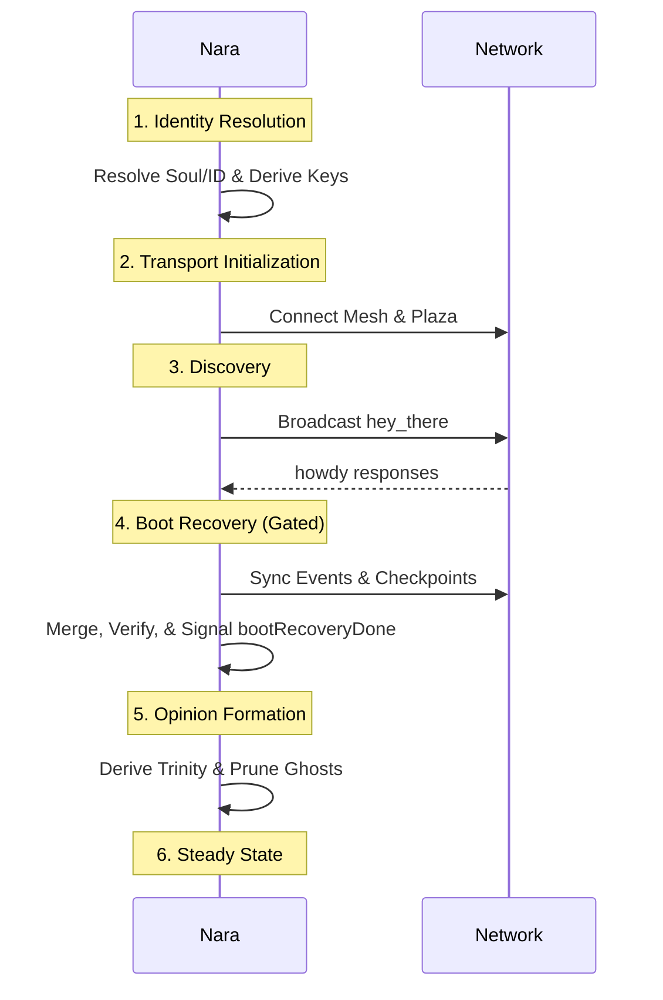

# Boot Sequence

The Boot Sequence orchestrates a Nara's transition from startup to full network participation, prioritizing identity and historical reconciliation (Sync).

## 1. Purpose
- Resolve cryptographic identity (Soul, ID, Keypair).
- Establish Mesh (WireGuard) and Plaza (MQTT) connectivity.
- Reconcile "hazy memory" via peer sync and checkpoints.
- Suppress social/opinion loops until a baseline is reached.

## 2. Conceptual Model
- **Gating**: `bootRecoveryDone` channel blocks social behaviors/opinions during sync.
- **Phases**: Sequential progression from Identity to Steady State.

### Invariants
- **Identity First**: No communication before Soul/ID resolution.
- **Mesh Dependency**: Mesh IP must be known before initial `hey_there`.
- **Silent Boot**: Social teases and logging suppressed during recovery.

## 3. Timeline

## 4. Algorithms

### Boot Recovery (`bootRecovery`)
1. **Discovery**: Wait ≤ 30s for initial peers.
2. **Parallel Sync**: Fetch events from mesh neighbors.
   - **Sample Mode**: Distributed subset retrieval.
   - **Capacity**: 5k (Short) to 80k (Hog) events.
3. **Anchor Sync**: Fetch [Checkpoints](./checkpoints.md) from ≤ 5 neighbors.
4. **Completion**: Close `bootRecoveryDone`.

### Initial Opinion Pass
Post-recovery `formOpinion`:
1. **Trinity**: Calculate `StartTime`, `Restarts`, `TotalUptime` for all known peers.
2. **Liveness**: Attempt verification pings for quiet nodes.
3. **Metrics**: Seed `AvgPingRTT` from recovered history.

## 5. Failure Modes
- **Isolation**: No neighbors in 30s; starts with empty ledger.
- **Sync Fallback**: Mesh failure forces slower MQTT sync.
- **Identity Conflict**: Clashing name/soul rejected by peers.

## 6. Security
- **Auth**: Mesh auth enabled immediately.
- **Verification**: Historical integrity verified via peer signatures.

## 7. Test Oracle
- `TestBootRecovery_Gating`: No opinions before recovery signal.
- `TestBootRecovery_ParallelSync`: Request distribution across neighbors.
- `TestBootRecovery_CheckpointBaseline`: Trinity anchoring.
