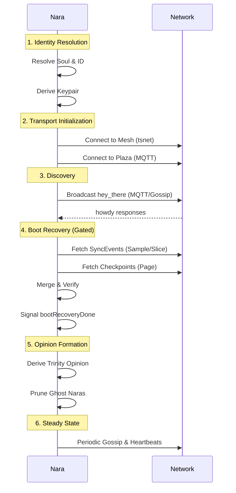

# Boot Sequence

The Boot Sequence orchestrates a Nara's transition from an empty process to a fully integrated participant in the network. It prioritizes identity resolution and historical reconciliation (Sync) before activating social and observation loops.
## 1. Purpose
- Resolve the Nara's cryptographic identity (Soul, ID, Keypair).
- Establish connectivity via Mesh (WireGuard) and Plaza (MQTT).
- Reconcile "hazy memory" by fetching historical events and checkpoints from peers.
- Suppress social triggers and "opinions" until a consistent baseline is reached.
## 2. Conceptual Model
- **Phases**: A series of ordered steps (Identity → Transport → Recovery → Steady State).
- **Gating**: The `bootRecoveryDone` channel prevents social behaviors from firing until history is synced.
- **Phases**: A series of ordered steps (Identity → Transport → Recovery → Steady State).
- **Gating**: The `bootRecoveryDone` channel prevents social behaviors from firing until history is synced.
- **Recovery Target**: The Nara attempts to fill its ledger capacity based on its [Memory Model](./memory-model.md).

### Invariants
- **Identity First**: No network communication occurs until the Soul and Nara ID are resolved.
- **Mesh Before MQTT**: The Mesh IP must be known before the initial `hey_there` broadcast so peers know how to reach the node.
- **Silent Boot**: Event logging and social teases are suppressed during the recovery phase to avoid spamming the network with "stale" observations.
## 3. External Behavior
- **Join Announcement**: Peers observe a `hey_there` message followed by a spike in sync requests from the new node.
- **Opinion Formation**: A Nara's reported metrics (Restarts, Uptime) may fluctuate during boot as it merges divergent views from peers, eventually converging.
## 4. Interfaces
- `ln.Start()` / `network.Start()`: The primary entry points for the boot sequence.
- `bootRecoveryDone`: A coordination channel used to unblock dependent services like `formOpinion`.
## 5. Timeline

## 6. Algorithms

### Boot Recovery (`bootRecovery`)
1. **Wait for Neighbors**: Wait up to 30s (or 3 retries) for initial peer discovery.
2. **Parallel Sync**: Identify mesh-enabled neighbors and fetch events.
   - **Sample Mode**: Distribute calls across neighbors to fetch a representative subset of history.
   - **Target**: ~50,000 events (5k for Short, 80k for Hog).
3. **Checkpoint Sync**: Fetch all [Checkpoints](./checkpoints.md) from up to 5 neighbors to anchor history.
4. **Signal Completion**: Close `bootRecoveryDone`.

### Opinion Formation Pass
Once recovery is complete, the Nara runs `formOpinion`:
1. **Trinity Derivation**: Calculate `StartTime`, `Restarts`, and `TotalUptime` for every Nara in the neighbourhood.
2. **Verification Pings**: Attempt to verify quiet naras before accepting "missing" status.
3. **Seed History**: Populate `AvgPingRTT` and other metrics from recovered history.

## 7. Failure Modes
- **Isolaton**: If no neighbors respond during the 30s window, the Nara starts with an empty ledger and must rely on slow background sync to recover history.
- **Sync Failure**: If mesh sync fails, the Nara falls back to MQTT-based ledger requests, which are slower and less reliable.
- **Identity Clash**: If a Nara boots with a soul that clashes with an existing name, it may be rejected by peers.
## 8. Security / Trust Model
- **Mesh Auth**: Initialized immediately to ensure all P2P sync traffic is authenticated.
- **Attestation**: During boot, the Nara relies on the signatures of peers to verify the historical events it receives.
## 9. Test Oracle
- `TestBootRecovery_Gating`: Ensures that `formOpinion` does not run until the recovery signal is sent.
- `TestBootRecovery_ParallelSync`: Verifies that sync requests are correctly distributed across multiple neighbors.
- **Mesh Auth**: Initialized immediately to ensure all P2P sync traffic is authenticated.
- **Attestation**: During boot, the Nara relies on the signatures of peers to verify the historical events it receives.

## Test Oracle
- `TestBootRecovery_Gating`: Ensures that `formOpinion` does not run until the recovery signal is sent.
- `TestBootRecovery_ParallelSync`: Verifies that sync requests are correctly distributed across multiple neighbors.
- `TestBootRecovery_CheckpointBaseline`: Confirms that checkpoints correctly anchor the initial Trinity derivation.
