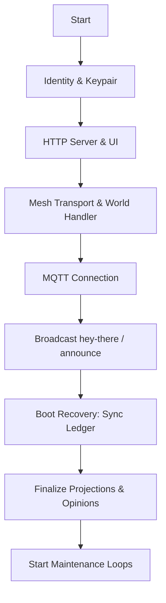

# Boot Sequence

Orchestrates the transition from startup to steady-state by initializing identity, transport, and historical recovery before activating social loops.

## Conceptual Model

| Phase | Purpose |
| :--- | :--- |
| **Identity & HTTP** | Initialize Soul, Nara ID, and the local UI/API server. |
| **Transport** | Start Mesh (tsnet) and MQTT. Mesh precedes MQTT to ensure IP is available for presence. |
| **Boot Recovery** | Reconcile ledger state from peers. Social opinions are suppressed until this completes. |
| **Steady State** | Activate background maintenance loops (Gossip, Sync, Trends, Buzz). |

## Lifecycle

## Algorithms

### 1. Boot Recovery (`boot_recovery.go`)
1. **Silence**: Suppress ledger event logging to avoid startup spam.
2. **Sync**: Parallel fetch from neighbors (see [Sync Protocol](./sync-protocol.md)).
3. **Checkpoint**: Fetch multi-sig anchors to establish baseline history.
4. **Signal**: Close `bootRecoveryDone` channel to unblock social triggers.

### 2. Maintenance Loops (Steady State)
Long-running routines activated post-recovery:
- **Presence**: Heartbeats (600s jittered).
- **Gossip**: Periodic zine exchange.
- **Sync**: Background catch-up (Mode: `recent`).
- **Observations**: Uptime monitoring and restart detection (1s).
- **Social**: Tease cleanup and trend tracking.
- **Coordinates**: Vivaldi ping cycles.

## Interfaces
- `Network.Start()`: Main entry point.
- `bootRecoveryDone`: Coordination channel for opinion formation.

## Failure Modes
- **Mesh Failure**: Falls back to mock local mesh; world journeys are disabled.
- **MQTT Failure**: Fatal unless `-transport gossip` is specified.
- **Recovery Skip**: Node starts with "empty" memory; opinions drift until sync converges.

## Security
- **Mesh Auth**: Initialized before any peer-to-peer data exchange.
- **Read-Only Mode**: Skips all presence broadcasts and emitters for passive monitoring.

## Test Oracle
- **Sequencing**: Verify services start in dependency order. (`network_test.go`)
- **Gating**: Ensure opinions do not form before recovery completes. (`boot_recovery_test.go`)
