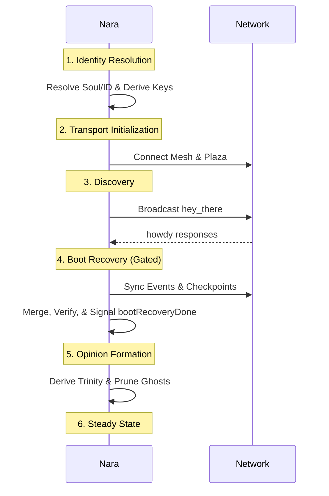

The Boot Sequence orchestrates a nara's transition from startup to full network participation. It prioritizes identity resolution, transport connectivity, and historical reconciliation (Sync).

## 1. Purpose
- Resolve the nara's cryptographic identity (Soul, ID, Keypair).
- Establish connectivity to the Mesh (WireGuard) and Plaza (MQTT).
- Reconcile "hazy memory" by syncing events and checkpoints from peers.
- Suppress social behaviors and opinion formation until a reliable baseline of history is reached.

## 2. Conceptual Model
- **Gating**: The `bootRecoveryDone` signal blocks social interactions and opinion updates during the initial sync phase.
- **Phases**: A sequential progression from a cold start to a fully informed participant.
- **Backfill**: The process of populating a blank ledger with historical facts from neighbors.

### Invariants
1. **Identity First**: No network communication is allowed until the local Soul and ID are resolved.
2. **Mesh Prerequisite**: The mesh IP MUST be known or assigned before the initial `hey-there` announcement can be made.
3. **Silent Boot**: To avoid social "noise," teases and automated log broadcasts are suppressed until boot recovery is complete.

## 3. External Behavior
- Upon starting, the nara appears briefly in a "loading" state as it resolves identity.
- It then joins the plaza and mesh, appearing `ONLINE` to others.
- It remains relatively "quiet" for several minutes as it pulls historical data from its neighbors.
- Once the `bootRecoveryDone` signal is triggered, the nara begins forming its own opinions and participating in social interactions.

## 4. Interfaces
- `bootRecovery()`: The internal orchestrator for the startup sync process.
- `bootRecoveryDone`: A coordination signal (channel) that unlocks steady-state behavior.
- `backgroundSync()`: A periodic task that continues the "backfilling" process throughout the nara's lifetime.

## 5. Event Types & Schemas
The boot sequence consumes all types defined in the [Events Spec](/docs/spec/events/), specifically prioritizing:
- `hey-there` (for peer discovery).
- `checkpoint` (for historical anchors).
- `observation:restart` (for identity verification).

## 6. Algorithms

### Timeline

### Boot Recovery (`bootRecovery`)
1. **Discovery Wait**: Wait up to 30 seconds to find initial peers via Plaza or Mesh.
2. **Parallel Sync**: Divide the `BootRecoveryTargetEvents` (50,000) into batches.
3. **Neighbor Slicing**: Request interleaved "slices" of the ledger from multiple mesh neighbors simultaneously.
4. **Anchor Sync**: Explicitly request the most recent [Checkpoints](/docs/spec/checkpoints/) for all discovered peers.
5. **Finalization**: Trigger `bootRecoveryDone`.

### Background Sync
To maintain consistency during long uptimes, a `backgroundSync` task runs every 30 minutes (±5m jitter):
- It fetches the 100 most `recent` events from 1-2 random neighbors.
- It specifically targets `observation`, `ping`, and `social` events from the last 24 hours.
- It uses the "recovering" data to refine [Network Coordinates](/docs/spec/coordinates/).

## 7. Failure Modes
- **Isolation**: If no neighbors are found within the discovery window, the nara starts with an empty memory and builds history from scratch.
- **Sync Fallback**: If Mesh HTTP is unavailable, the nara attempts a slower, partition-based sync via MQTT topics.
- **Identity Conflict**: If another nara claims the same name with a different soul, the local nara may fail to form valid opinions.

## 8. Security / Trust Model
- **Signature Gating**: Only events with valid author signatures are merged during the backfill process.
- **Response Accountability**: Neighbors sign their `SyncResponse`, making them accountable for the bundle of historical facts they provide.

## 9. Test Oracle
- `TestBootRecovery_Gating`: Ensures that `formOpinion` does not run until the recovery signal is closed.
- `TestBootRecovery_ParallelSync`: Verifies that sync requests are distributed across available mesh neighbors.
- `TestBootRecovery_CheckpointBaseline`: Validates that recovered checkpoints are used to correctly initialize peer Trinity values.

## 10. Open Questions / TODO
- Implement "Snapshot Resumption" to allow faster boots by saving a local cache of the latest checkpoints.
- Add support for "Priority Subjects" in boot recovery (e.g., sync your best friends' history first).
