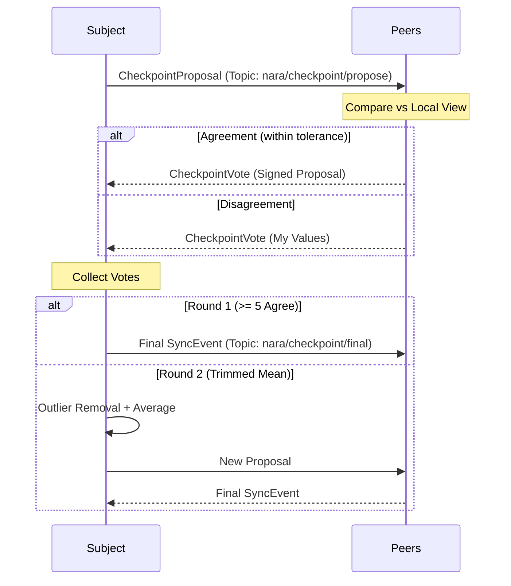

# Checkpoints

Multi-signature snapshots of historical uptime and restart data. They anchor consensus for long-term state derivation.

## Conceptual Model

| Term | Rule |
| :--- | :--- |
| **Consensus** | Requires ≥ 5 signatures for creation; ≥ 2 for local trust. |
| **Anchor** | State calculation starts from latest checkpoint + replayed events. |
| **Permanence** | Critical priority; never pruned. |
| **Uniqueness** | One per subject per `as_of_time`. |

## Lifecycle



## Consensus Algorithm: Trimmed Mean (Round 2)
1. Collect all values from votes (agree + disagree).
2. **Filter**: Remove values outside `[median * 0.2, median * 5.0]`.
3. **Average**: Use mean of remaining values for final proposal.

## State Derivation
To calculate current state (e.g., restarts):
1. **Locate Anchor**: Find latest valid checkpoint (`as_of_time`). Fallback: Backfill event.
2. **Base**: `Restarts = Checkpoint.Restarts`.
3. **Replay**: `CurrentRestarts = Base + Count(RestartEvents where ts > as_of_time)`.

## Interfaces

### Signing Format (Attestation)
Canonical string for voters:
`checkpoint:{subject_id}:{as_of_time}:{start_time}:{restarts}:{total_uptime}`

### Payload (`svc: checkpoint`)
```json
{
  "subject_id": "nara-id",
  "as_of_time": 1700000000,
  "observation": { "restarts": 42, "total_uptime": 123456, "start_time": 1690000000 },
  "voter_ids": ["id1", "id2"],
  "signatures": ["sig1", "sig2"]
}
```

## Logic & Constraints
- **Schedule**: Every 24h if ≥ 5 online peers.
- **Tolerances**: Restarts (±5), Uptime/StartTime (±60s).
- **Finalization**: Cap at 10 signatures; prefer high-uptime voters.
- **Filtering**: Drop if `ts < 1768271051` (prevents historical bug ingestion).

## Test Oracle
- **Derivation**: Checkpoint + Events = Correct state. (`checkpoint_test.go`)
- **Voting**: Tolerance enforcement. (`checkpoint_test.go`)
- **Security**: Ignore invalid signatures; verify threshold. (`checkpoint_signature_bug_test.go`)
- **Ingestion**: Filter old checkpoints. (`sync_checkpoint_filter_test.go`)
