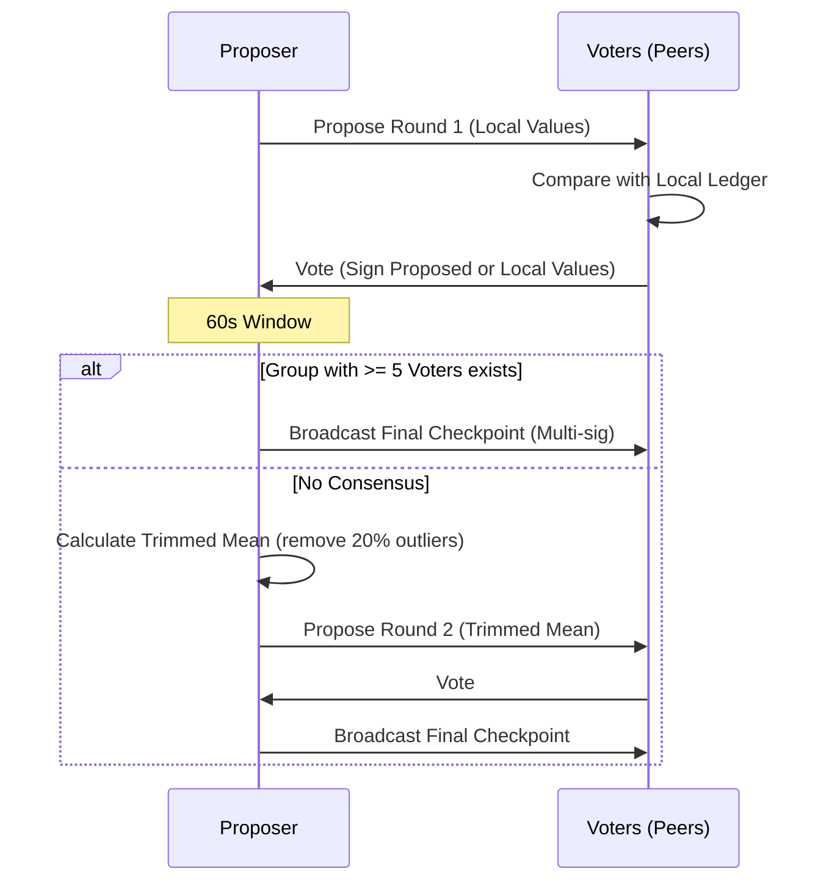

Checkpoints provide multi-party consensus for anchoring historical state (restarts, uptime, first-seen). They create trusted snapshots that survive network restarts and ledger pruning.

> **v2 Chain of Trust**: Starting with the latest release, checkpoints are versioned (v2) and link to a previous checkpoint ID. Proposals or votes that arrive without the versioned reference are ignored by v2 nodes, ensuring a single verified timeline.

## 1. Purpose
- Anchor historical facts predating the event-sourced system.
- Provide a trusted baseline for lifetime statistics (total restarts, uptime).
- Accelerate synchronization for new nodes via verified snapshots.

## 2. Conceptual Model
- **Proposal**: A Nara proposes a snapshot of its state (`Restarts`, `TotalUptime`, `StartTime`).
- **Vote**: Peers compare the proposal against local ledgers and sign correct values.
- **Consensus**:
  - **Round 1**: Direct approval of proposed values.
  - **Round 2**: Trimmed mean of votes if Round 1 fails.
- **Finalized Checkpoint**: Multi-sig bundle of verified state.
- **Chain of Trust** (v2): Each checkpoint proposal/vote advertises a `LastSeenCheckpointID` (the latest checkpoint the attester observed for the subject). Consensus only succeeds when all collected attestations (proposals, votes, and the resulting checkpoint) agree on the same reference ID, which is recorded in the finalized checkpoint as `PreviousCheckpointID`. Version 1 messages are ignored once the network runs v2 nodes to prevent mixing unlinked snapshots.

### Invariants
- **Multi-sig Trust**: Requires ≥ `MinCheckpointSignatures` (2) from known peers and ≥ `MinVotersRequired` (5) total voters.
- **Subject-Initiated**: Only the subject Nara can propose its checkpoint.
- **As-Of Stability**: All voters sign the identical `AsOfTime` and values.
- **Persistence**: Checkpoints are never pruned from the ledger.
- **Priority**: Prioritize signatures from peers with higher uptime if many are available.
- **Chain-of-Trust Agreement**: For v2 checkpoints, every attestation in the flow shares the same `LastSeenCheckpointID`. The resulting checkpoint records this ID as `PreviousCheckpointID`, so ledger readers can reconstruct a linear history. Proposals that cannot see the reference checkpoint (e.g., missing from the ledger) may still participate if the reference is empty (first checkpoint) but otherwise must wait to sync the missing checkpoint before signing.
- **Protocol Version Gating**: v2 nodes reject any proposal or vote stamped with version <2. This prevents mixing old-style checkpoints into the new chain and forces a coordinated rollout where all voting nodes upgrade before the first v2 checkpoint is finalized.

## 3. External Behavior
- **Frequency**: Every 24 hours (checked every 15 minutes).
- **Consensus Window**: 1-minute voting window on MQTT.
- **Storage**: Broadcast finalized checkpoints via MQTT; merged into `SyncLedger`.
- **Chain References**: v2 proposals and votes include the attester's current `LastSeenCheckpointID` for the subject and only finalize checkpoints whose voters agree on that reference. The proposer records the agreed reference as `PreviousCheckpointID` when broadcasting the final `SyncEvent`. Legacy v1 traffic is ignored once the service is running in v2 mode.

## 4. Interfaces

### MQTT Topics
| Topic | Payload | Purpose |
| :--- | :--- | :--- |
| `nara/checkpoint/propose` | `CheckpointProposal` | Proposer broadcasts state. |
| `nara/checkpoint/vote` | `CheckpointVote` | Peers broadcast attestations. |
| `nara/checkpoint/final` | `SyncEvent(checkpoint)`| Proposer broadcasts multi-sig checkpoint. |

### Attestation Structure
- `Subject` / `SubjectID`: Target Nara.
- `Version`: Format version for the attestation payload. v2 nodes ignore proposals or votes that report a version lower than 2 to avoid mixing unchained checkpoints.
- `Observation`: Trinity values (`Restarts`, `TotalUptime`, `StartTime`).
- `Attester` / `AttesterID`: Signing Nara.
- `LastSeenCheckpointID`: (v2 only) The checkpoint ID the attester had previously recorded for the subject. Included in the canonical signature string to pin the chain of trust.
- `AsOfTime`: Unix timestamp.
- `Signature`: Ed25519 signature (RFC 8032).

## 5. Data Structures

### CheckpointProposal
- `Attestation`: A self-attestation where `Subject == Attester`. v2 proposals always set `Version=2` and include `LastSeenCheckpointID`, which is the highest checkpoint ID the proposer has recorded for itself. This reference becomes the `PreviousCheckpointID` in the finalized checkpoint. `AsOfTime` is the Unix timestamp for the snapshot.
- `Round`: 1 or 2, matching the consensus phase for the values in the attestation.

### CheckpointVote
- `Attestation`: Third-party attestation (`Attester != Subject`) signed by the voter. v2 votes set `Version=2` and include the voter's `LastSeenCheckpointID` for the subject; votes are ignored if the reference does not match the group consensus.
- `ProposalTS`: Timestamp of the proposal being voted on. Voters sign the same `AsOfTime` as the proposal.
- `Round`: 1 or 2 to match the proposal phase.
- `Approved`: `true` when the voter agrees with the proposal's observation; `false` when signing their own local values (still referencing the same `LastSeenCheckpointID`).

### CheckpointEventPayload (SyncEvent)
- `Version`: Format version for the checkpoint payload. v2 checkpoints include extra metadata to form the chain; older v1 checkpoints omit the `PreviousCheckpointID`.
- `Subject` / `SubjectID`: Whose state the checkpoint represents.
- `PreviousCheckpointID`: (v2 only) The checkpoint ID that this snapshot builds on. It's derived from the `LastSeenCheckpointID` agreed by the proposer and voters.
- `Observation`: Agreed values (`Restarts`, `TotalUptime`, `StartTime`).
- `AsOfTime`: The shared timestamp voters signed.
- `Round`: Consensus round (1 or 2) used to verify tolerance.
- `VoterIDs`: Nara IDs who participated in the consensus (max 10).
- `Signatures`: Ed25519 signatures, each covering the entire payload (including `PreviousCheckpointID` when version ≥ 2 via `ContentString`).

The canonical `ContentString` includes the `PreviousCheckpointID` for v2 checkpoints (`checkpoint:v2:...:previousID`), so the checkpoint ID and signatures cryptographically bind the new snapshot to its predecessor. v1 checkpoints omit the version prefix and previous ID.

## 6. Algorithms

### Consensus Flow

Each proposal and vote advertises its `LastSeenCheckpointID`, which voters derive from their local `SyncLedger`. Consensus only succeeds when a group of signatures agrees on both the observation values and the referenced checkpoint ID; the resulting `CheckpointEventPayload` reuses that reference as `PreviousCheckpointID`. The trimmed-mean phase is subject to the same constraint, so outliers are computed only among votes that share the same reference.

### Consensus Finding (Round 1)
1. **Tolerance**: 5 restarts, 60s uptime, 60s start-time.
   - Attestations must also match the same `LastSeenCheckpointID` to be treated as agreeing; otherwise the group is split and no checkpoint is formed.
2. If values match within tolerance, voter signs proposed values (`Approved=true`).
3. Otherwise, voter signs local values (`Approved=false`).
4. Proposer collects votes for 60s. If ≥ 5 identical attestations exist, create checkpoint.

When a consensus group is selected, the checkpoint's `PreviousCheckpointID` is set to the shared `LastSeenCheckpointID` that the voters recorded; this ID becomes the reference for the next checkpoint chain step.

### Verification
Accept if:
- ≥ `MinVotersRequired` signatures.
- ≥ `MinCheckpointSignatures` verify against known public keys.
- Signatures match `Attestation` format for specified values and `AsOfTime`.

## 7. Failure Modes
- **Insufficient Voters**: < 6 naras (proposer + 5 voters) online.
- **Consensus Failure**: Round 2 fails; retry in 24h.
- **Clock Skew**: Peers reject proposals if `AsOfTime` is too far in past/future.
- **Version Mismatch**: v2 nodes refuse to process proposals or votes that report version < 2; if some peers remain on v1, no checkpoint can be finalized until they upgrade or the network temporarily routes around them.
- **Reference Desync**: If voters disagree on `LastSeenCheckpointID` because they have different ledgers (e.g., a reference checkpoint got trimmed or was never synced), consensus cannot form; nodes must fetch the missing checkpoint before voting, or wait until the proposer can broadcast a checkpoint that references a shared history.

## 8. Security
- **Byzantine Resistance**: Multi-sig + trimmed mean prevents single-actor manipulation.
- **Voter Cap**: Max 10 signatures; prefer highest uptime peers.

## 9. Test Oracle
- `TestCheckpoint_Consensus`: Identical votes trigger creation.
- `TestCheckpoint_Round2TrimmedMean`: Outlier removal and compromise proposal.
- `TestCheckpoint_VerificationThreshold`: Rejection if < 2 verified signatures.
- `TestCheckpoint_DeriveStats`: Checkpoint used as `SyncLedger` baseline.
- `TestCheckpointV2Format`, `TestCheckpointV2TamperDetection`, `TestCheckpointV2FirstCheckpoint`: v2 payloads must include `PreviousCheckpointID`, and any tampering with the reference invalidates signatures.
- `TestCheckpointV2NodeRejectsV1Proposal` / `TestCheckpointV2NodeIgnoresV1Votes`: Version gating is enforced; v2 nodes do not vote on legacy proposals or accept legacy votes.
- `TestCheckpointV2DivergentReferencePointsNoConsensus`, `TestCheckpointV2NetworkDisagreesWithProposer`, `TestCheckpointV1ToV2Chain` (integration): Voters must agree on a shared checkpoint reference before consensus; proposer-led divergence is resolved by only counting voters that share the reference and by linking new v2 checkpoints to the last seen v1 checkpoint when transitioning.
