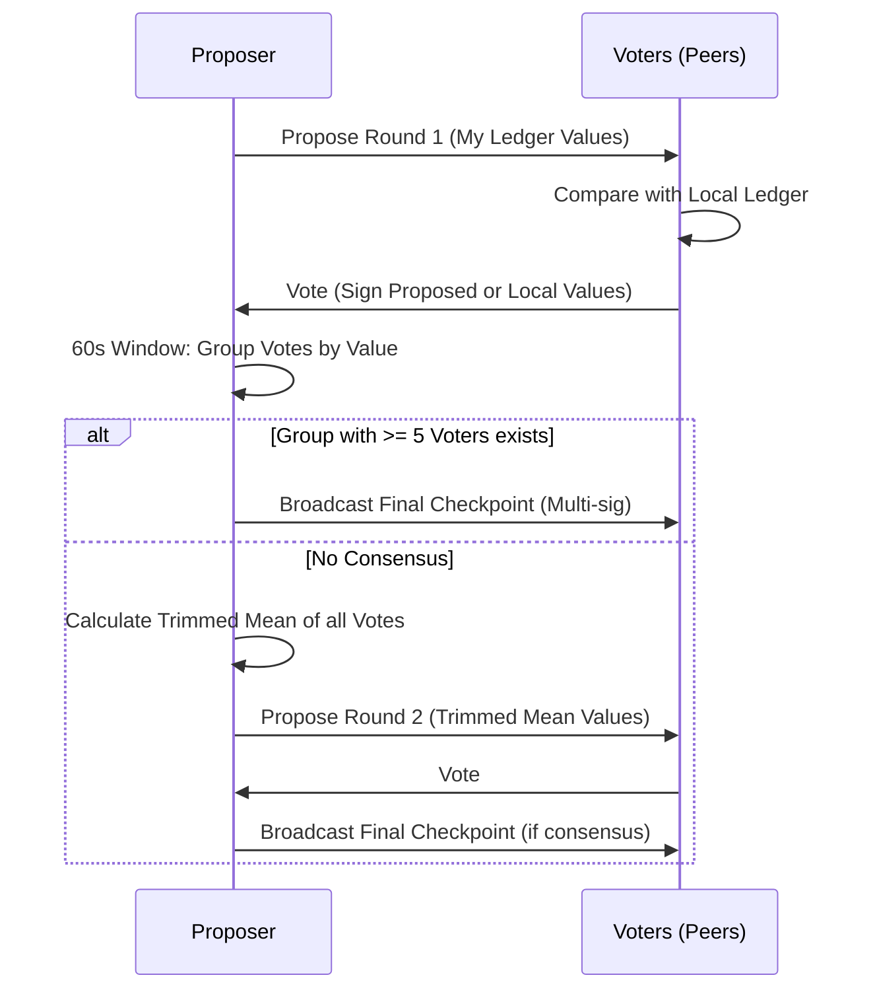

# Checkpoints
Checkpoints provide a multi-party consensus mechanism for anchoring historical state (restarts, uptime, first-seen). They solve the problem of "hazy memory" by creating trusted snapshots that survive network-wide restarts and ledger pruning.
## 1. Purpose
- Anchor historical facts that predated the event-sourced system.
- Provide a trusted baseline for calculating lifetime statistics (total restarts, lifetime uptime).
- Enable new naras to join the network and quickly synchronize deep history through a few verified snapshots.
## 2. Conceptual Model
- **Proposal**: A Nara proposes a snapshot of its own current state (`Restarts`, `TotalUptime`, `StartTime`).
- **Vote**: Other naras compare the proposal against their own local ledgers and "vote" by signing the values they believe are correct.
- **Round-based Consensus**:
## Conceptual Model
- **Proposal**: A Nara proposes a snapshot of its own current state (`Restarts`, `TotalUptime`, `StartTime`).
- **Vote**: Other naras compare the proposal against their own local ledgers and "vote" by signing the values they believe are correct.
- **Round-based Consensus**:
  - **Round 1**: Direct approval of the proposed values.
  - **Round 2**: If Round 1 fails, a "trimmed mean" of all votes is proposed to find a compromise.
- **Finalized Checkpoint**: A multi-sig bundle of a verified state snapshot.

### Invariants
- **Multi-sig Trust**: A checkpoint is only valid if it has at least `MinCheckpointSignatures` (default 2) valid signatures from known peers. Creation requires at least `MinVotersRequired` (default 5) voters.
- **Subject-Initiated**: Only the Nara the checkpoint is about can propose it.
- **As-Of Stability**: All voters sign the exact same `AsOfTime` and values to create a valid attestation.
- **Critical Importance**: Checkpoints are never pruned from the ledger.
- **Signature Priority**: When a checkpoint has many signatures, naras prioritize storing those from peers with higher uptime.
## 3. External Behavior
- **Periodic Proposals**: Naras attempt to checkpoint themselves every 24 hours.
- **Consensus Loop**: Every 15 minutes, a Nara checks if 24h have passed since its last checkpoint. If so, it proposes its state on MQTT. Peers respond with votes within a 1-minute window.
- **Storage**: Finalized checkpoints are broadcast via MQTT and merged into the `SyncLedger` of all observing naras.
## 4. Interfaces
### MQTT Topics
| Topic | Payload | Purpose |
| :--- | :--- | :--- |
| `nara/checkpoint/propose` | `CheckpointProposal` | Proposer broadcasts their state. |
| `nara/checkpoint/vote` | `CheckpointVote` | Peers broadcast their attestations. |
| `nara/checkpoint/final` | `SyncEvent(checkpoint)`| Proposer broadcasts the multi-sig finalized checkpoint. |
### Attestation Structure
- `Subject` / `SubjectID`: Who the checkpoint is about.
- `nara/checkpoint/final`: The proposer broadcasts the multi-sig finalized checkpoint.

### Attestation Structure
- `Subject` / `SubjectID`: Who the checkpoint is about.
- `Observation`: The state values (`Restarts`, `TotalUptime`, `StartTime`).
- `Attester` / `AttesterID`: Who is signing.
- `AsOfTime`: Unix seconds timestamp of the snapshot.
- `Signature`: Ed25519 signature of the attestation string.
- `Attester` / `AttesterID`: Who is signing.
- `AsOfTime`: Unix seconds timestamp of the snapshot.
- `Signature`: Ed25519 signature of the attestation string.
### Data Structures

#### CheckpointProposal
- `Attestation`: The self-attestation.
- `Round`: 1 or 2.

#### CheckpointVote
- `Attestation`: The third-party attestation.
- `ProposalTS`: Timestamp of the original proposal.
- `Round`: 1 or 2.
- `Approved`: Boolean (matches voter's ledger?).

#### CheckpointEventPayload (SyncEvent)
- `Subject` / `SubjectID`: Target Nara.
- `Observation`: Agreed Trinity values.
- `AsOfTime`: Snapshot timestamp.
- `Round`: Round that reached consensus.
- `VoterIDs`: List of Nara IDs who signed.
- `Signatures`: List of corresponding Ed25519 signatures.

## 6. Algorithms
### Consensus Flow

### Consensus Finding (Round 1)
1. Proposer derives state from its local ledger and broadcasts a proposal.
2. Voters derive their own opinion of the proposer's state.
3. If the proposer's values match the voter's (within tolerance: 5 restarts, 60s uptime), the voter signs the **proposed** values.
4. If they don't match, the voter signs **their own** derived values.
### Consensus Finding (Round 1)
1. Proposer derives state from its local ledger and broadcasts a proposal.
2. Voters derive their own opinion of the proposer's state. 
   - **Tolerance**: 5 restarts, 60s uptime, 60s start-time.
3. If values match within tolerance, the voter signs the **proposed** values (`Approved=true`).
4. If they don't match, the voter signs **their own** derived values (`Approved=false`).
5. Proposer collects votes for 60s. If any group of >= 5 identical attestations exists, a checkpoint is created.
### Trimmed Mean (Round 2)
If Round 1 fails (no group of 5 naras agreed on the exact same values):
1. Proposer collects all Round 1 votes.
2. For each field (Restarts, Uptime, StartTime), the proposer calculates a **trimmed mean** (removing the top and bottom 20% of outliers).
3. The proposer initiates Round 2 with these calculated consensus values.
### Verification
Peers only accept a checkpoint if:
- It has >= `MinVotersRequired` signatures in total.
- At least `MinCheckpointSignatures` of those signatures are verifiable using known public keys.
- The signatures verify against the `Attestation` format for the specified values and `AsOfTime`.
## 7. Failure Modes
- **Insufficient Voters**: If < 6 naras (proposer + 5 voters) are online, a checkpoint cannot be created.
- **No Consensus**: If even Round 2 fails to reach a group of 5 naras, the checkpoint attempt is aborted and retried in 24h.
- **Clock Skew**: While `AsOfTime` is fixed by the proposer, large clock skew can cause voters to reject proposals as "too old" or "in the future".
## 8. Security / Trust Model
- **Byzantine Tolerance**: By requiring multiple signatures and using a trimmed mean, the network resists single-actor manipulation of history.
- **Voter Priority**: If more than `MaxCheckpointSignatures` (default 10) votes are available, only the 10 from voters with highest uptime are included.
- **Immutability**: Once stored, checkpoints are never pruned, providing a permanent record of the network's agreed-upon state at that time.
## 9. Test Oracle
- `TestCheckpoint_Consensus`: Verifies that identical votes correctly trigger checkpoint creation.
- `TestCheckpoint_Round2TrimmedMean`: Validates that outliers are removed and a compromise value is proposed in Round 2.
- `TestCheckpoint_VerificationThreshold`: Ensures that checkpoints with fewer than 2 verifiable signatures are rejected.
- `TestCheckpoint_DeriveStats`: Checks that `SyncLedger` correctly uses checkpoints as a baseline for lifetime restart and uptime counts.
