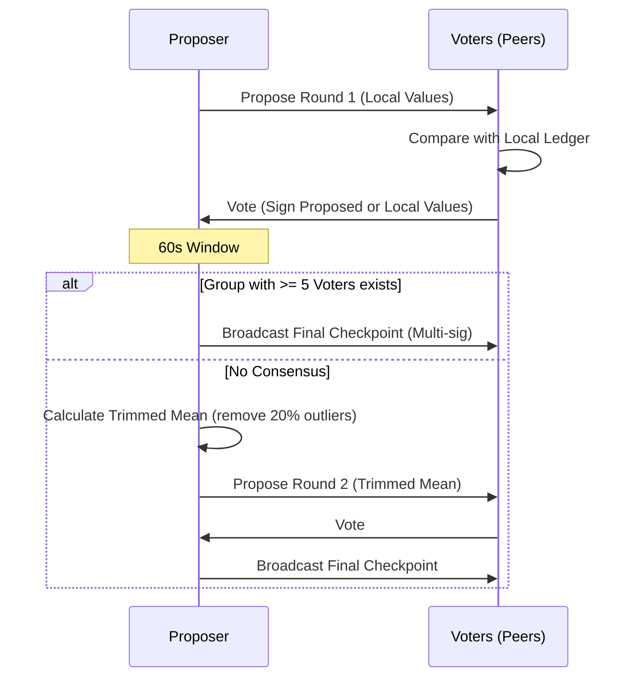

Checkpoints provide multi-party consensus for anchoring historical state (restarts, uptime, first-seen). They create trusted snapshots that survive network restarts and ledger pruning.

## 1. Purpose
- Anchor historical facts predating the event-sourced system.
- Provide a trusted baseline for lifetime statistics (total restarts, uptime).
- Accelerate synchronization for new nodes via verified snapshots.

## 2. Conceptual Model
- **Proposal**: A Nara proposes a snapshot of its state (`Restarts`, `TotalUptime`, `StartTime`).
- **Vote**: Peers compare the proposal against local ledgers and sign correct values.
- **Consensus**:
  - **Round 1**: Direct approval of proposed values.
  - **Round 2**: Trimmed mean of votes if Round 1 fails.
- **Finalized Checkpoint**: Multi-sig bundle of verified state.

### Invariants
- **Multi-sig Trust**: Requires ≥ `MinCheckpointSignatures` (2) from known peers and ≥ `MinVotersRequired` (5) total voters.
- **Subject-Initiated**: Only the subject Nara can propose its checkpoint.
- **As-Of Stability**: All voters sign the identical `AsOfTime` and values.
- **Persistence**: Checkpoints are never pruned from the ledger.
- **Priority**: Prioritize signatures from peers with higher uptime if many are available.

## 3. External Behavior
- **Frequency**: Every 24 hours (checked every 15 minutes).
- **Consensus Window**: 1-minute voting window on MQTT.
- **Storage**: Broadcast finalized checkpoints via MQTT; merged into `SyncLedger`.

## 4. Interfaces

### MQTT Topics
| Topic | Payload | Purpose |
| :--- | :--- | :--- |
| `nara/checkpoint/propose` | `CheckpointProposal` | Proposer broadcasts state. |
| `nara/checkpoint/vote` | `CheckpointVote` | Peers broadcast attestations. |
| `nara/checkpoint/final` | `SyncEvent(checkpoint)`| Proposer broadcasts multi-sig checkpoint. |

### Attestation Structure
- `Subject` / `SubjectID`: Target Nara.
- `Observation`: Trinity values (`Restarts`, `TotalUptime`, `StartTime`).
- `Attester` / `AttesterID`: Signing Nara.
- `AsOfTime`: Unix timestamp.
- `Signature`: Ed25519 signature (RFC 8032).

## 5. Data Structures

### CheckpointProposal
- `Attestation`: Self-attestation.
- `Round`: 1 or 2.

### CheckpointVote
- `Attestation`: Third-party attestation.
- `ProposalTS`: Original proposal timestamp.
- `Round`: 1 or 2.
- `Approved`: Boolean (matches voter's ledger?).

### CheckpointEventPayload (SyncEvent)
- `SubjectID`, `Observation`, `AsOfTime`, `Round`.
- `VoterIDs`: List of signers.
- `Signatures`: Ed25519 signatures.

## 6. Algorithms

### Consensus Flow

### Consensus Finding (Round 1)
1. **Tolerance**: 5 restarts, 60s uptime, 60s start-time.
2. If values match within tolerance, voter signs proposed values (`Approved=true`).
3. Otherwise, voter signs local values (`Approved=false`).
4. Proposer collects votes for 60s. If ≥ 5 identical attestations exist, create checkpoint.

### Verification
Accept if:
- ≥ `MinVotersRequired` signatures.
- ≥ `MinCheckpointSignatures` verify against known public keys.
- Signatures match `Attestation` format for specified values and `AsOfTime`.

## 7. Failure Modes
- **Insufficient Voters**: < 6 naras (proposer + 5 voters) online.
- **Consensus Failure**: Round 2 fails; retry in 24h.
- **Clock Skew**: Peers reject proposals if `AsOfTime` is too far in past/future.

## 8. Security
- **Byzantine Resistance**: Multi-sig + trimmed mean prevents single-actor manipulation.
- **Voter Cap**: Max 10 signatures; prefer highest uptime peers.

## 9. Test Oracle
- `TestCheckpoint_Consensus`: Identical votes trigger creation.
- `TestCheckpoint_Round2TrimmedMean`: Outlier removal and compromise proposal.
- `TestCheckpoint_VerificationThreshold`: Rejection if < 2 verified signatures.
- `TestCheckpoint_DeriveStats`: Checkpoint used as `SyncLedger` baseline.
