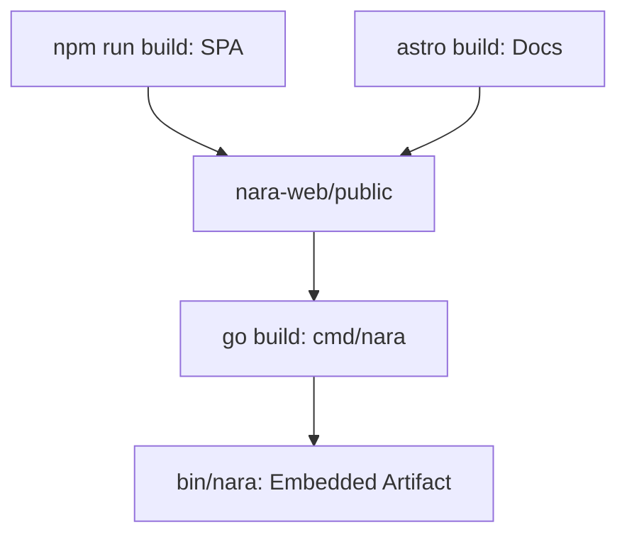

Build and runtime orchestration for Nara binaries, UI assets, and documentation.

## 1. Conceptual Model
- **`bin/nara`**: Standalone binary with embedded UI and docs.
- **`bin/nara-backup`**: CLI for ledger operations.
- **`nara-web/public`**: Pre-compiled SPA and docs site.

### Invariants
- **Embedding**: Web assets must be built before the Go binary.
- **Unified Port**: Single HTTP port serves API and UI.

## 2. Build Pipeline

## 3. Build Targets (`/usr/bin/make`)
- `build-web`: Compiles SPA and docs.
- `build`: Compiles `bin/nara` (includes web).
- `build-backup`: Compiles backup utility.
- `build-nix`: Reproducible Nix build.
- `clean`: Artifact removal.

## 4. Infrastructure: Fly.io
Configuration (`fly.toml`):
- **Port**: 8080.
- **Health Check**: `GET /` every 15s.

## 5. Failure Modes
- **Stale Assets**: Empty/missing UI if `build-web` is skipped.
- **Port Conflict**: Instances on same host require unique `-http-addr`.

## 6. Test Oracle
- **Standalone**: Produce functional executable.
- **Accessibility**: Verify `/` and `/docs/` on a running node.
