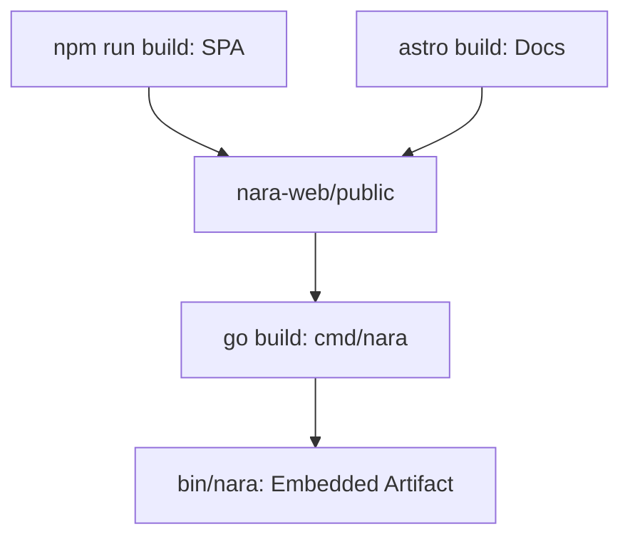

Deployment covers the build process, asset embedding, and infrastructure requirements for running nara in production or development environments.

## 1. Purpose
- Ensure reproducible builds across different platforms (Linux, macOS, Nix).
- Bundle the Web UI and documentation into a single, standalone binary.
- Provide a standardized way to deploy naras to cloud providers like Fly.io or local hardware.

## 2. Conceptual Model
- **Monolith Binary**: The `nara` binary is self-contained, including all logic, embedded UI assets, and the documentation site.
- **Embedded Assets**: Pre-compiled frontend files are baked into the Go binary at build time.
- **Build Targets**: Standardized `Makefile` targets for different build configurations.

### Invariants
1. **Embedding**: Web assets MUST be successfully built and present before the final Go compilation starts.
2. **Port Uniformity**: A single HTTP port serves both the API and the Web UI.
3. **Reproducibility**: Builds SHOULD produce consistent results across different environments.

## 3. External Behavior
- The resulting binary can be run as a standalone service with no external dependencies (other than an optional MQTT broker).
- The Web UI is accessible immediately upon startup at the configured address.
- Documentation is served locally from the same binary at `/docs/`.

## 4. Interfaces
### Build Targets (`Makefile`)
- `make build`: Compiles the standard `bin/nara` binary (requires web assets).
- `make build-web`: Compiles the Preact SPA and the Astro documentation site.
- `make test`: Runs the full Go test suite.
- `make build-nix`: Creates a reproducible build using the Nix package manager.

### Runtime Environments
- **Fly.io**: Supported via `fly.toml` for easy cloud deployment.
- **NixOS**: Supported via `nara.nix` module.
- **Docker**: Can be containerized as a single-binary alpine-based image.

## 5. Event Types & Schemas
Deployment configuration (e.g., environment variables) affects the initial [Configuration](/docs/spec/configuration/) of the nara.

## 6. Algorithms
### Build Pipeline
1. **Frontend**: Compile the Preact SPA in `nara-web/` using esbuild.
2. **Docs**: Build the Astro-based documentation in `docs/`.
3. **Staging**: Collect all assets into `nara-web/public/`.
4. **Go Build**: Use `go:embed` to include the `public/` directory in the `cmd/nara` binary.

## 7. Failure Modes
- **Stale Assets**: If `build-web` is not run before `build`, the binary will serve outdated or missing UI/docs.
- **Port Conflict**: Multiple instances on the same host must be assigned unique ports via `-http-addr`.
- **Incomplete Nix Closure**: Missing dependencies in the Nix expression may lead to build failures in clean environments.

## 8. Security / Trust Model
- **Supply Chain**: Build dependencies (Go modules, npm packages) should be pinned to ensure consistent and secure builds.
- **Sandboxing**: Production deployments should run naras with minimal privileges.

## 9. Test Oracle
- **Artifact Verification**: Verifies that `bin/nara` exists and is executable.
- **Embedded Asset Check**: Confirms that `/` (UI) and `/docs/` return valid content when the binary is run.
- **Health Check**: Validates that the binary responds to standard orchestration health checks.

## 10. Open Questions / TODO
- Implement a CI/CD pipeline that automatically builds and pushes multi-arch Docker images.
- Add support for automated "canary" deployments with coordinated soul migration.
