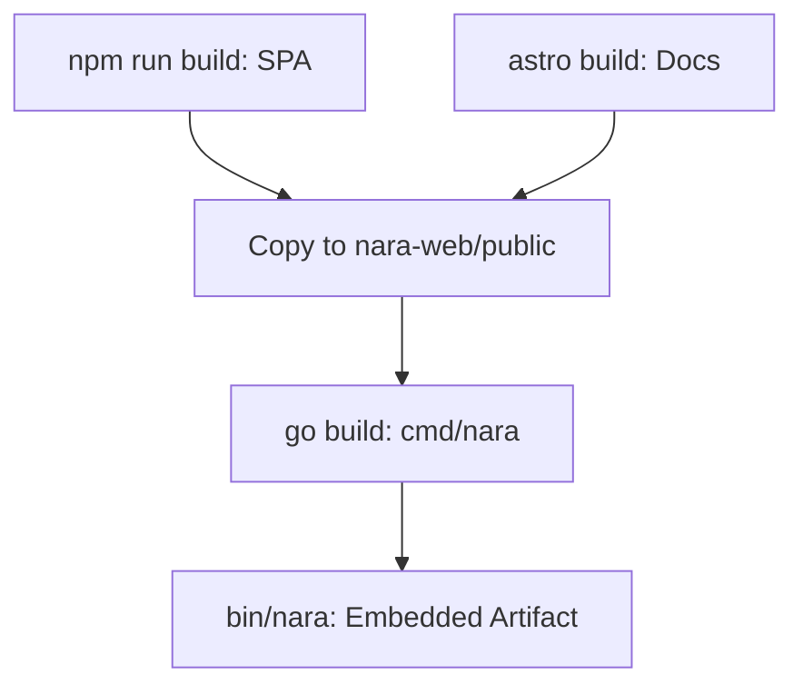

# Deployment

Build and runtime orchestration for Nara binaries, UI assets, and documentation.

## Conceptual Model

| Component | Description |
| :--- | :--- |
| **`bin/nara`** | Main binary with embedded UI and documentation. |
| **`bin/nara-backup`**| CLI tool for ledger export/import. |
| **`nara-web/public`**| Bundled SPA and docs site. |

### Invariants
- Web assets must be compiled before the main Go binary to ensure embedding.
- A single HTTP port serves both the API and the UI.

## Build Pipeline

## Build Targets (`/usr/bin/make`)

- `build-web`: Compiles SPA and docs.
- `build`: Compiles `bin/nara` (includes web).
- `build-backup`: Compiles the backup utility.
- `build-nix`: Reproducible build via Nix.
- `clean`: Remove all artifacts.

## Infrastructure: Fly.io
Configuration in `fly.toml` for the `nara-web` app:
- **Port**: 8080 (Internal & External).
- **Health Check**: `GET /` every 15s.

## Failure Modes
- **Missing Assets**: Empty UI/404 on docs if the build-web step is skipped.
- **Port Conflicts**: Multiple instances require unique `-http-addr` flags.

## Test Oracle
- **Binary**: Successful build produces a standalone executable.
- **Embedded UI**: Verify `/` and `/docs/` are accessible on the running node.
