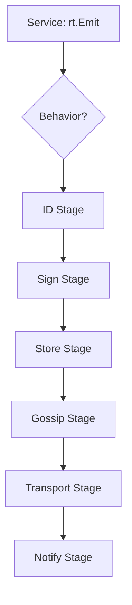

This guide is for engineers building new services (apps) for the **nara runtime** or contributing to the core system.

## 1. Purpose
- Define the developer experience (DX) and vision for the nara runtime.
- Provide a step-by-step path for creating and testing new services.
- Document the build system, environment configurations, and testing strategies.

## 2. Conceptual Model

### The Vision: Nara as an Operating System
Nara is not just a node; it is a **runtime** or "Operating System" for distributed agents. Services are **programs** that run on it. The runtime provides the "hardware" and "drivers":
- **Identity**: Cryptographic keys and signature authority.
- **Memory**: The `Ledger` for event storage and retrieval.
- **Transport**: Abstracted MQTT (Plaza) and Mesh (HTTP) communication.
- **Security**: Self-encryption primitives (`Seal`/`Open`).

### Everything is a Message
In the nara runtime, every fact, request, or local notification is a `Message`. Whether it's a persistent event stored in the ledger or an ephemeral P2P ping, it uses the same envelope. The difference is defined by **Behavior**.

### Behavior-Driven Development (BDD)
Instead of writing complex protocol logic, developers **declare behavior**. You define:
1. **The Kind**: A unique string identifier (e.g., `stash:store`).
2. **The Pipeline**: Which stages (Sign, Store, Gossip, Filter) the message passes through.
3. **The Handler**: The function that executes when a message of this kind is received.

### Invariants
1. Services MUST NOT store state on disk; use the `Stash` service or the `Ledger` via the runtime.
2. Services MUST be transport-agnostic; use `Runtime.Emit` and `Runtime.Receive`.
3. Handlers MUST be idempotent and handle out-of-order messages where possible.

## 3. External Behavior

### Developer Tools
- **The CLI**:
    - `-verbose`: Enables debug logging across all services.
    - `-nara-id <name>`: Overrides identity for testing multiple instances locally.
    - `-serve-ui`: Launches the embedded web inspector.
- **MockRuntime**: A high-fidelity test double that allows you to "run" a service in a unit test, capturing its emissions and simulating network input without a real network.

### Environment Modes
- `EnvProduction`: Default. Graceful error handling, focused logging.
- `EnvDevelopment`: Warnings for suspicious behavior, detailed logs.
- `EnvTest`: Strict. Panics on pipeline failures to catch bugs early in the CI/CD cycle.

## 4. Interfaces

### The Service Interface
All nara "apps" must implement the `Service` interface.
```go
type Service interface {
    Name() string
    Init(rt RuntimeInterface) error // Store the runtime reference
    Start() error                   // Start background loops/goroutines
    Stop() error                    // Graceful cleanup
}
```

### The BehaviorRegistrar
Most services also implement this to tell the runtime which messages they handle.
```go
type BehaviorRegistrar interface {
    RegisterBehaviors(rt RuntimeInterface)
}
```

### Build & Test Commands
Always use `/usr/bin/make` to ensure consistent toolchains:
- `/usr/bin/make build`: Compiles the binary to `bin/nara`.
- `/usr/bin/make test`: Runs the full integration suite (3+ minutes).
- `/usr/bin/make test-fast`: Runs unit tests (`-short` flag).

## 5. Message Schemas
Payloads are Go structs that the runtime automatically serializes to/from JSON.
```go
type MyPayload struct {
    Target  types.NaraID `json:"target"`
    Content string       `json:"content"`
}
```

## 6. Algorithms

### Creating a New Service
1. **Define the Payload**: Create the struct for your data.
2. **Implement Service**: Create your struct with `Init`, `Start`, `Stop`.
3. **Declare Behaviors**: Use the runtime templates (e.g., `StoredEvent`, `Ephemeral`, `MeshRequest`) to register your kinds.
4. **Wire the Handlers**: Map your message kinds to typed handler functions.
5. **Add to Runtime**: Register the service in `runtime_integration.go`.

### Case Study: The Stash Service
The `stash` service is the reference implementation for the Nara runtime. It provides distributed encrypted storage by using Nara as its operating system.

#### 1. Defining Behaviors
The stash service implements the `BehaviorRegistrar` interface. It defines how its messages move through the network:
```go
func (s *StashService) RegisterBehaviors(rt RuntimeInterface) {
    // stash:store is a mesh-only request (no MQTT broadcast)
    rt.Register(MeshRequest("stash:store", "Store encrypted stash").
        WithPayload[StashStorePayload]().
        WithHandler(1, s.handleStoreV1))
}
```

#### 2. Version-Aware Handlers
Stash handles schema evolution by mapping versions to specific handler functions. The runtime automatically deserializes the correct payload type:
```go
func (s *StashService) handleStoreV1(msg *Message, p *StashStorePayload) {
    s.log.Info("received stash store request", "owner", p.OwnerID)
    // Business logic goes here...
}
```

#### 3. Using Runtime Primitives
Instead of managing its own crypto or transport, Stash consumes Nara OS primitives:
- **Logging**: `s.log = rt.Log("stash")` (Scoped, structured logs).
- **Encryption**: `rt.Seal(data)` (Uses the Nara's hardware/identity keys).
- **Transport**: `rt.Emit(msg)` (Transport-agnostic delivery).

### The Pipeline Flow


## 7. Failure Modes
- **Orphaned Messages**: Emitting a message without a registered Behavior returns an error.
- **Signature Mismatch**: If a peer sends a message with an invalid signature, the `VerifyStage` in the receive pipeline drops it before it hits your handler.
- **Schema Drift**: If `MinVersion` and `CurrentVersion` are not managed, older nodes will drop messages they cannot deserialize.

## 8. Security / Trust Model
- **Isolation**: Services cannot access each other's private data unless explicitly exposed via a message kind.
- **Attestation**: Use `rt.LookupPublicKey(id)` to ensure you are talking to the real owner of a Nara ID.
- **Sovereignty**: Users own their data through `Seal`/`Open`; the runtime provides the crypto, but the service defines the policy.

## 9. Test Oracle
- **Verification**: Use `rt.EmittedMessages` in tests to verify your service reacted correctly to an input.
- **Determinism**: Given the same input messages, a service should reach the same internal state every time.

## 10. Open Questions / TODO
- **Dynamic Loading**: Can services be loaded as WASM modules in the future?
- **Resource Accounting**: Limiting CPU/Memory usage per service.
