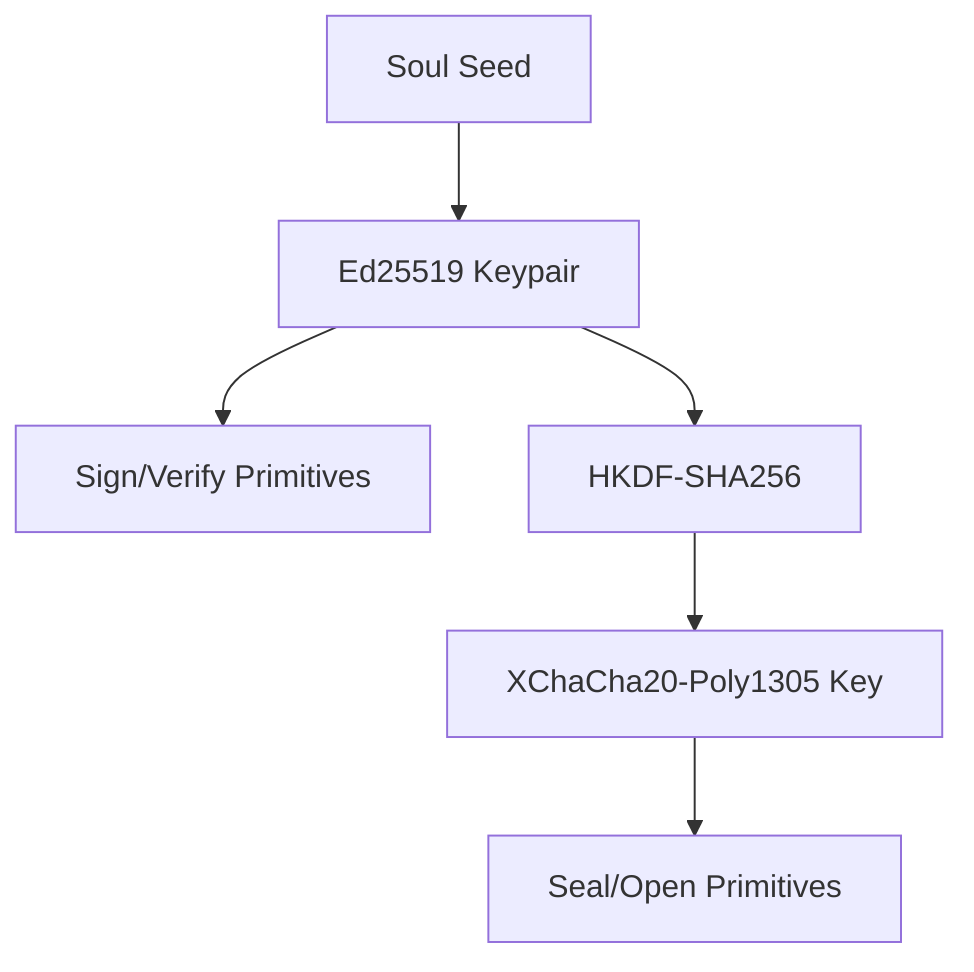

Nara uses Ed25519 for identity and signing, and XChaCha20-Poly1305 for self-encryption. Cryptographic operations are centralized in the `identity` package and managed by the `Keyring`.

## 1. Purpose
- Ensure the authenticity of all messages in the network via Ed25519 signatures.
- Provide a "Hazy Memory" safe-haven through self-encryption (encryption that only the owner can decrypt).
- Centralize key management to prevent secret leakage and ensure deterministic key derivation.

## 2. Conceptual Model
- **NaraKeypair**: The local nara's "Soul" in cryptographic form. It contains the Ed25519 private/public keys and a derived symmetric key.
- **Keyring**: The "address book" of the runtime. It maps Nara IDs to public keys and provides convenience methods for verification.
- **Self-Encryption (Seal/Open)**: A mechanism where data is encrypted using a key derived from the local private key. It is used to store state on peers (confidants) without them being able to read it.

### Invariants
1. Private keys MUST NOT be serialized or sent over the network.
2. Every message signature MUST be verified against the `Keyring`'s registered public key for that Nara ID.
3. Encryption keys MUST be derived deterministically using HKDF-SHA256 from the Ed25519 seed.

## 3. The NaraKeypair Primitive

### Key Derivation
The keypair is derived from a `SoulV1` seed:
- **Seed**: 32-byte deterministic seed.
- **Ed25519**: `ed25519.NewKeyFromSeed(seed)` provides the signing identity.
- **Encryption Key**: Derived via HKDF-SHA256:
    - **Salt**: `nara:stash:v1`
    - **Info**: `symmetric`
    - **Key Size**: 32 bytes (for XChaCha20-Poly1305).

### Seal / Open (Self-Encryption)
- **Algorithm**: XChaCha20-Poly1305 (IETF variant).
- **Nonce**: 24-byte random nonce, required for every `Seal` operation.
- **Behavior**: Plaintext is encrypted and authenticated. Decryption (`Open`) fails if the ciphertext or nonce has been tampered with, or if the key is incorrect.

## 4. The Keyring Primitive

The `Keyring` is the runtime's source of truth for peer identities.

### Capabilities
- **Registry**: Stores `NaraID` -> `ed25519.PublicKey` mappings.
- **Signing**: Provides convenience methods for signing data with the local private key.
- **Verification**: Verifies signatures from known peers. If a peer is unknown, verification fails (it does not automatically trust new keys without registration).

### Signable Interface
Nara uses a `Signable` interface to ensure deterministic signing of Go structs:
```go
type Signable interface {
    SignableContent() string // Returns canonical string for signing
}
```

## 5. Algorithms

### Deterministic Key Derivation


### Signature Verification Flow
1. Receive `Message` with `FromID`, `Signature`, and `Payload`.
2. `Keyring.Lookup(FromID)` to retrieve the peer's public key.
3. If public key is `nil`, the message is rejected (authenticity cannot be established).
4. `ed25519.Verify(pubKey, payload, signature)` to confirm the creator.

## 6. Failure Modes
- **Seed Mismatch**: If a Nara's seed changes (e.g., hardware change without backup), its previous self-encrypted stashes become undecryptable.
- **Invalid Key Size**: Ed25519 requires exactly 32-byte public keys and 64-byte signatures. Any deviation results in an immediate failure.

## 7. Security / Trust Model
- **Authenticity**: Guaranteed by Ed25519.
- **Confidentiality**: Guaranteed by XChaCha20-Poly1305 for self-encrypted data.
- **Trust-on-First-Use (TOFU)**: Public keys are typically registered via the `hey-there` message. Once a key is in the `Keyring`, it is the authoritative key for that Nara ID.

## 8. Test Oracle
- `NaraKeypair.Sign` followed by `Keyring.Verify` MUST return `true`.
- `NaraKeypair.Seal` followed by `NaraKeypair.Open` MUST return the original plaintext.
- Modification of even 1 bit in a `Seal`ed ciphertext MUST cause `Open` to return an error.
- Deterministic derivation: The same Soul Seed MUST always produce the same Ed25519 Public Key.
