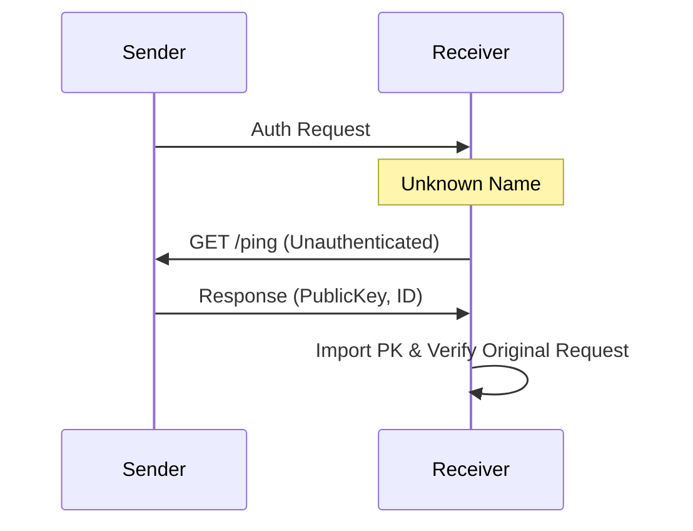

Mesh HTTP is the transport layer for sensitive, private, and bulk data exchange in the nara network. It runs over an encrypted WireGuard mesh (e.g., Tailscale or Headscale) and provides authenticated point-to-point links.

## 1. Purpose
- Provide an encrypted and authenticated alternative to the public MQTT plaza.
- Facilitate large data transfers like Zines and Sync Protocol batches.
- Power the Stash Service for distributed encrypted storage.
- Support low-latency routing for World Postcards.

## 2. Conceptual Model
- **Mesh Network**: A private overlay network where every nara has a stable IP.
- **Mutual Auth**: Every request and response is signed by the sender's soul.
- **Middleware**: A unified authentication layer that verifies identities and discovers public keys on-the-fly.

### Invariants
1. **Signed Headers**: Every request MUST include `X-Nara-Name`, `X-Nara-Timestamp`, and `X-Nara-Signature`.
2. **Clock Tolerance**: Requests are rejected if the timestamp is more than 30 seconds away from the receiver's clock.
3. **Encryption**: All traffic MUST be encrypted by the underlying mesh transport (WireGuard).

## 3. External Behavior
- naras discover each other's mesh IPs via [Plaza](/docs/spec/developer/plaza-mqtt/) or mesh scans.
- When communicating over the mesh, naras perform a cryptographic handshake to verify the other's identity.
- Unauthenticated access is strictly limited to basic health checks and public key discovery.

## 4. Interfaces

### Authenticated Headers
- **Request**: Ed25519 signature of `{name}{timestamp}{method}{path}`.
- **Response**: Ed25519 signature of `{name}{timestamp}{base64(sha256(body))}`.

### Core Endpoints
- `/ping`: Unauthenticated latency measurement and public key discovery.
- `/gossip/zine`: Bidirectional event exchange.
- `/dm`: Single `SyncEvent` delivery.
- `/api/sync`: Historical ledger reconciliation.
- `/mesh/message`: (New Runtime) Unified entry point for all runtime messages.

## 5. Event Types & Schemas
The mesh transport carries all event types defined in the [Events Spec](/docs/spec/developer/events/) and all runtime messages.

## 6. Algorithms

### Mesh Authentication
1. **Freshness Check**: Verify `abs(now - ts) <= 30s`.
2. **Key Resolution**: Fetch the public key for the claimed `X-Nara-Name`.
3. **On-Demand Discovery**: If the key is unknown, the receiver calls `/ping` on the sender's mesh IP to fetch their identity.
4. **Verification**: Verify the signature using the resolved public key.

### Discovery Fallback

## 7. Failure Modes
- **Clock Drift**: Requests fail if clocks differ by more than 30 seconds.
- **Mesh Partition**: If a nara loses its mesh connection, it is restricted to public plaza broadcasts and cannot participate in private gossip or stash.
- **Discovery Lag**: Finding new peers via mesh scanning may be slow compared to the real-time plaza.

## 8. Security / Trust Model
- **Transport Security**: Provided by WireGuard (AES-GCM or ChaCha20-Poly1305).
- **Application Auth**: Ed25519 signatures provide end-to-end proof of identity and message integrity.
- **Privacy**: Only public keys and IDs are accessible unauthenticated via `/ping`.

## 9. Test Oracle
- `TestMeshAuth_SignVerify`: Verifies basic request/response signing.
- `TestMeshAuth_ClockSkew`: Ensures that stale requests are rejected.
- `TestMeshAuth_UnknownSenderDiscovery`: Validates that receivers can fetch keys on-the-fly for new senders.
- `TestMeshAuth_ResponseSigning`: Ensures that the body of the response is also signed and verified.

## 10. Open Questions / TODO
- Move from name-based key lookup to ID-based (nara ID) lookup for increased robustness.
- Implement rate-limiting at the middleware level to prevent mesh-based DoS.
