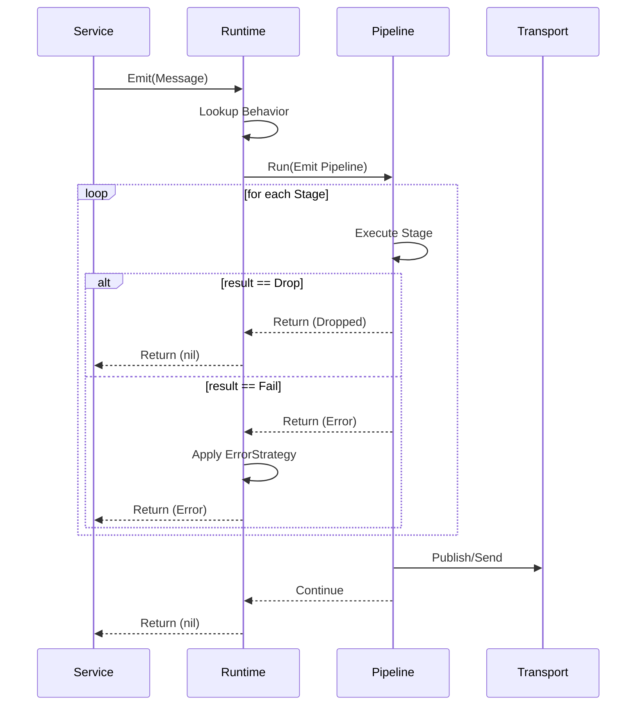

Pipelines are the "middleware" of the nara runtime. Every message emitted or received passes through a sequence of `Stage` objects that can transform, validate, or reject it.

## 1. Purpose
- Centralize cross-cutting concerns (Signing, Deduplication, Filtering) so services don't have to implement them.
- Provide a modular way to extend message processing without modifying the runtime core.
- Ensure consistent enforcement of network invariants (e.g., "all messages must be signed").

## 2. Conceptual Model
- **The Pipeline**: A list of `Stage` implementations executed in order.
- **The Stage**: A single unit of logic that returns a `StageResult`.
- **StageResult**: Explicit outcome of a stage: `Continue`, `Drop(reason)`, or `Fail(error)`.
- **The Context**: A shared object containing references to the ledger, transport, and keypair, passed to every stage.
- **TransportAdapter**: Bridges runtime transport stages to legacy `Network` (mesh HTTP and MQTT).

### Invariants
1. Every emitted message MUST pass through the emit pipeline before any transport call.
2. Every received message MUST be processed through the receive pipeline before reaching a handler.
3. Message IDs are deterministic but unique per instance (includes nanosecond timestamp).
4. Critical messages (Importance 3) MUST NOT be filtered by personality stages.

## 3. External Behavior
- **Emit Pipeline**: Triggered by `rt.Emit()`. Processes a message from the service and sends it to the network.
- **Receive Pipeline**: Triggered by `rt.Receive()`. Processes raw bytes from the network and routes them to a service handler.

## 4. Interfaces

### Stage
```go
type Stage interface {
    Process(msg *Message, ctx *PipelineContext) StageResult
}
```

### PipelineContext
Contains dependencies like:
- `Ledger`: To store/retrieve facts.
- `Keypair`: To sign or verify signatures.
- `Transport`: To publish to MQTT or Mesh.
- `Personality`: To apply subjective filters.

## 5. Algorithms

### Pipeline Execution Flow


### Emit Flow
1. Set `Timestamp` (if zero) and `FromID` / `From`.
2. Lookup `Behavior`. Set `Version` to `CurrentVersion` if zero.
3. Build Emit Pipeline: `IDStage` -> `ContentKeyStage` (optional) -> `SignStage` -> `StoreStage` -> `GossipStage` -> `TransportStage` -> `NotifyStage`.
4. Execute `Pipeline.Run`. Stop on `Drop` or `Fail`.

### Receive Flow
1. Peek `Kind` and `Version`.
2. Deserialize `Payload` into the type registered for that version.
3. Resolve `InReplyTo` via `CallRegistry` if present.
4. Build Receive Pipeline: `VerifyStage` -> `DedupeStage` -> `RateLimitStage` (optional) -> `FilterStage` (optional) -> `StoreStage` -> `GossipStage` -> `NotifyStage`.
5. Execute `Pipeline.Run`. Stop on `Drop` or `Fail`.
6. Invoke version-specific handler via reflection.

### ID Computation
`ID = Base58(SHA256(Kind + FromID + Timestamp(RFC3339Nano) + JSON(Payload)))[:16]`

### Importance Filtering
- **Importance 3 (Critical)**: Always continues.
- **Importance 2 (Normal)**: Dropped if `Personality.Chill > 85`.
- **Importance 1 (Casual)**: Subject to custom `CasualFilter` function.

## 6. Failure Modes
- **Transport Failure**: If a transport stage fails, the behavior's `Emit.OnError` strategy determines the outcome.
- **Verification Failure**: Invalid signatures or unknown senders result in a `Drop("invalid_signature")`.
- **Duplicate Detection**: Messages with existing `ID` or `ContentKey` are dropped with `duplicate_id` or `duplicate_content`.

## 7. Test Oracle
- `Pipeline.Run` results: Must explicitly return `Continue`, `Drop`, or `Fail`.
- `ImportanceFilterStage`: Given a Chill personality > 85, Importance 2 messages MUST be dropped, while Importance 3 MUST continue.
- `IDStage`: Two messages with the same content but different nanosecond timestamps MUST have different `ID`s.
