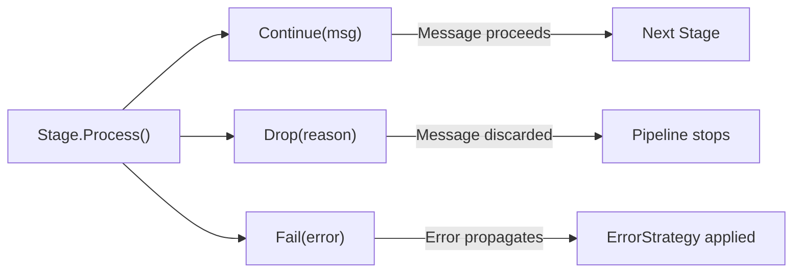
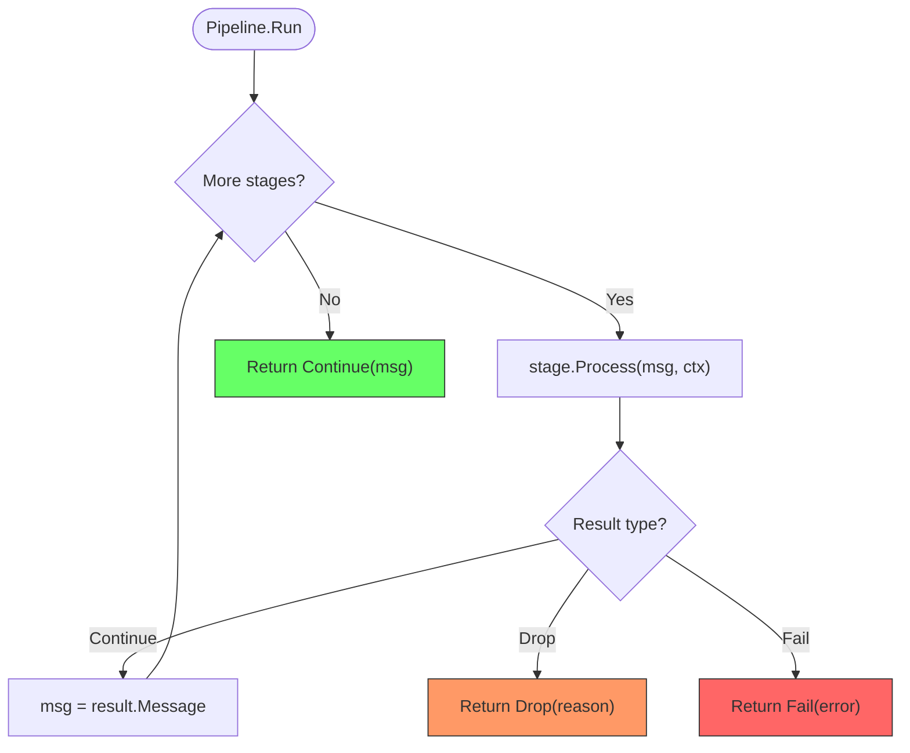
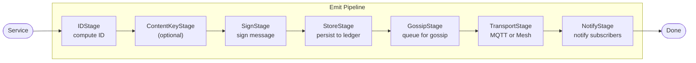
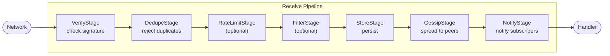
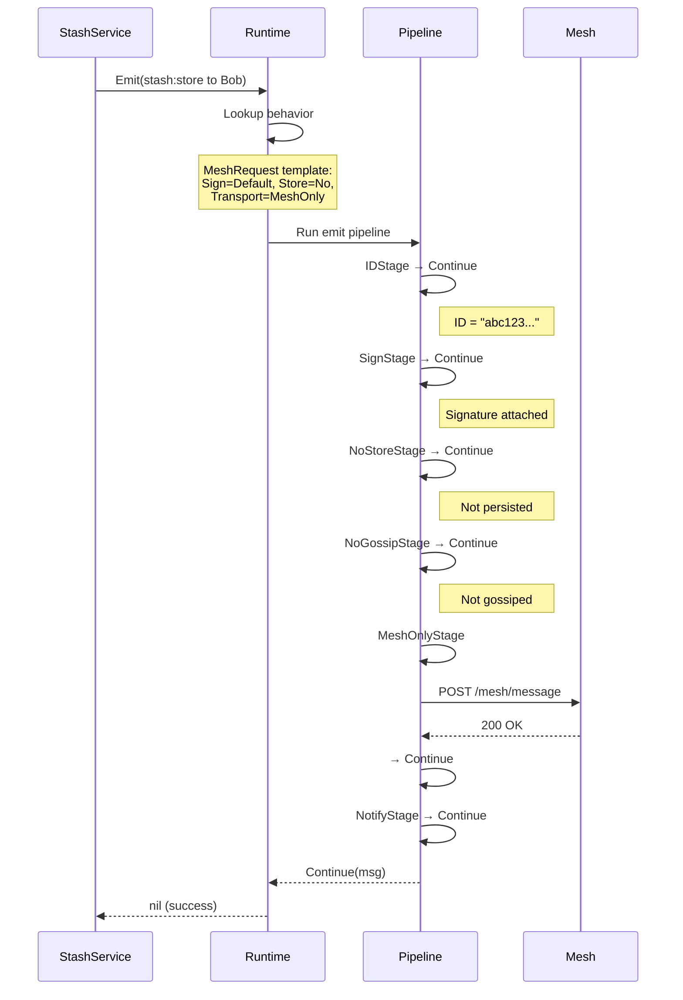
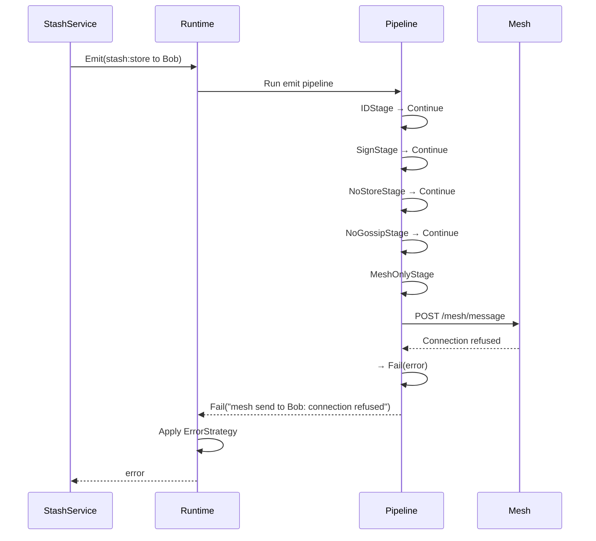

Pipelines are the "middleware" of the nara runtime. Every message emitted or received passes through a sequence of stages that can transform, validate, store, or reject it.

---

## 1. Purpose

Pipelines centralize cross-cutting concerns so services remain focused on business logic:

- **Signing**: Messages are signed automatically based on behavior config
- **Storage**: Ledger persistence handled uniformly
- **Verification**: Signature validation happens before handlers see messages
- **Deduplication**: Duplicate messages filtered without service involvement
- **Filtering**: Personality-based filtering applied consistently

---

## 2. Conceptual Model

### Core Primitives

| Primitive | Role |
|-----------|------|
| **Stage** | A single unit of processing that returns an explicit result |
| **Pipeline** | An ordered list of stages executed sequentially |
| **StageResult** | The outcome: `Continue`, `Drop`, or `Fail` |
| **PipelineContext** | Shared dependencies (ledger, transport, keypair) |

### Invariants

1. Every emitted message MUST pass through the emit pipeline before network transport.
2. Every received message MUST pass through the receive pipeline before handler invocation.
3. Message IDs include nanosecond timestamps—same content at different times produces different IDs.
4. Critical messages (Importance 3) MUST NOT be filtered by personality stages.

---

## 3. StageResult: Explicit Outcomes

Every stage returns a `StageResult` that explicitly communicates what happened. No silent failures.

### The Three Outcomes

| Result | When to use | Example |
|--------|-------------|---------|
| `Continue(msg)` | Stage succeeded, message should proceed | Signature verified |
| `Drop(reason)` | Message intentionally rejected | `"duplicate_id"`, `"rate_limited"` |
| `Fail(error)` | Something went wrong | Transport unreachable |

### Why explicit results?

Old designs used `next()` callbacks that could be forgotten. The explicit return ensures:

- **Can't forget**: You must return something
- **Clear error path**: Errors are returned, not swallowed
- **Debuggable**: The `Reason` field explains why a message was dropped

---

## 4. Pipeline Execution

The pipeline runs stages sequentially. It stops on the first `Drop` or `Fail`.

### Execution Rules

1. **Sequential**: Stages run in order, not in parallel
2. **Early exit**: First `Drop` or `Fail` stops the pipeline
3. **Message threading**: Each `Continue` passes the (possibly modified) message to the next stage
4. **Final result**: If all stages continue, the pipeline returns `Continue(finalMsg)`

---

## 5. Emit Pipeline

When a service calls `rt.Emit(msg)`, the message flows through the emit pipeline:

### Stage Responsibilities

| Stage | Purpose | Default |
|-------|---------|---------|
| **IDStage** | Compute unique envelope ID | Always runs |
| **ContentKeyStage** | Compute semantic dedup key | Only if behavior defines `ContentKey` |
| **SignStage** | Sign with keypair | `DefaultSign()` |
| **StoreStage** | Persist to ledger | `NoStore()` |
| **GossipStage** | Add to gossip queue | `NoGossip()` |
| **TransportStage** | Send over network | Behavior-defined |
| **NotifyStage** | Notify local subscribers | Always runs |

---

## 6. Receive Pipeline

When bytes arrive from the network, `rt.Receive(raw)` processes them:

### Stage Responsibilities

| Stage | Purpose | Default |
|-------|---------|---------|
| **VerifyStage** | Validate signature | `DefaultVerify()` |
| **DedupeStage** | Reject seen messages | `IDDedupe()` |
| **RateLimitStage** | Throttle by key | Optional |
| **FilterStage** | Personality filtering | Optional |
| **StoreStage** | Persist to ledger | Behavior-defined |
| **GossipStage** | Spread to peers | If behavior enables |
| **NotifyStage** | Trigger handlers | Always runs |

---

## 7. Concrete Example: Stash Store

A `stash:store` message demonstrates the pipeline in action:

### What if Bob is unreachable?

---

## 8. Stage Catalog

### Sign Stages

| Stage | DSL Helper | Behavior |
|-------|------------|----------|
| `DefaultSignStage` | `DefaultSign()` | Signs with runtime keypair |
| `NoSignStage` | `NoSign()` | Skips signing (signature in payload) |

### Store Stages

| Stage | DSL Helper | Behavior |
|-------|------------|----------|
| `DefaultStoreStage` | `DefaultStore(priority)` | Persists with GC priority (0=never prune, 4=expendable) |
| `ContentKeyStoreStage` | `ContentKeyStore(priority)` | Dedupes by ContentKey before storing |
| `NoStoreStage` | `NoStore()` | Skips storage (ephemeral) |

### Transport Stages

| Stage | DSL Helper | Behavior |
|-------|------------|----------|
| `MQTTStage` | `MQTT(topic)` | Broadcast to fixed topic |
| `MQTTPerNaraStage` | `MQTTPerNara(pattern)` | Broadcast to `pattern % sender` |
| `MeshOnlyStage` | `MeshOnly()` | Direct HTTP to `ToID` |
| `NoTransportStage` | `NoTransport()` | Local only |

### Verify Stages

| Stage | DSL Helper | Behavior |
|-------|------------|----------|
| `DefaultVerifyStage` | `DefaultVerify()` | Lookup pubkey by FromID |
| `SelfAttestingVerifyStage` | `SelfAttesting(extractKey)` | Extract pubkey from payload |
| `CustomVerifyStage` | `CustomVerify(fn)` | Custom verification logic |
| `NoVerifyStage` | `NoVerify()` | Skip verification |

### Dedupe Stages

| Stage | DSL Helper | Behavior |
|-------|------------|----------|
| `IDDedupeStage` | `IDDedupe()` | Reject if ID seen before |
| `ContentKeyDedupeStage` | `ContentKeyDedupe()` | Reject if ContentKey seen |

### Filter Stages

| Stage | DSL Helper | Behavior |
|-------|------------|----------|
| `ImportanceFilterStage` | `Critical()` | Never filter (importance 3) |
| `ImportanceFilterStage` | `Normal()` | Filter if Chill > 85 |
| `ImportanceFilterStage` | `Casual(fn)` | Custom filter function |

---

## 9. Error Strategies

When a stage fails, the behavior's `OnError` strategy determines what happens:

| Strategy | Behavior |
|----------|----------|
| `ErrorDrop` | Silent drop |
| `ErrorLog` | Log warning and drop |
| `ErrorRetry` | Retry with backoff (not yet implemented) |
| `ErrorQueue` | Dead letter queue (not yet implemented) |
| `ErrorPanic` | Fatal error (critical messages) |

---

## 10. Failure Modes

| Failure | Stage | Result |
|---------|-------|--------|
| Unknown sender | `DefaultVerifyStage` | `Drop("unknown_sender")` |
| Bad signature | `DefaultVerifyStage` | `Drop("invalid_signature")` |
| Duplicate ID | `IDDedupeStage` | `Drop("duplicate_id")` |
| Duplicate fact | `ContentKeyDedupeStage` | `Drop("duplicate_content")` |
| Rate exceeded | `RateLimitStage` | `Drop("rate_limited")` |
| Too chill | `ImportanceFilterStage` | `Drop("filtered_by_chill")` |
| Mesh unreachable | `MeshOnlyStage` | `Fail(error)` |
| MQTT publish failed | `MQTTStage` | `Fail(error)` |
| Ledger full | `DefaultStoreStage` | `Fail(error)` |

---

## 11. Test Oracle

### Pipeline.Run behavior

- Given stages `[A, B, C]` where all return `Continue`, the result MUST be `Continue` with the final message.
- Given stages `[A, B, C]` where B returns `Drop("reason")`, the result MUST be `Drop("reason")` and C MUST NOT execute.
- Given stages `[A, B, C]` where B returns `Fail(err)`, the result MUST be `Fail(err)` and C MUST NOT execute.

### ImportanceFilterStage behavior

- Given `Personality.Chill = 90` and `Importance = 2`, the stage MUST return `Drop("filtered_by_chill")`.
- Given `Personality.Chill = 90` and `Importance = 3`, the stage MUST return `Continue`.
- Given `Importance = 1` with a `CasualFilter` that returns `false`, the stage MUST return `Drop("filtered_by_personality")`.

### IDStage behavior

- Two messages with identical `Kind`, `FromID`, and `Payload` but different nanosecond timestamps MUST produce different `ID` values.

### Deduplication behavior

- `IDDedupeStage`: If `Ledger.HasID(msg.ID)` returns true, the stage MUST return `Drop("duplicate_id")`.
- `ContentKeyDedupeStage`: If `msg.ContentKey != ""` and `Ledger.HasContentKey(msg.ContentKey)` returns true, the stage MUST return `Drop("duplicate_content")`.
