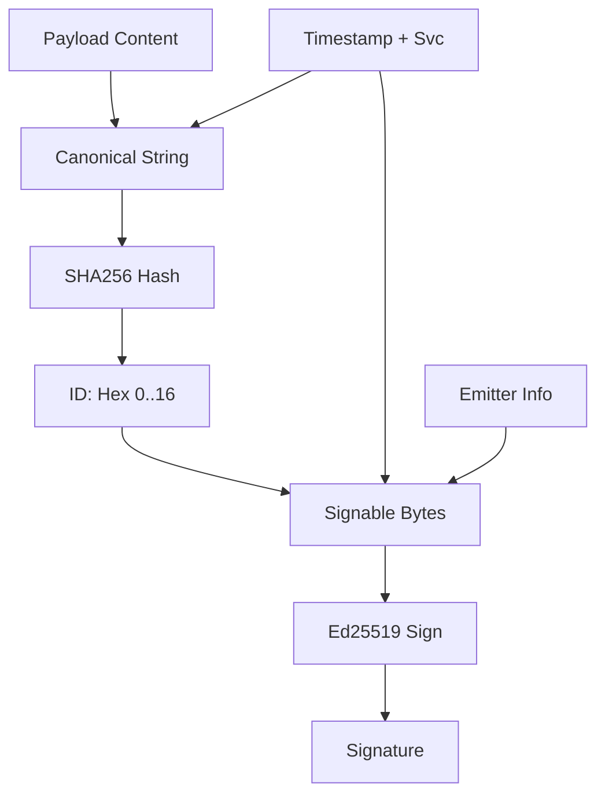

# Events

Events are the immutable, shared facts of Nara. All state (opinions, projections, UI) is derived from the event ledger.

## Conceptual Model

| Property | Rule |
| :--- | :--- |
| **Immutability** | Never mutated after ID computation. |
| **Determinism** | IDs are hashes of timestamp, service, and payload. |
| **Precision** | Nanosecond timestamps to prevent collisions. |
| **Authentication** | Ed25519 signatures verify emitter, not truth of content. |

## SyncEvent Structure

```json
{
  "id": "16-byte hex",
  "ts": 1700000000000000000,
  "svc": "service_name",
  "emitter": "nara-name",
  "emitter_id": "nara-ID",
  "sig": "Base64 signature",
  "payload": { ... } // social, ping, observation, hey_there, chau, seen, checkpoint
}
```

## Event Types (`svc`)

| Service | Purpose | Key Fields |
| :--- | :--- | :--- |
| `social` | Teasing & gossip | `type`, `actor`, `target`, `reason`, `witness` |
| `ping` | Latency (RTT) | `observer`, `target`, `rtt` (rounded to 0.1ms) |
| `observation` | Network consensus | `type` (restart, first-seen), `importance`, `start_time`, `online_state` |
| `hey-there` | Presence (UP) | `from`, `public_key`, `mesh_ip`, `id` |
| `chau` | Presence (DOWN) | `from`, `id` |
| `seen` | Proof of contact | `observer`, `subject`, `via` (zine, mesh, ping) |
| `checkpoint` | Multi-party state | `observation`, `as_of_time`, `round`, `voter_ids`, `signatures` |

## Algorithms

### Event ID & Signature


- **ID**: `Hex(SHA256(TS + ":" + Svc + ":" + PayloadString))[0..16]`
- **Signable**: `SHA256(ID + ":" + TS + ":" + Svc + ":" + Emitter + ":" + PayloadString)`

### Verification
1. **Structural**: Verify `svc`, `ts`, and payload presence.
2. **Key Resolution**: Lookup public key via `emitter_id`.
3. **Cryptographic**: `Ed25519_Verify(PublicKey, SignableBytes, Signature)`.
4. **Filtering**: Drop `checkpoint` events if `ts < 1768271051`.

## Security
- **Self-Authentication**: Signature proves origin.
- **Divergence**: Peers may have different ledger subsets; convergence occurs via gossip.
- **No Truth Guarantee**: Signed claims ("A said X") are facts; whether X is true is determined by consensus.

## Test Oracle
- **ID Determinism**: `sync_test.go`
- **Immutability**: Hash changes invalidate signatures. (`sync_test.go`)
- **Signature Validity**: `identity_crypto_test.go`
- **Checkpoint Filtering**: `sync_checkpoint_filter_test.go`
