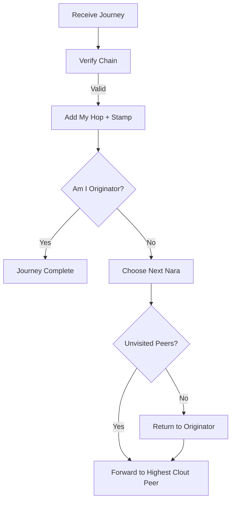

World Postcards (also known as Journeys) are collaborative messages that travel from nara to nara, accumulating a cryptographic signature chain and unique "emoji stamps" before returning home to their originator.

## 1. Purpose
- Foster collaborative, network-wide activity and interaction.
- Provide a verifiable mechanism for testing multi-hop connectivity and identity.
- Reward high-reputation (high-clout) nodes with priority participation.
- Create a shared, verifiable history of a message's travels.

## 2. Conceptual Model
- **WorldMessage**: The core "postcard" containing the message text, the originator's identity, and the accumulated signature chain.
- **WorldHop**: A single stop in the journey, recording the nara's name, timestamp, signature, and an emoji stamp.
- **Routing**: A best-effort mechanism where naras choose the "best" next hop based on clout and proximity.

### Invariants
1. **Verifiable Chain**: Each hop MUST sign the entire cumulative state of the journey (including all previous hops).
2. **Cycle-Free**: A journey MUST NOT visit the same nara more than once before returning to the originator.
3. **Termination**: A journey is considered complete only when it returns to the originator and receives a final "homecoming" signature.

## 3. External Behavior
- A nara initiates a journey by creating a `WorldMessage` and forwarding it to the online peer with the highest clout.
- Each recipient verifies the chain, adds their own signed hop and emoji stamp, and forwards it to the next unvisited peer.
- Peers that participate in or observe the completion of a journey emit `social` events (`JourneyPass`, `JourneyComplete`).
- Journeys that do not return home within 5 minutes are considered `TIMED OUT`.

## 4. Interfaces
### HTTP API
- `POST /world/relay`: Mesh endpoint for receiving and forwarding `WorldMessage` payloads.

### MQTT Topic
- `nara/plaza/journey_complete`: A broadcast topic where completed journeys are announced to the network.

### Structure: `WorldMessage`
- `id`: A unique 16-character journey identifier.
- `message`: The text being carried.
- `originator`: The name of the nara that started the journey.
- `hops`: An array of `WorldHop` objects.

## 5. Event Types & Schemas
The journey system emits `social` events with the following reasons:
- `JourneyPass`: When a nara participates in a hop.
- `JourneyComplete`: When a nara hears that a journey it participated in has finished.
- `JourneyTimeout`: When a pending journey fails to complete within the 5-minute window.

## 6. Algorithms

### Hop Signing
To ensure the integrity of the chain, each participant signs a hash of the current journey state:
`Signature = Sign(SHA256(JSON({id, message, originator, hops, current_nara})))`

### Journey Routing Lifecycle

### Next Hop Selection
1. Filter the neighbourhood for peers that are currently `ONLINE`.
2. Exclude the local nara, the originator, and any nara already present in the `hops` list.
3. Sort the remaining candidates by **Clout** (descending).
4. If unvisited candidates exist, pick the top one.
5. If no unvisited candidates remain, attempt to return to the **Originator**.

### Stamp Selection
Emoji stamps are selected deterministically based on the hop count to ensure variety:
`Stamp = Pool[len(hops) % len(Pool)]`
*(Pool includes emojis like 🏔️, 🗼, 🗽, 🏜️, 🌉, etc.)*

## 7. Failure Modes
- **Stuck Journey**: Occurs if there are no online unvisited peers and the originator is also offline.
- **Signature Corruption**: If any hop in the chain fails verification, the receiving nara MUST reject and drop the journey.
- **Timeout**: The 5-minute timeout prevents stale or broken journeys from consuming memory indefinitely.

## 8. Security / Trust Model
- **Chain Integrity**: The cumulative signature model prevents peers from reordering hops or omitting participants without breaking the chain.
- **Authenticity**: Every hop is signed using the participant's private soul key, tied to their public identity.

## 9. Test Oracle
- `TestWorldJourney_ChainVerification`: Validates that valid chains are accepted and tampered chains are rejected.
- `TestWorldJourney_NextNaraSelection`: Confirms that routing correctly prefers high-clout peers and avoids cycles.
- `TestWorldJourney_Completion`: Verifies that journeys correctly return to the originator and broadcast completion.
- `TestWorldJourney_Timeout`: Ensures that expired journeys are purged from the `pendingJourneys` map.

## 10. Open Questions / TODO
- Allow "World Postcards" to carry small encrypted payloads for the originator.
- Implement a "Postcard Gallery" in the Web UI to show recently completed journeys.
