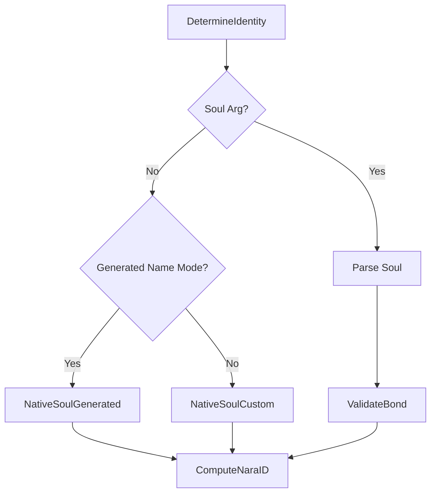

nara binds human-readable names to cryptographic "souls," enabling decentralized verification and stable identifiers.

## 1. Purpose
- Provide stable, portable identities for autonomous agents.
- Enable cryptographic signing of events and network state.
- Support deterministic identity generation from hardware fingerprints.
- Allow seamless identity migration across physical nodes.

## 2. Conceptual Model
- **Soul (V1)**: 40-byte value consisting of a 32-byte seed and an 8-byte HMAC bond tag.
- **nara ID**: Base58 hash of `RawSoulBytes || NameBytes`.
- **Keypair**: Ed25519 keypair derived from the soul's seed.
- **Bonding**: The cryptographic link between a soul and a name, verified via HMAC.

### Invariants
- **1:1 Binding**: A specific soul is cryptographically bonded to exactly one name.
- **Stability**: The nara ID MUST persist across restarts and migrations.
- **Native vs. Portable**: "Native" identities are derived from local hardware; "Portable" identities are provided via external configuration.

## 3. External Behavior
- The identity is established at startup and remains immutable for the lifetime of the process.
- All outgoing messages are signed by the local identity.
- Incoming messages are verified against the claimed sender's identity.
- Users can migrate an identity by providing the `-soul` string to a new instance.

## 4. Interfaces
- **CLI Flags**:
  - `-name`: Override the local name.
  - `-soul`: Provide a pre-generated soul string (Base58).
- **Public Types**:
  - `SoulV1`: Struct representing the 40-byte soul.
  - `NaraKeypair`: Ed25519 keypair wrapper.

## 5. Event Types & Schemas
Identity is primarily used for signing `SyncEvent` and `Message` envelopes. It is also featured in:
- `hey-there`: Announces the binding of name, public key, and ID.
- `attestation`: A signed claim about another nara's identity and state.

## 6. Algorithms

### Hardware Fingerprinting
`hwFingerprint = SHA256(machine_id)`. This serves as the root of trust for native identities.

### Soul Generation (HKDF-SHA256)
- **Custom Name**: `Seed = HKDF(salt="nara:soul:v2", info="seed:custom:" + name, secret=hwFingerprint)`
- **Generated Name**: `Seed = HKDF(salt="nara:soul:v2", info="seed:generated", secret=hwFingerprint)`, then `Name = GenerateName(Hex(Seed))`
- **Bonding Tag**: `Tag = HMAC-SHA256(key=Seed, msg="nara:name:v2:" + Name)[0:8]`

### Identity Resolution

### Derivations
- **nara ID**: `Base58(SHA256(RawSoulBytes || NameBytes))`
- **Ed25519 Keypair**: Derived from `Seed` (RFC 8032).
- **Symmetric Key**: `HKDF(salt="nara:stash:v1", info="symmetric", key=Seed)` for stash service.

## 7. Failure Modes
- **Bond Mismatch**: If a provided soul does not match the provided name, the identity is rejected.
- **Seed Collision**: Statistically improbable due to SHA256/HKDF.
- **Hardware ID Change**: A change in `machine_id` will result in a new native identity.

## 8. Security / Trust Model
- **Authenticity**: Guaranteed by the HMAC bond, which prevents name spoofing.
- **Integrity**: All state changes are signed by the nara's private key.
- **Self-Sovereignty**: Users who possess their soul string fully own their identity.

## 9. Test Oracle
- `TestNativeSoulDeterminism`: Verifies consistent generation from the same hardware ID.
- `TestValidateBond`: Ensures names and seeds are correctly paired.
- `TestComputeNaraID`: Validates stable ID generation.
- `TestDeriveKeypair`: Verifies Ed25519 derivation.
- `TestCrossHardwareValidity`: Confirms portability when the soul string is provided.

## 10. Open Questions / TODO
- Consider moving to V2 souls with larger HMAC tags.
- Formalize identity revocation or "retirement" events.
