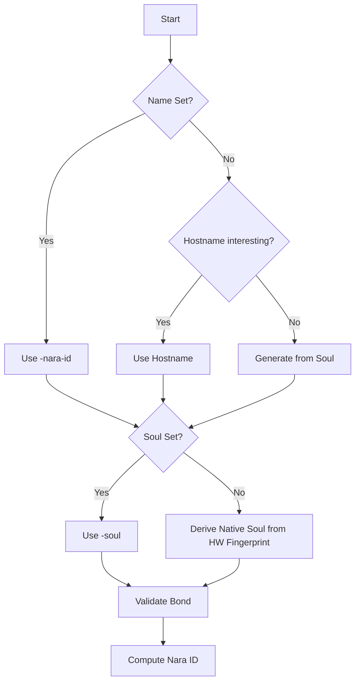

# Identity

Binds human-readable names to cryptographic "souls" for decentralized verification without a central registry.

## Conceptual Model

| Entity | Description |
| :--- | :--- |
| **Name** | Human-readable string (e.g., "jojo"). |
| **Soul** | 40-byte value: 32-byte seed + 8-byte HMAC tag. Encoded in Base58. |
| **Keypair** | Ed25519 (RFC 8032) derived from soul seed. |
| **Nara ID** | `Base58(SHA256(soul_bytes || name_bytes))`. Stable identifier. |

### Invariants
- **Bonding**: `HMAC(seed, name) == tag`. Invalid bonds are "inauthentic" (low trust).
- **Determinism**: Same hardware + same name => same soul.
- **Portability**: `-soul` flag allows identity migration between hardware.
- **Uniqueness**: Names can have multiple souls, but a soul binds to exactly one name.

## Lifecycle

### Startup Resolution

## Algorithms

### Soul Generation
- **Native**: `Seed = HKDF-SHA256(salt="nara:soul:v2", info="seed:custom:" + name, HW_Fingerprint)`
- **Generated**: `Seed = HKDF-SHA256(salt="nara:soul:v2", info="seed:generated", HW_Fingerprint)`, `Name = GenerateName(Hex(Seed))`
- **Tag**: `HMAC-SHA256(Seed, "nara:name:v2:" + Name)[0..8]`

### Derivations
- **Nara ID**: `Base58(SHA256(SoulBytes || NameBytes))`
- **Stash Key**: `HKDF-SHA256(PrivateKey.Seed(), salt="nara:stash:v1", info="symmetric")`

## Event Integration
Identity is included in all signed events.
- **HeyThere / Chau**: Includes `PublicKey` and `ID`.
- **Newspaper**: Includes full `Status` with identity fields.
- **Verification**: Standard Ed25519 signature verification using `PublicKey`.

## Failure Modes
- **Malformed Soul**: Startup fails or falls back to native.
- **Invalid Bond**: `IsValidBond = false`. Node remains functional but peers likely mistrust it.
- **HW Change**: Auto-derived identities change; `-soul` identities persist (marked `IsNative = false`).

## Security
- **TOFU**: Peers trust the first valid soul seen for a name.
- **Impersonation**: Bound by HMAC; forging a soul for an existing name requires the seed. New souls for the same name produce different IDs, causing peer-visible conflicts.

## Test Oracle
- **Determinism**: `NativeSoulCustom` is idempotent. (`identity_soul_test.go`)
- **Bonding**: `ValidateBond` enforces name/seed linkage. (`identity_soul_test.go`)
- **Portability**: Souls function identically across hardware. (`identity_soul_test.go`)
- **ID Stability**: ID derived from Name+Soul, not ephemeral keys. (`identity_detection_test.go`)
- **Signatures**: Ed25519 verification. (`identity_crypto_test.go`)
