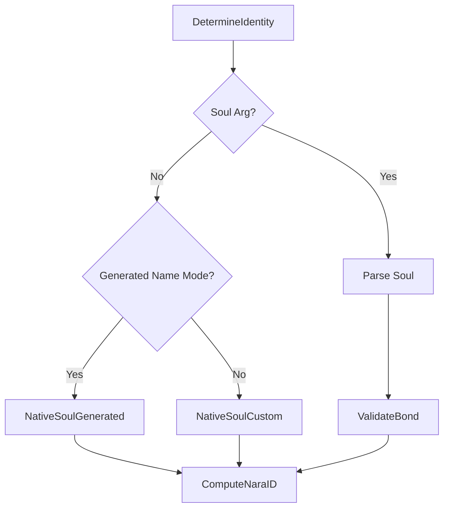

# Identity

Identity in Nara binds human-readable names to cryptographic "souls". This allows for decentralized verification and stable identifiers without a central registry.

## Purpose
- Provide stable, portable identities for autonomous agents.
- Enable cryptographic signing of events and state claims.
- Support deterministic identity generation based on hardware fingerprints.
- Allow migration of identity across different physical nodes.

## Conceptual Model
- **Name**: A human-readable string (e.g., "jojo" or "nara-1234").
- **Soul (V1)**: A 40-byte value consisting of a 32-byte seed and an 8-byte HMAC tag.
- **Nara ID**: A stable, Base58-encoded hash of the raw soul bytes and the name.
- **Keypair**: An Ed25519 keypair derived directly from the soul's seed.
- **Bonding**: A cryptographic link between a soul and a name, verified via the HMAC tag.

### Invariants
- **One Soul, One Name**: A soul is validly bonded to exactly one name.
- **Stable ID**: A Nara's ID depends only on its soul and name, surviving restarts and key rotations (if seeds were to rotate).
- **Native vs. Portable**: An identity is "native" if it matches what the local hardware fingerprint would generate; otherwise, it is "portable".

## External Behavior
- **Verification**: Other naras verify signatures on events using the sender's public key.
- **Trust**: A Nara with an invalid bond (`HMAC(seed, name) != tag`) is considered inauthentic and likely ignored by peers.
- **Stability**: Peers track each other via Nara ID to distinguish between different naras using the same name.

## Interfaces
### CLI Flags
- `-name`: Override the default name (hostname or generated).
- `-soul`: Provide a pre-existing soul (Base58) for identity migration.

### Public Structs
- `SoulV1`: {Seed [32]byte, Tag [8]byte}
- `IdentityResult`: Summary of identity resolution (Name, Soul, ID, IsValidBond, IsNative).
- `NaraKeypair`: Ed25519 PrivateKey and PublicKey.
- `Attestation`: A signed claim (Subject, Observation, Attester, Signature).

## Algorithms

## Algorithms
### Hardware Fingerprinting
The hardware fingerprint (`hwFingerprint`) is a 32-byte hash (SHA256) of machine-specific data (typically the Machine ID or equivalent). It serves as the root of trust for native identity generation.

### Soul Generation
Nara uses HKDF-SHA256 for deterministic soul derivation.

- **Custom Name**:
  - `Seed = HKDF-SHA256(salt="nara:soul:v2", info="seed:custom:" + name, secret=HW_Fingerprint)`
- **Generated Name**:
  - `Seed = HKDF-SHA256(salt="nara:soul:v2", info="seed:generated", secret=HW_Fingerprint)`
  - `Name = GenerateName(Hex(Seed))`
- **Bonding Tag**:
  - `Tag = HMAC-SHA256(key=Seed, message="nara:name:v2:" + Name)[0:8]`
### Identity Resolution Flow

### Derivations
- **Nara ID**: `Base58(SHA256(RawSoulBytes || NameBytes))`
- **Ed25519 Keypair**: `Seed` used directly as the 32-byte seed for Ed25519.
- **Symmetric Key**: `HKDF-SHA256(salt="nara:stash:v1", info="symmetric", key=Seed)` (used for Stash encryption).

### Attestation Signing
- **Signable Content**: `attestation:v{version}:{attester_id}:{subject_id}:{as_of_time}:{restarts}:{total_uptime}:{first_seen}`
  - `version`: defaults to 1
  - `as_of_time`: Unix timestamp
  - `observation`: includes Restarts, TotalUptime, and StartTime
- **Signature**: Ed25519 signature of the signable content string.
## Failure Modes
## Failure Modes
- **Invalid Soul Format**: Startup fails or falls back to generating a native soul.
- **Invalid Bond**: The node starts, but `IsValidBond` is false. Peers will see this in heartbeats and may reject events.
- **Hardware Change**: Without a `-soul` flag, a new hardware fingerprint results in a new identity (new ID, new name if generated).

## Security / Trust Model
- **Authenticity**: Guaranteed by the HMAC bond. You cannot claim a name without knowing the seed that produces the correct tag.
- **Integrity**: Events are signed with Ed25519.
- **Self-Encryption**: The symmetric Stash key allows a Nara to encrypt data that only it (or another node with its soul) can decrypt.

## Test Oracle
- `TestNativeSoulDeterminism`: Verifies that `NativeSoulCustom` produces the same soul for the same name/HW fingerprint.
- `TestValidateBond`: Ensures `ValidateBond` correctly identifies valid/invalid name-seed pairings.
- `TestComputeNaraID`: Checks that ID generation is stable and handles Base58 correctly.
- `TestDeriveKeypair`: Verifies that Ed25519 keys are correctly derived from the soul seed.
- `TestAttestationSigning`: Confirms that `Attestation.SignableContent` matches the expected format for verification.
- `TestCrossHardwareValidity`: Verifies that a soul minted on one machine is valid on another (portability).
