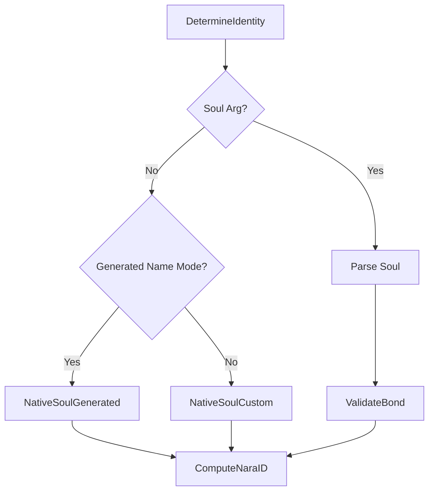

Nara binds human-readable names to cryptographic "souls," enabling decentralized verification and stable identifiers.

## 1. Purpose
- Stable, portable identities for autonomous agents.
- Cryptographic signing of events and state.
- Deterministic identity generation from hardware fingerprints.
- Migration across physical nodes.

## 2. Conceptual Model
- **Soul (V1)**: 40-byte value (32-byte seed + 8-byte HMAC tag).
- **Nara ID**: Base58 hash of `Soul || Name`.
- **Keypair**: Ed25519 derived from the soul's seed.
- **Bonding**: Cryptographic link between soul and name via HMAC.

### Invariants
- **1:1 Binding**: One soul is bonded to exactly one name.
- **Stability**: ID persists across restarts and migrations.
- **Native vs. Portable**: "Native" if derived from local hardware; "Portable" if provided via flag.

## 3. Interfaces
- **CLI**: `-name` (override), `-soul` (migrate).
- **Structs**: `SoulV1`, `IdentityResult`, `NaraKeypair`, `Attestation`.

## 4. Algorithms

### Hardware Fingerprinting
`hwFingerprint = SHA256(machine_id)`. Root of trust for native identities.

### Soul Generation (HKDF-SHA256)
- **Custom Name**: `Seed = HKDF(salt="nara:soul:v2", info="seed:custom:" + name, secret=hwFingerprint)`
- **Generated Name**: `Seed = HKDF(salt="nara:soul:v2", info="seed:generated", secret=hwFingerprint)`, then `Name = GenerateName(Hex(Seed))`
- **Bonding Tag**: `Tag = HMAC-SHA256(key=Seed, msg="nara:name:v2:" + Name)[0:8]`

### Identity Resolution Flow

### Derivations
- **Nara ID**: `Base58(SHA256(RawSoulBytes || NameBytes))`
- **Ed25519 Keypair**: RFC 8032 using `Seed`.
- **Symmetric Key**: `HKDF(salt="nara:stash:v1", info="symmetric", key=Seed)` for Stash.

### Attestation Signing
- **Content**: `attestation:v1:{attester_id}:{subject_id}:{ts}:{restarts}:{uptime}:{first_seen}`
- **Signature**: Ed25519 (RFC 8032).

## 5. Security & Trust
- **Authenticity**: Guaranteed by HMAC bond; prevents name spoofing.
- **Integrity**: Ed25519 signed events.
- **Portability**: Identity migrations via `-soul` flag.

## 6. Test Oracle
- `TestNativeSoulDeterminism`: Consistent generation.
- `TestValidateBond`: Name-seed pairing verification.
- `TestComputeNaraID`: Stable ID generation.
- `TestDeriveKeypair`: Ed25519 derivation.
- `TestAttestationSigning`: Content format verification.
- `TestCrossHardwareValidity`: Portability validation.
