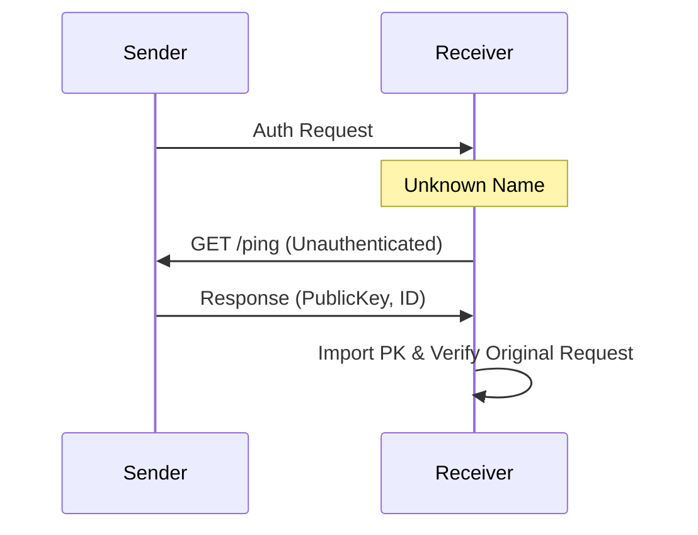

# Mesh HTTP

Mesh HTTP is the transport for sensitive and bulk data exchange, running over an encrypted WireGuard mesh (tsnet/Headscale). It provides authenticated point-to-point links.

## 1. Purpose
- Encrypted/authenticated alternative to MQTT.
- Large data transfers: [Zines](./zines.md) and [Sync](./sync-protocol.md).
- Distributed storage: [Stash](./stash.md).
- Low-latency routing: [World Postcards](./world-postcards.md).

## 2. Conceptual Model
- **Auth**: Mandatory soul-based signatures for all requests except `/ping`.
- **Port**: Default `7433`.
- **Middleware**: Unified `meshAuthMiddleware` for verification and discovery.

### Invariants
- **Identity Headers**: `X-Nara-Name`, `X-Nara-Timestamp`, `X-Nara-Signature`.
- **Clock Tolerance**: ±30 seconds.
- **Mutual Auth**: Both requests and responses are signed.

## 3. Interfaces

### Authenticated Headers
- **Request**: Ed25519 signature of `{name}{timestamp}{method}{path}`.
- **Response**: Ed25519 signature of `{name}{timestamp}{base64(sha256(body))}`.

### Core Endpoints
| Endpoint | Method | Purpose |
| :--- | :--- | :--- |
| `/ping` | GET | Latency measurement and PK discovery (Unauthenticated). |
| `/gossip/zine` | POST | Bidirectional event exchange. |
| `/dm` | POST | Single `SyncEvent` delivery. |
| `/events/sync` | POST | Ledger reconciliation. |
| `/world/relay` | POST | [World Postcard](./world-postcards.md) forwarding. |
| `/stash/*` | POST/DEL| [Stash](./stash.md) operations. |

## 4. Algorithms

### Mesh Authentication
1. **Freshness**: `abs(now - ts) <= 30s`.
2. **Key Resolution**: Fetch public key for `X-Nara-Name`.
3. **On-Demand Discovery**: If key is unknown, call `/ping` on sender IP.
4. **Verification**: RFC 8032 (Ed25519) verification.

### Discovery Fallback

## 5. Failure Modes
- **Auth Failure**: Clock drift > 30s or key mismatch.
- **Mesh Partition**: Loss of Headscale connectivity limits node to MQTT.

## 6. Security
- **Transport**: WireGuard (encryption + IP identity).
- **Application**: Ed25519 (end-to-end auth + integrity).
- **Privacy**: Public access restricted to `/ping`.

## 7. Test Oracle
- `TestMeshAuth_SignVerify` / `TestMeshAuth_ClockSkew`.
- `TestMeshAuth_UnknownSenderDiscovery`: On-demand key fetching.
- `TestMeshAuth_ResponseSigning`: Body integrity verification.
