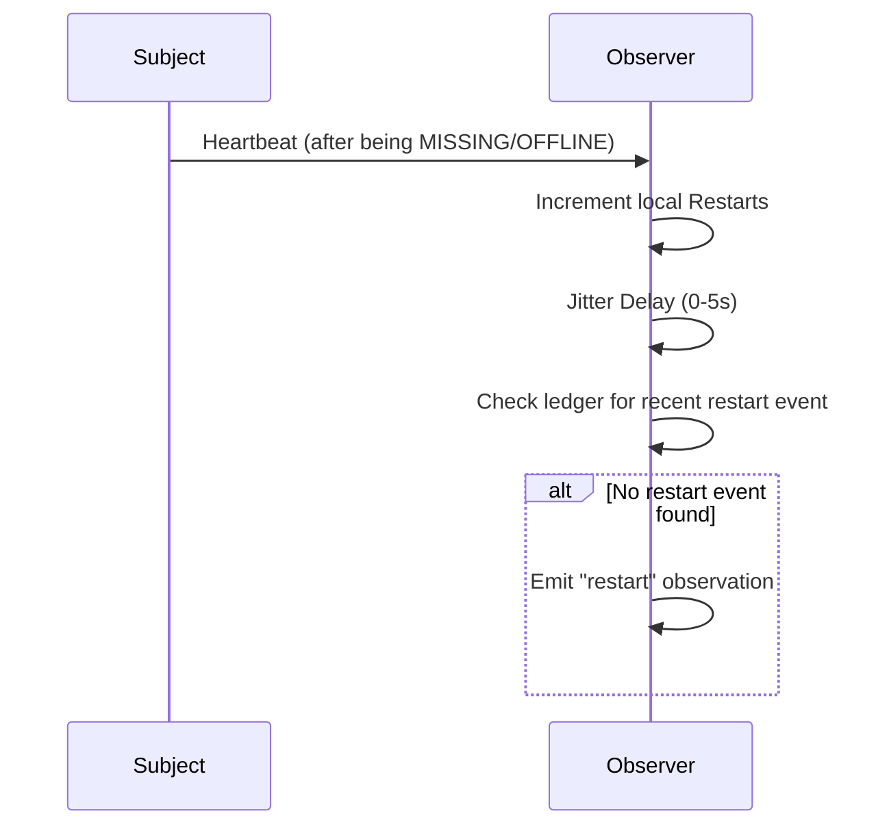

# Observations

Observations allow naras to monitor and agree on peer state (restarts, first-seen, status changes) to derive a collective "opinion" without a central registry.

## 1. Purpose
- Track the **Trinity**: `StartTime`, `Restarts`, and `TotalUptime`.
- Reach decentralized consensus on peer state.
- Provide inputs for social interactions (e.g., teasing).
- Maintain historical continuity across node failures.

## 2. Conceptual Model
- **Observation Event**: A `SyncEvent` containing an **Observer's** claim about a **Subject**.
- **The Trinity**:
    - **`StartTime`**: Unix timestamp of first appearance.
    - **`Restarts`**: Cumulative restart count.
    - **`TotalUptime`**: Verified seconds online.
- **Opinion**: Subjective local calculation of a peer's Trinity.
- **Ghost Nara**: Short-lived entry without meaningful data, eventually garbage collected.

### Invariants
- **Recency**: Latest timestamp is authoritative for online status.
- **Deduplication**: Multi-observer reports of the same restart count once.
- **Tolerance**: 60s window for clock drift in consensus.
- **Persistence**: Restart and first-seen events are never pruned until anchored in a checkpoint.

## 3. External Behavior
- **Maintenance**: Periodic opinion updates and pruning.
- **Verification**: Direct ping before marking a Nara as `MISSING`.
- **Gossip**: Observations spread via zines/sync to inform nodes about unseen peers.
- **Blue Jay**: Optional initial opinion baseline from `https://nara.network/narae.json`.

## 4. Interfaces

### Observation Event (SyncEvent Payload)
- `type`: `restart`, `first-seen`, `status-change`.
- `importance`: 1 (Casual), 2 (Normal), 3 (Critical).
- `online_state`: `ONLINE`, `OFFLINE`, `MISSING`.
- `start_time` / `restart_num`: Metrics at observation time.
- `observer_uptime`: Reporter's uptime for weighting.

## 5. Algorithms

### Opinion Consensus (`DeriveOpinion`)
1. **StartTime**: **Trimmed Mean** of reported values.
2. **Restarts**: Highest `RestartNum` from reliable observer + count of unique `StartTime`s in subsequent restart events.
3. **TotalUptime**: Checkpoint `TotalUptime` + sum of `ONLINE` to `OFFLINE`/`MISSING` intervals since.

### Trimmed Mean Positive
Removes outliers:
1. Filter non-positive values.
2. Calculate median.
3. Keep values within 0.2x to 5.0x of median.
4. Return average of remainder.

### Restart Detection

### Tiered Pruning
- **Newcomers** (< 2d old): Pruned after 24h offline.
- **Established** (2-30d old): Pruned after 7d offline.
- **Veterans** (30d+ old): Never auto-pruned.
- **Zombies**: Immediate pruning if malformed (e.g., `StartTime` > 1h ago but never seen).

## 6. Failure Modes
- **Byzantine Observers**: False reporting mitigated by trimmed mean and verification pings.
- **Divergent History**: Missing gossip cycles lowers derived `TotalUptime`.
- **Clock Drift**: May cause multiple `StartTime` counts for one restart.

## 7. Security / Trust Model
- **Weighting**: High-uptime naras' observations carry more weight.
- **Self-Correction**: Checkpoints provide multi-sig anchors to resolve divergence.

## 8. Test Oracle
- `TestOpinionConsensus`: Trinity derivation from mock events.
- `TestGhostGarbageCollection`: Purge verification.
- `TestRestartDeduplication`: Prevent double-counting.
- `TestVerificationPing`: Validate ping-before-missing.
- `TestOpinionMethodDivergence`: Compare observation vs checkpoint derivation.
