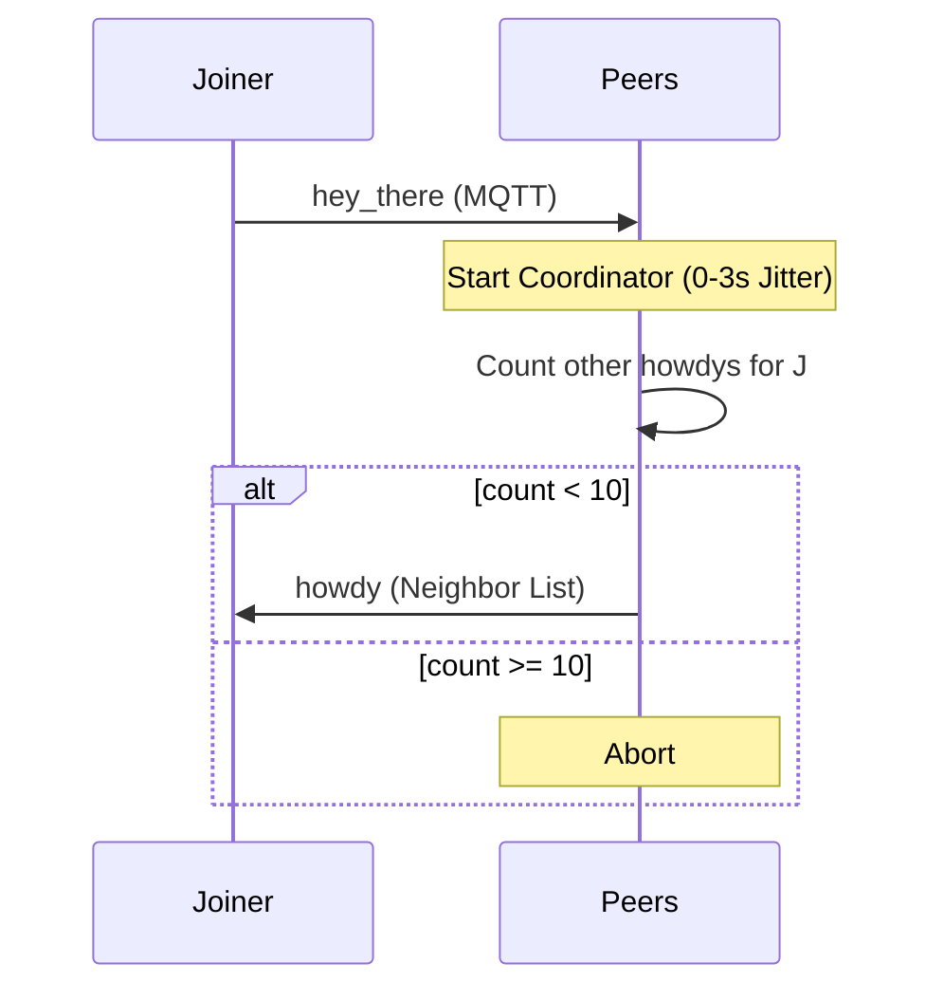

Presence signals enable discovery, liveness tracking, and graceful departures via hybrid MQTT and gossip.

## 1. Purpose
- **`hey_there`**: Announce new nodes.
- **`howdy`**: Bootstrap joining nodes with network and history data.
- **`chau`**: Signal intentional departures.
- **Derived Status**: Track liveness from any signed activity (pings, social, etc.).

## 2. Conceptual Model
- **Liveness Thresholds**: Mark **MISSING** if no events seen within 5m (Plaza) or 1h (Gossip).
- **Status Types**: **ONLINE** (active), **OFFLINE** (graceful exit), **MISSING** (timeout).

### Invariants
- **Evidence-Based**: Ledger activity is the source of truth for status.
- **Thundering Herd Protection**: Up to 10 peers respond with `howdy` using random jitter.
- **Bootstrap Priority**: `chau` events are ignored during initial boot to prevent clobbering live join events.

## 3. External Behavior
- **Join**: Broadcast `hey_there`; wait for `howdy`.
- **Bootstrap**: Neighbors share peer lists via `howdy` to avoid manual discovery.
- **Heartbeat**: `NewspaperEvent` broadcasts full state at decreasing frequency.

## 4. Interfaces

### HeyThereEvent (SyncEvent)
- `PublicKey`, `MeshIP`, `ID`.

### ChauEvent (SyncEvent)
- `PublicKey`, `ID`.

### HowdyEvent (MQTT Only)
- `You`: Newcomer's history (`NaraObservation`).
- `Neighbors`: Up to 10 peers (Name, PK, MeshIP, ID, Observation).
- `Me`: Responder's full `NaraStatus`.

### NewspaperEvent (MQTT Only)
- `Status`: Full `NaraStatus` object.
- `Signature`: Ed25519 of status content.

## 5. Algorithms

### Discovery & Howdy Coordination

### Neighbor Selection (for Howdy)
1. Pick up to 10 **ONLINE** naras.
2. Sort by **least recently active** to maximize network knowledge spread.

### Online Status Projection
Derived from "most recent event wins":
- `hey_there`, `Social`, `Ping`, `Seen`, `Restart` → **ONLINE**.
- `chau`, `Observation(OFFLINE)` → **OFFLINE**.
- `Observation(MISSING)` → **MISSING**.
- **Timeout**: If ONLINE and `now - LastEventTime > threshold` → **MISSING**.

## 6. Failure Modes
- **Storms**: Jitter failure leads to `howdy` spikes.
- **Identity TOFU**: Public keys are Trusted On First Use; potential for name spoofing before key binding.

## 7. Test Oracle
- `TestHowdyCoordination`: Response limit enforcement.
- `TestOnlineStatusProjection`: Event-driven status transitions and timeouts.
- `TestChauEvent`: Graceful exit state.
- `TestHeyThereBootstrap`: Identity/Mesh IP import.
