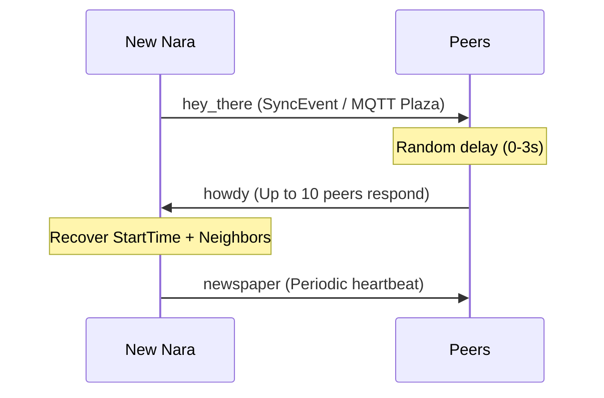

# Presence

Real-time liveness signals enabling peer discovery, status tracking, and graceful shutdowns.

## Conceptual Model

| Signal | Mechanism | Purpose |
| :--- | :--- | :--- |
| **`hey_there`** | `SyncEvent` | "I just arrived" + Identity proof. |
| **`howdy`** | MQTT | Discovery & recovery response to `hey_there`. |
| **`chau`** | `SyncEvent` | "I'm leaving" (Graceful shutdown). |
| **`newspaper`** | MQTT | Periodic status heartbeat (30-300s). |

### Invariants
- **Evidence-Based**: Presence signals are inputs to projections; `chau` is ignored if newer activity exists.
- **Soft State**: Online status expires without periodic refreshment.
- **Boot Safety**: `chau` events are ignored during initial sync to avoid marking peers offline based on stale history.

## Lifecycle

### Discovery Protocol


## Algorithms

### 1. Howdy Coordination
To prevent response storms when a node joins:
1. Wait 0-3s.
2. Listen for other `howdy` responses.
3. If >10 responses seen, **abort**.
4. Send `howdy` containing:
   - `You`: Locally cached observation of the new node (helps them recover `StartTime`).
   - `Neighbors`: Up to 10 online peers (sorted by least recently active).
   - `Me`: Own status.

### 2. StartTime Recovery
Naras recover their forgotten `StartTime` from `howdy` votes:
- Collect `You.StartTime` from responses.
- Weigh votes by sender uptime.
- Apply consensus if votes are within a 60s window.

## Interfaces

### HowdyEvent (MQTT Only)
Signature covers: `howdy:{from}:{to}:{seq}`.
```json
{
  "From": "sender", "To": "target", "Seq": 1,
  "You": { "StartTime": 0, "Restarts": 0 },
  "Neighbors": [ { "Name": "n1", "ID": "id1", "MeshIP": "ip1" } ],
  "Me": { "Status": "ONLINE" }
}
```

### NewspaperEvent (MQTT Only)
Signature covers the raw JSON of the `status` field.
```json
{ "status": { "Name": "nara", "Uptime": 123, ... } }
```

## Failure Modes
- **Lost Howdys**: Isolation until next heartbeat/zine.
- **Split Brain**: MQTT failure forces reliance on slower gossip-based `hey_there` propagation.

## Security
- **Bootstrap**: `hey_there` acts as a self-signed identity certificate (TOFU).
- **Hearsay**: Neighbors in `howdy` are unverified until direct contact (ping/signed event).

## Test Oracle
- **Storm Prevention**: No more than 10 `howdy` responses per join. (`presence_howdy_test.go`)
- **Neighbor Quality**: `howdy` prioritizes online peers. (`presence_howdy_test.go`)
- **State Transition**: `chau` triggers offline state in projections. (`integration_events_test.go`)
