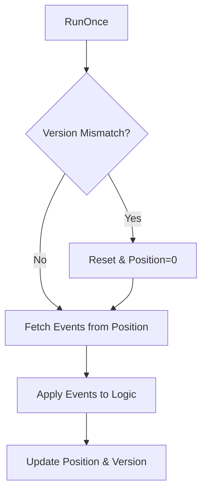

Projections are deterministic, read-only views derived from the event ledger. They transform the stream of facts into actionable, pre-computed state like online status, reputation, and consensus network metrics.

## 1. Purpose
- Transform raw event streams into specific state models (e.g., "Is Alice online?"). See **[Events](/docs/spec/events/)**.
- Reach consensus on peer metrics (The Trinity) without central coordination. See **[Observations](/docs/spec/observations/)**.
- Compute complex, computationally expensive metrics like **[Clout](/docs/spec/clout/)** on-the-fly.
- Decouple interpretation logic from event storage and transport.

## 2. Conceptual Model
- **State Function**: `State = f(Events, Personality)`. See **[Personality](/docs/spec/personality/)**.
- **Incremental Processing**: Projections track their current `position` in the ledger and only process new events since the last run.
- **Auto-Reset**: If the underlying ledger structure changes (e.g., due to pruning), the projection resets its state and replays the entire ledger. See **[Memory Model](/docs/spec/memory-model/)** for pruning logic.
- **Subjectivity**: Some projections (like Clout) are influenced by the local nara's personality.

### Invariants
1. **Read-Only**: Projections MUST NOT emit new events during their processing cycle.
2. **Chronological Order**: Replay MUST follow the chronological order of events to ensure consistent final state.
3. **Determinism**: Given the same set of events (and same personality), a projection MUST always produce the same state.

## 3. External Behavior
- Projections update their state whenever new events are added to the ledger.
- Components query projections to get the "current opinion" of the network state.
- Projections automatically detect ledger structural changes (via `version` increments) and trigger full replays.

## 4. Interfaces
### Projection Structure
- `position`: The index of the next event to be processed.
- `lastVersion`: The structural version of the ledger at the last successful run.
- `RunOnce()`: Processes any new events since the last run.
- `Reset()`: Clears derived state and resets `position` to 0.

### ProjectionStore
- Manages the lifecycle of all projections for a nara.
- `Trigger()`: Forces an immediate update across all managed projections.

## 5. Major Projections

### Online Status
Tracks the liveness of peers based on:
- **Presence**: `hey-there`, `Seen`, `Ping`, or `Social` events mark a nara as `ONLINE`.
- **Graceful Exit**: `chau` events mark a nara as `OFFLINE`.
- **Timeouts**: If no activity is seen within a threshold (5 mins for Plaza/MQTT, 1 hour for mesh/gossip), the nara is marked as `MISSING`.

### Opinion Consensus
Computes consensus for The Trinity (`StartTime`, `Restarts`, `TotalUptime`) by aggregating observations and anchoring them with checkpoints.

### Clout
Calculates social reputation by filtering interactions through a personality-aware "resonance" algorithm.

## 6. Algorithms

### Projection Update Lifecycle
1. Check if `Ledger.Version` matches `Projection.lastVersion`.
2. If version mismatch (and it's not the first run):
   - Invoke `onReset()` callback to clear state.
   - Set `position = 0`.
3. Fetch events from the ledger starting at `position`.
4. If reprocessing from 0, sort events by `Timestamp` to ensure chronological order.
5. For each event, invoke the `handler(event)`.
6. Update `position` and `lastVersion`.

## 7. Failure Modes
- **Divergent Opinions**: Different pruning thresholds across naras may lead to slightly different projection results (Subjective Truth).
- **Processing Lag**: On hardware with very low CPU resources, projections may lag behind a high-volume event stream.
- **Replay Storms**: Frequent pruning in a very active network may cause frequent full replays, increasing CPU load.

## 8. Security / Trust Model
- **Fact-Based**: Projections only process events that have passed cryptographic verification.
- **Outlier Mitigation**: Consensus projections use trimmed-mean algorithms to mitigate the impact of buggy or malicious reports.

## 9. Test Oracle
- `TestProjections_ResetOnPrune`: Verifies that projections correctly detect structural changes and replay the ledger.
- `TestOnlineStatus_Decay`: Ensures that naras transition to `MISSING` after the appropriate inactivity threshold.
- `TestOpinion_ConsensusValidation`: Validates that the consensus algorithm correctly aggregates multiple reports into a single Trinity.
- `TestClout_SubjectiveDivergence`: Confirms that different personalities produce different clout rankings from the same event stream.

## 10. Open Questions / TODO
- Move projection processing to a background worker to avoid blocking API calls.
- Optimize "Full Replay" by using "Projection Checkpoints" to snapshot state at certain ledger positions.
