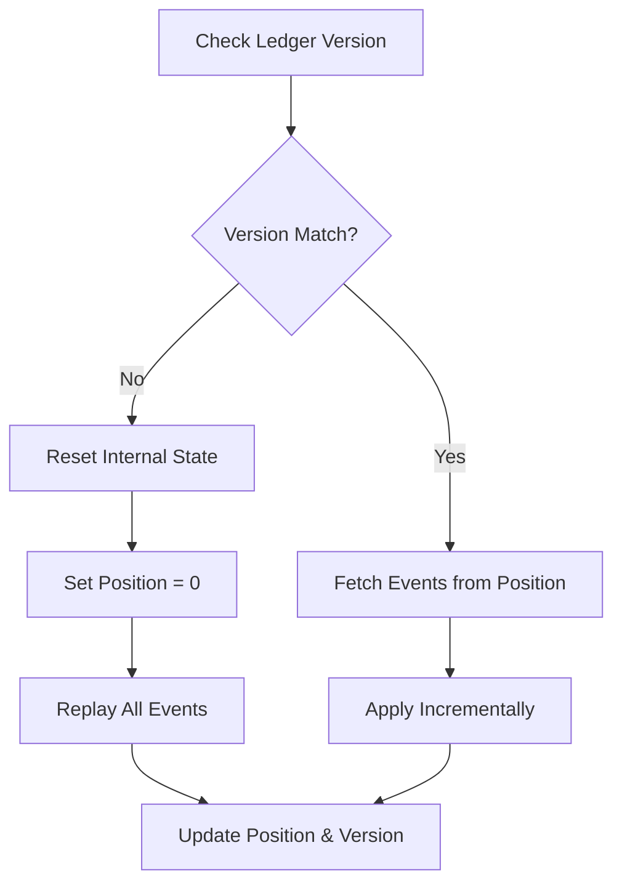

# Projections

Projections are deterministic, read-only models that derive network state (online status, clout, consensus) from the event ledger.

## Conceptual Model

| Rule | Description |
| :--- | :--- |
| **Pure Function** | `State = f(Events)`. Replaying events in order produces identical state. |
| **Read-Only** | Projections do not emit events or mutate the ledger. |
| **Automatic Replay** | Projections detect ledger pruning/version changes and reset/replay automatically. |
| **Incremental** | Updates process only new events unless a reset is triggered. |

## Major Projections

### 1. OnlineStatus
Tracks liveness based on presence and activity.
- **Logic**: Most recent activity wins (`hey-there`, `seen`, `ping`, `social` = ONLINE; `chau` = OFFLINE).
- **Decay**: Transitions to `MISSING` if no ONLINE event occurs within 5-60 minutes (mode-dependent).

### 2. OpinionConsensus
Aggregates observations into a single "truth" for restarts and start times.
- **Start Time**: Trimmed mean of `first-seen` and `restart` event timestamps.
- **Restarts**: Baseline from latest checkpoint + replayed `restart` events.
- **Last Restart**: Max observed timestamp across all restart observations.

### 3. Clout
Calculates reputation from `social` interactions (teases, observed actions).

## Algorithms

### Projection Reset & Replay

### Trimmed Mean Consensus
Used for timestamps and restart counts:
1. Collect all peer observations for a subject.
2. Filter outliers (values outside `[median * 0.2, median * 5.0]`).
3. Calculate the mean of remaining values.

## Interfaces

- `Trigger()`: Forces an immediate update cycle.
- `GetStatus(name)`: Synchronous read of current online state.
- `DeriveOpinion(name)`: Returns consolidated restart and uptime data.

## Security & Trust
- **Subjectivity**: Projections reflect the local node's interpretation of available facts.
- **Integrity**: Guaranteed by the underlying signed events in the ledger.

## Test Oracle
- **Determinism**: `projections_test.go`
- **Reset Logic**: Verify state wipe on ledger pruning. (`projections_test.go`)
- **Consensus Accuracy**: Verify outlier rejection. (`consensus_events_test.go`)
- **Online Transition**: Verify decay to MISSING state. (`presence_projection_test.go`)
