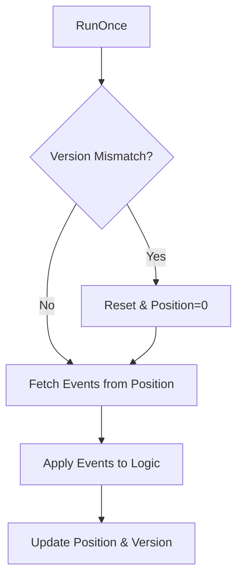

Projections are deterministic, read-only views derived from the event ledger, representing a Nara's subjective "Opinion" of replayed facts.

## 1. Purpose
- Transform event streams into actionable state (e.g., liveness).
- Reach consensus on peer metrics (Trinity) without central coordination.
- Compute complex metrics like [Clout](/docs/spec/clout/) on-the-fly.
- Decouple interpretation logic from event storage.

## 2. Conceptual Model
- **State Function**: `State = f(Events)`.
- **Incremental**: Processes only new events since the last update.
- **Auto-Reset**: Full replay triggered if the ledger version/structure changes.
- **Subjective**: Interpretation influenced by the Nara's personality.

### Invariants
- **Read-Only**: Projections never emit events.
- **Ordered**: Replay follows ledger chronological order.
- **Event-Driven**: Updates triggered by new data or manual calls.

## 3. Major Projections

### Online Status
- **ONLINE**: Triggered by `hey-there`, `Seen`, `Ping`, or `Social`.
- **OFFLINE**: Triggered by `chau`.
- **MISSING**: Activity older than threshold (5m Plaza, 1h Gossip).

### Opinion Consensus
- **Trinity**: Derives consensus `StartTime`, `Restarts`, and `TotalUptime`.
- **Anchoring**: Uses [Checkpoints](/docs/spec/checkpoints/) as trusted baselines.

### Clout
- **Resonance**: Filters interactions via personality-based algorithms.
- **Temporal Weighting**: Newer interactions carry higher weight.

## 4. Algorithms

### Projection Lifecycle (`RunOnce`)

### Consensus Validation
Log warnings if observation-based vs. checkpoint-based opinions diverge significantly (e.g., >5 restarts or >1h `StartTime`).

## 5. Failure Modes
- **Lag**: Processing delay results in stale state.
- **Replay Storms**: Frequent resets due to pruning can be CPU-intensive on `hog` nodes.

## 6. Test Oracle
- `TestProjections_ResetOnPrune`: State wipe verification.
- `TestOnlineStatus_Decay`: Timeout transition logic.
- `TestOpinion_ConsensusValidation`: Drift detection checks.
- `TestClout_SubjectiveDivergence`: Personality-based interpretation variance.
