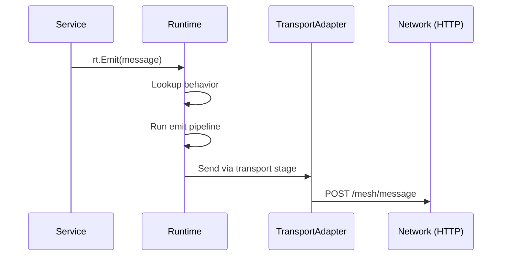
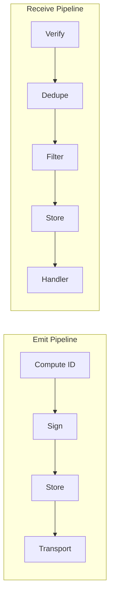

The runtime is nara’s operating system. Every service is a program that runs inside it, and every observable fact is a `Message` flowing through the runtime’s pipelines. The runtime owns storage, transport, logging, and identity primitives so services can remain transport- and protocol-agnostic.

## 1. Purpose
- Describe `Message` as the universal primitive and guarantee that every fact, request, response, and gossip bundle is routed through the same pipeline machinery.
- Provide an orchestrator for services (Init/Start/Stop), so adding new capabilities is a matter of declaring behaviors and letting the runtime handle signing, storage, dedup, gossip, and transport.
- Decouple services from transport details by exposing only `Runtime.Emit`, `Runtime.Receive`, and behavior registration.

## 2. Conceptual Model
- **Message** – envelope with ID/ContentKey, kind/version, sender/target identity, timestamp, payload, signature, and optional `InReplyTo`. IDs are always unique while `ContentKey` encodes semantic equivalence.
- **Behavior** – declarative metadata for each kind: version range, payload types, pipelines for emit/receive, error strategies, and typed handlers.
- **Service** – implements `Service{Name, Init, Start, Stop}` and optionally `BehaviorRegistrar` to teach the runtime how to handle its message kinds.
- **Pipeline** – chains stages (`ID`, `ContentKey`, `Sign`, `Store`, `Gossip`, `Transport`, `Notify`, `Verify`, `Dedupe`, `Filter`, …) whose outcomes are encoded by `StageResult (Continue/Drop/Error)`.
- **TransportAdapter** – bridges runtime transport stages to the legacy `Network` so mesh HTTP and MQTT continue to work without leaking into services.

Invariants:
1. Every emitted message passes through the emit pipeline before any transport call.
2. Every received message is deserialized by the behavior’s payload type, verified, deduped, stored (if configured), and handed to the version-specific handler.
3. Behaviors declare the same handler signature per version (`func(*Message, *Payload)`), letting the runtime use reflection to route payloads.

## 3. External Behavior
- Services call `Runtime.Emit` and build on top of the guarantees that the runtime will set defaults (`Timestamp`, `FromID`, `From`), compute IDs, sign messages, store them when needed, gossip when asked, and deliver them over the requested transport (MQTT, mesh, or no transport).
- Incoming bytes are fed to `Runtime.Receive`; the runtime peeks at the kind/version, deserializes into the behavior’s payload type, runs the receive pipeline, applies the declared error strategy, and finally invokes the version-specific handler.
- Services do not mutate transport state directly: transport adapters handle mesh HTTP and MQTT publication, the ledger adapter stores messages, and the event bus notifies local subscribers.
- Adapters also expose the same `RuntimeInterface` for tests through `runtime.MockRuntime`, which captures emitted messages and lets tests deliver synthetic messages directly to handlers.

## 4. Interfaces
- `RuntimeConfig` / `NewRuntime(cfg RuntimeConfig)` – wires identity (`KeypairInterface`, `Nara`, `Environment`), storage (`LedgerInterface`), transport (`TransportInterface`), gossip queue, and event bus. See `runtime/runtime.go`.
- `Runtime.Emit(msg *Message) error` – sets defaults, enforces version bounds, builds the emit pipeline from the behavior, runs the stages, and applies `ErrorStrategy` on failure.
- `Runtime.Receive(raw []byte) error` – deserializes the envelope, checks if `InReplyTo` matches a pending call, runs the receive pipeline, and dispatches to the version-specific handler.
- `Message` struct – fields `ID`, `ContentKey`, `Kind`, `Version`, `From`, `FromID`, `To`, `ToID`, `Timestamp`, `Payload`, `Signature`, `InReplyTo`. Helper methods: `ComputeID`, `SignableContent`, `VerifySignature`, `Reply`, and `Marshal`. See `runtime/message.go`.
- `Service` interface – `Name() string`, `Init(RuntimeInterface) error`, `Start() error`, `Stop() error`. Services that handle messages also implement `BehaviorRegistrar` and call `runtime.Register` or `Runtime.RegisterBehavior`.
- `Behavior` type – declares `Kind`, `Description`, `CurrentVersion`, `MinVersion`, `PayloadTypes`, `Handlers`, `ContentKey` derivation, `Emit`/`Receive` pipelines (with `Sign`, `Store`, `Gossip`, `Transport`, `Verify`, `Dedupe`, `RateLimit`, `Filter`), and per-stage `ErrorStrategy`. Default templates such as `StoredEvent`, `MeshRequest`, `Ephemeral`, `Local`, etc. See `runtime/behavior.go`.
- `Stage` interface – single method `Process(msg *Message, ctx *PipelineContext) StageResult`. Stages include `IDStage`, `ContentKeyStage`, `DefaultSignStage`, `NoSignStage`, `Store` variants, `Gossip`, transport (`MeshOnly`, `MQTT`), `Verify` variants, dedupe (`IDDedupe`, `ContentKeyDedupe`), filters, rate limiters, and `NotifyStage`. All were implemented in `runtime/stages_emit.go` and `runtime/stages_receive.go`.
- `StageResult` – explicit outcomes `Continue`, `Drop(reason)`, `Fail(error)` and helpers `IsContinue`, `IsDrop`, `IsError`. See `runtime/stage.go`.
- Transport interfaces – `TransportInterface` (`PublishMQTT`, `TrySendDirect`); adapters in `runtime_adapters.go` connect to `Network` (mesh HTTP `/mesh/message` and MQTT topics).
- `KeypairInterface` and adapter – backed by `NaraKeypair` via `NewKeypairAdapter`, used by sign stages.
- `EventBusInterface` – `Emit`/`Subscribe`; production adapter `EventBusAdapter` notifies services when messages are emitted.
- `IdentityAdapter` – exposes `LookupPublicKey`/`LookupPublicKeyByName`/`RegisterPublicKey`; currently created in `runtime_integration.go` but wired in the next chapter.
- `LedgerAdapter` and `GossipQueueAdapter` – currently stubs in `runtime_integration.go` but represent how the runtime will reuse `SyncLedger` and gossip queues later.
- `MockRuntime` – testing helper that implements `RuntimeInterface`, captures emitted messages, and can `Deliver` synthetic messages to registered behaviors. See `runtime/mock_runtime.go`.

## 5. Event Types & Schemas
- Every observable fact is a `Message`. The envelope fields are:
  - `ID`: deterministic but unique per emission (`ComputeID` includes kind, sender, timestamp, payload hash).
  - `ContentKey`: optional semantic key for deduping across observers.
  - `Kind`: fully qualified type (e.g., `stash:store`, `presence:hey-there`).
  - `Version`: schema version. `Runtime.Emit` defaults to `Behavior.CurrentVersion`; `Runtime.Receive` enforces `MinVersion <= version <= CurrentVersion`.
  - `FromID` / `From`: sender identity (name + ID). Runtime fills `FromID` with `MeID()` if missing.
  - `ToID` / `To`: optional direct target identity.
  - `Timestamp`: set on emit when zero.
  - `Payload`: typed struct chosen from `Behavior.PayloadTypes[version]`.
  - `Signature`: Ed25519 signature over `SignableContent`.
  - `InReplyTo`: used by correlators and future Call/response handling (Chapter 3).
- Payload typing is declared via `Behavior.WithPayload`/`PayloadTypeOf` and validated by the runtime during deserialization.
- Typed handlers (`behavior.Handlers[version]`) have the exact signature `func(*Message, *Payload)`; the runtime uses reflection described in `runtime/runtime.go` to invoke the correct handler for each version.

## 6. Algorithms
- **Emit flow**: Services call `Runtime.Emit`. The runtime sets timestamp/identities, looks up the behavior, ensures a version, builds the emit pipeline (`ID`, optional `ContentKey`, `Sign`, `Store`, `Gossip`, `Transport`, `Notify`), runs each stage via `Pipeline.Run`, and reacts to `StageResult` using the behavior’s `Emit.OnError` strategy (`ErrorDrop`, `ErrorLog`, `ErrorRetry`, `ErrorQueue`, `ErrorPanic`).
- **Receive flow**: Raw bytes are parsed to determine `Kind`/`Version`, the behavior’s payload type is used to decode the payload, the receive pipeline is constructed (`Verify`, `Dedupe`, optional `RateLimit`, `Filter`, `Store`, `Gossip`, `Notify`), and the final message is handed to the version-specific handler. If `InReplyTo` matches a pending call, the built-in `CallRegistry` (currently a stub) resolves the response before further handling.

- Emitting services do not see HTTP or MQTT: the emit transport stage picks either `MeshOnly`, `MQTT`, `MQTTPerNara`, or `NoTransport` based on the registered behavior. See `runtime/stages_emit.go`.
- Receiving services do not see buffer management: `Runtime.Receive` handles verification (`DefaultVerify`, `SelfAttesting`, `CustomVerify`, `NoVerify`), deduplication (`IDDedupe`, `ContentKeyDedupe`), filtering (`ImportanceFilterStage`), rate limiting, storage (`DefaultStore`, `ContentKeyStore`), and notification.
- Every stage returns a `StageResult`; the pipeline runner stops if it encounters a drop (`Message == nil`), failure (`Error != nil`), or continues with the potentially mutated message.

## 7. Failure Modes
- If a transport stage fails (MQTT broker missing, mesh target unreachable, `TransportInterface` nil), the stage returns `Fail(err)` and the behavior’s `Emit.OnError` strategy decides whether to drop, log, retry, queue, or panic.
- Verification failures (unknown sender, invalid signature) drop messages via `StageResult.Reason` (`unknown_sender`, `invalid_signature`), respecting the behavior’s `Receive.Verify`.
- Duplicates are dropped either by `IDDedupe` (exact message seen before) or `ContentKeyDedupe` (same semantic fact). The pipeline stops once `Message == nil`.
- Storage failures bubble up as errors; `Runtime.applyErrorStrategy` is invoked with `Receive.OnError` or `Emit.OnError`.
- Unsupported versions or unregistered kinds cause `Runtime.Receive`/`Emit` to return an error immediately.
- `TransportAdapter.TrySendDirect` fails when the target has no mesh IP or when HTTP `/mesh/message` returns non-200; these errors surface via `Fail(err)` so the runtime can apply the configured `ErrorStrategy`.

## 8. Security / Trust Model
- `Message.Signature` is computed by the runtime using `KeypairInterface.Sign` (`KeypairAdapter` wraps `NaraKeypair`). Services cannot bypass signing unless they explicitly opt into `NoSign`.
- `DefaultVerify` looks up public keys via `Runtime.LookupPublicKey` (to be provided by `IdentityAdapter` once wired in) and rejects messages with invalid or missing signatures.
- Services that carry public keys in payloads use `SelfAttesting` to extract the key and register it for future use.
- `InReplyTo` links responses to pending requests (`Correlator`s) so the runtime can separate request/response flows from the rest of the graph.
- Behaviors can set `Receive.Filter` to drop low-importance messages for chill personalities, but the runtime enforces that critical messages (importance 3) cannot be filtered.

## 9. Test Oracle
- Any runtime change must keep the stash service tests green (`services/stash/service_test.go`): they use `runtime.NewMockRuntime` to assert that `StoreWith` emits a `stash:store`, that `Deliver` triggers `stall:ack`, that `RequestFrom`/`Response` negotiate `InReplyTo`, and that invalid payloads yield failure acknowledgements.
- `runtime.NewMockRuntime` itself is the canonical test double for the runtime: it captures `Emitted` messages, lets tests inject payloads through `Deliver`, and validates handler invocation via the behavior registry (`runtime.ClearBehaviors`, `runtime.Register`). See `runtime/mock_runtime.go`.
- `TestStashStoreAndAck`, `TestStashRequestAndResponse`, `TestStashRequestNotFound`, and `TestStashInvalidPayloads` verify that the runtime correctly wires emit/receive pipelines, version-specific handlers, and correlators.

## 10. Open Questions / TODO
- `runtime.LookupPublicKey`, `RegisterPublicKey`, and the `IdentityAdapter` are hooked but not fully wired; public keys still rely on the legacy network map until Chapter 2 completes.
- `LedgerAdapter` and `GossipQueueAdapter` are stubbed to no-op; the runtime currently skips persistent storage and gossip queueing for stash. Full ledger tracking will be added later.
- `CallRegistry.Register`/`Resolve` are placeholders supported in interfaces but not implemented; Chapter 3 will resume request/response semantics beyond the current correlator-based work.
