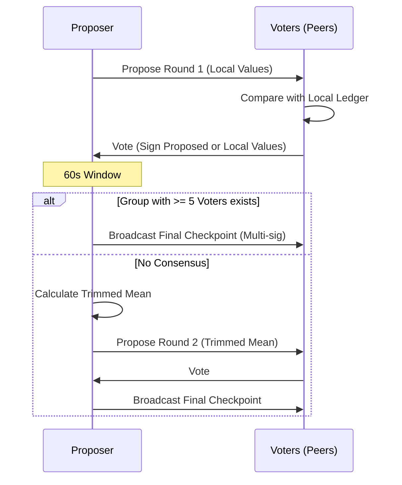

Checkpoints provide multi-party consensus for anchoring historical state (restarts, uptime, first-seen). They create trusted snapshots that survive network restarts and ledger pruning.

## 1. Core Objectives
- Anchor historical facts that predate the current event-sourced system, using [observed Trinity values](/docs/spec/services/observations/).
- Create multi-party attestations of network state (uptime, restarts).
- Accelerate synchronization for new nodes by providing verified snapshots of the network state.

## 2. Conceptual Model
- **Proposal**: A nara proposes a snapshot of its own state (`Restarts`, `TotalUptime`, `StartTime`).
- **Vote**: Peers compare the proposal against their local ledgers and sign the values they believe are correct.
- **Consensus**: A two-round process to reach agreement even when peers have slightly different data.
- **Chain of Trust (v2)**: Each checkpoint links to the ID of the `PreviousCheckpointID`, forming a linear history.

### Invariants
1. **Multi-sig Trust**: A checkpoint requires ≥ 2 signatures from known peers and ≥ 5 total voters to be considered valid.
2. **Subject-Initiated**: Only the subject nara can initiate a proposal for its own checkpoint.
3. **As-Of Stability**: All voters must sign the exact same `AsOfTime` and set of values.
4. **Immutability**: Checkpoints are never pruned from the ledger.
5. **Chain Continuity**: v2 nodes MUST ignore proposals or votes that do not correctly reference the previous checkpoint ID in the chain.

## 3. External Behavior
- **Frequency**: Checkpoints are typically proposed every 24 hours.
- **Consensus Window**: There is a 1-minute window on MQTT for collecting votes.
- **Gossip**: Once finalized, checkpoints are broadcast via MQTT and merged into the `SyncLedger` of all nodes.
- **Backwards Compatibility**: v2 nodes reject v1 proposals to prevent "unchained" history from being injected.

## 4. Interfaces

### MQTT Topics
- `nara/checkpoint/propose`: Proposer broadcasts their state.
- `nara/checkpoint/vote`: Peers broadcast their attestations.
- `nara/checkpoint/final`: Proposer broadcasts the multi-sig `SyncEvent`.

### CLI / API
- Checkpoints are visible in the `SyncLedger` and used by projections to set the "base" values for opinions.

## 5. Event Types & Schemas

### `checkpoint` (SyncEvent Payload)
- `Version`: Format version (e.g., 2).
- `Subject` / `SubjectID`: The nara this checkpoint is about.
- `PreviousCheckpointID`: ID of the preceding checkpoint in the chain.
- `Observation`: The agreed Trinity values (`Restarts`, `TotalUptime`, `StartTime`).
- `AsOfTime`: The shared timestamp (Unix seconds).
- `VoterIDs`: List of nara IDs who participated.
- `Signatures`: Array of Ed25519 signatures.

## 6. Algorithms

### Consensus Flow
1. **Propose**: Subject broadcasts `CheckpointProposal` (Round 1).
2. **Vote**: Peers compare with local `SyncLedger`. If within tolerance (5 restarts, 60s time), they sign the proposal.
3. **Analyze**: If ≥ 5 identical attestations are collected, the proposer finalizes.
4. **Round 2 (Fallback)**: If Round 1 fails, the proposer calculates a **Trimmed Mean** of all received votes and proposes that as Round 2.
5. **Finalize**: Proposer bundles the signatures and broadcasts the `SyncEvent`.

## 7. Failure Modes
- **Insufficient Voters**: If fewer than 6 naras (proposer + 5 voters) are online, consensus cannot be reached.
- **Consensus Divergence**: If voters cannot agree even in Round 2, the checkpoint fails and will be retried after 24 hours.
- **Chain Split**: If a node misses a checkpoint, it cannot vote on the next one because it won't know the correct `PreviousCheckpointID`.

## 8. Security / Trust Model
- **Byzantine Resistance**: The combination of multi-signature requirements and trimmed-mean logic prevents a single actor from corrupting historical state.
- **Voter Selection**: Proposers prefer signatures from peers with higher uptime to increase the reliability of the anchor.

## 9. Test Oracle
- `TestCheckpoint_Consensus`: Verifies that identical votes trigger immediate finalization.
- `TestCheckpoint_Round2TrimmedMean`: Validates that outliers are removed when calculating the Round 2 proposal.
- `TestCheckpointV2Format`: Ensures `PreviousCheckpointID` is correctly included and verified.
- `TestCheckpointV2NodeRejectsV1Proposal`: Confirms version gating.

## 10. Open Questions / TODO
- Implement a mechanism for "catch-up" when a node has missed an intermediate checkpoint in the chain.
- Explore using checkpoints to prune very old `SyncEvent` data from the ledger.
