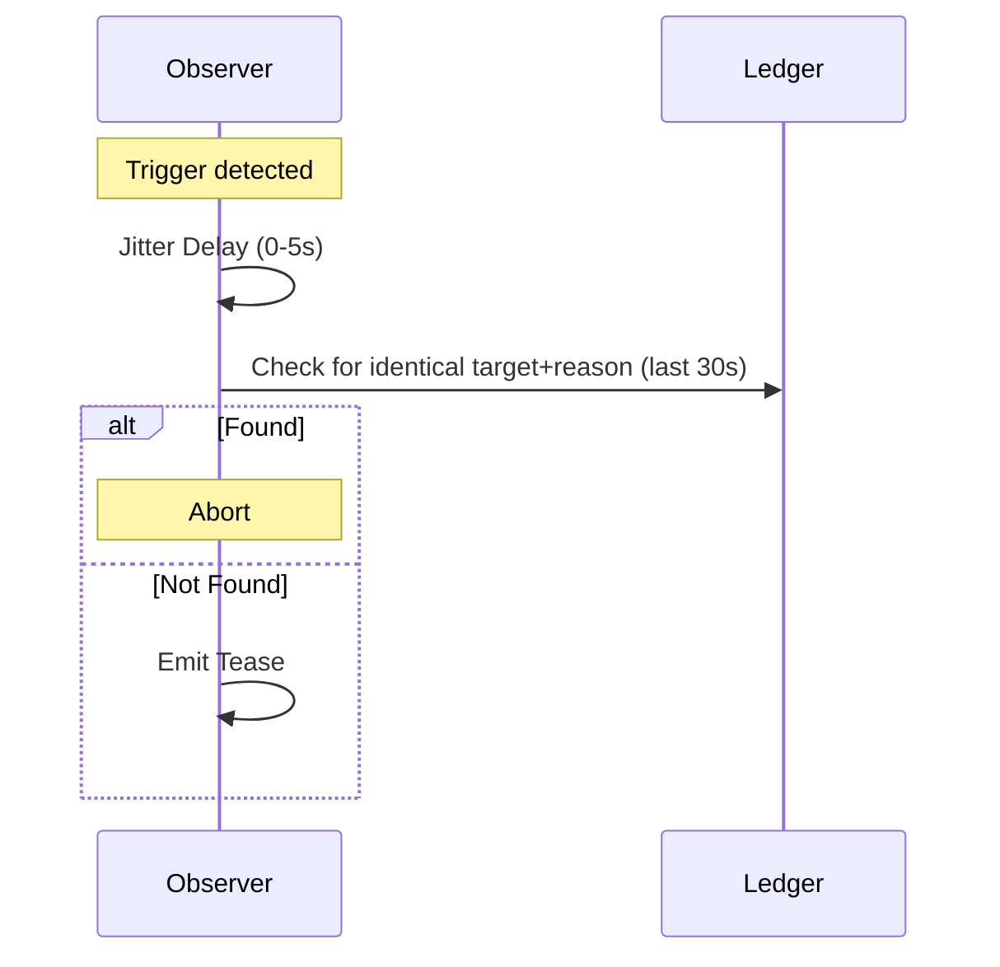

Social events enable naras to interact, judge, and participate in collective behaviors like trends and "buzz." They turn cold network metrics into human-readable social narrative.

## 1. Purpose
- Create human-readable network activity for the UI and logs.
- Drive the subjective reputation system ([Clout](/docs/spec/clout/)).
- Model collective behaviors (trends) and network energy (Buzz).
- Provide a basis for autonomous "drama" and interaction.

## 2. Conceptual Model
- **SocialEvent**: An interaction payload contained within a `SyncEvent`.
- **Teasing**: Subjective commentary or "jabs" at a peer's state or behavior.
- **Buzz**: A numerical metric representing the current "energy" or activity level of the network.
- **Trends**: Collective participation in shared movements or styles, influenced by personality.

### Invariants
1. **Subjective Resonance**: A nara's personality determines whether a social event is considered "meaningful" enough to be stored.
2. **Anti-Pile-On**: Jitter and ledger checks prevent multiple naras from emitting the exact same commentary simultaneously.
3. **Cooldown**: naras enforce a 5-minute local cooldown per target for specific interaction types.
4. **Deterministic Interaction**: The choice to tease or join a trend is influenced by the nara's soul-derived traits.

## 3. External Behavior
- naras monitor the ledger for "teasable" moments (e.g., a peer reaching 69 restarts).
- naras join or leave trends based on their Agreeableness and the trend's current popularity.
- The Web UI visualizes "Shooting Stars" and animations for social events to reflect network Buzz.

## 4. Interfaces
- `SocialEventPayload`: The payload structure for `SyncEvent` (type: `social`).
- `BuzzProjection`: Computes local and network-weighted buzz levels.
- `TrendManager`: Handles joining, starting, and abandoning trends.

## 5. Event Types & Schemas
### `social` (SyncEvent Payload)
- `type`: `tease`, `observed`, `gossip`, `observation`, `service`.
- `actor`, `actor_id`: The nara initiating the interaction.
- `target`, `target_id`: The nara being interacted with.
- `reason`: The social trigger (e.g., `nice-number`, `high-restarts`).
- `witness`: Optional third-party nara reporting the event.

### Tease Reasons
- `high-restarts`: Peer exceeds a specific restart threshold.
- `comeback`: Peer returns to `ONLINE` status after being `MISSING`.
- `trend-abandon`: Peer leaves a popular (>30%) trend.
- `nice-number`: Milestone or meme numbers (e.g., 42, 69, 100, 420).
- `random`: A rare, probabilistic "poke" to keep things interesting.

## 6. Algorithms

### Buzz Calculation
- **Local Buzz**: Incremented by sent/received teases and joining trends.
- **Decay**: Buzz naturally decays over time (e.g., -3 every 10 seconds).
- **Weighted Buzz**: A combination of local activity, the average network buzz, and the maximum buzz reported by any peer.

### Anti-Pile-On
To prevent redundant commentary:
1. When a trigger is detected, the nara waits for a random jitter delay (0-5s).
2. It then checks the ledger for any event with the same `target` and `reason` within the last 30 seconds.
3. If such an event exists, the nara aborts its own tease.

### Trend Logic (Every 30s)
- **Joining**: Chance is a function of `Agreeableness` and the trend's popularity.
- **Starting**: Chance is a function of `Sociability`.
- **Rebel Trends**: naras with very low `Agreeableness` may start "underground" trends when the dominant trend becomes too popular (>50%).

## 7. Failure Modes
- **Buzz Saturation**: If the network is extremely active, buzz may stay at its maximum level, losing its utility as a differentiator.
- **Trend Stagnation**: If every nara is highly Agreeable, the network may get stuck in a single permanent trend.

## 8. Security / Trust Model
- **Authenticity**: Social events must be signed by the actor.
- **Hearsay**: `gossip` type events are treated as lower-confidence data than direct observations.

## 9. Test Oracle
- `TestTeaseCooldown`: Ensures naras don't tease the same target too frequently.
- `TestNiceNumbers`: Verifies that meme and milestone numbers correctly trigger teases.
- `TestTrendTransition`: Validates that Agreeableness correctly influences trend adoption.
- `TestBuzzDecay`: Confirms that the buzz level decreases when activity stops.

## 10. Open Questions / TODO
- Implement "Social Conflict" where naras with opposing traits have a higher chance of teasing each other.
- Link trend participation to Aura color modifiers.
