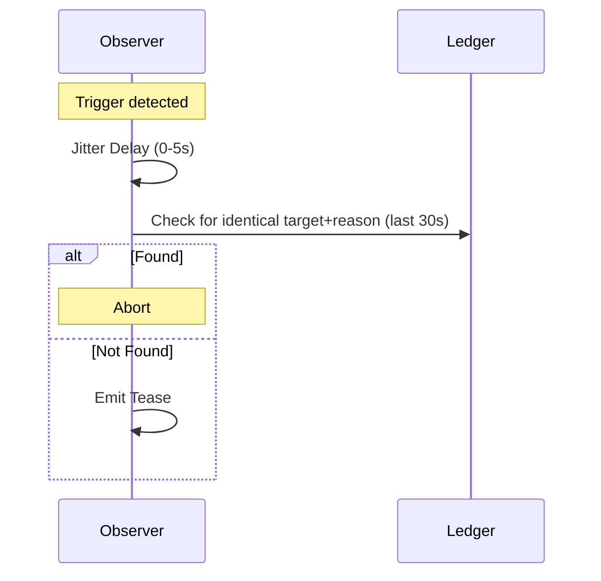

Social events enable naras to interact, judge, and participate in collective behaviors like trends and "buzz."

## 1. Purpose
- Human-readable network activity for UI/logs.
- Drive subjective reputation (Clout).
- Model collective behaviors (trends) and network energy (Buzz).

## 2. Conceptual Model
- **SocialEvent**: Interaction payload in a `SyncEvent`.
- **Teasing**: Subjective commentary on a peer's state.
- **Buzz**: Metric (0-182) representing activity "energy."
- **Trends**: Collective participation in shared movements/styles.

### Invariants
- **Subjective Resonance**: Personality determines if an event is noticed/stored.
- **Anti-Pile-On**: Jitter + ledger check prevents redundant commentary.
- **Cooldown**: 5-minute local limit per target.
- **Determinism**: Behavior derived from the Nara's soul.

## 3. Personality Traits
Derived from **Soul**: `Seed = binary.BigEndian.Uint64(SHA256(Soul)[:8])`.
- **Agreeableness**: Trend adoption and event filtering.
- **Sociability**: Frequency of interactions and trend initiation.
- **Chill**: Memory decay rate and drama sensitivity.

## 4. Buzz Metric
### Calculation
- **Local Buzz**: (+3 tease sent, +5 received, +2 join); decays by 3 every 10s.
- **Weighted Buzz**: `(Local * 0.5) + (NetworkAvg * 0.2) + (NetworkMax * 0.3)`.

## 5. Interfaces

### SocialEvent Payload
- `type`: `tease`, `observed`, `gossip`, `observation`, `service`.
- `actor`, `target`, `reason`, `witness`.

### Tease Reasons
- `high-restarts`: Exceeds daily threshold.
- `comeback`: Return from `MISSING`.
- `trend-abandon`: Leaving a popular (>30%) trend.
- `nice-number`: Meme/milestone counts (42, 69, 420, 100, 121).
- `random`: Rare probabilistic "poke."

## 6. Algorithms

### Anti-Pile-On

### Trend Logic (Every 30s)
- **Joining**: Chance = `f(Agreeableness, vibe_popularity)`.
- **Starting**: Chance = `f(Sociability)`. Rebels (low Agreeableness) start "underground" trends if top trend > 50%.
- **Leaving**: Chance = `f(100 - Chill, isolation)`.

## 7. Clout & Memory
- **Clout**: `Opinion = f(events, personality)`.
- **Decay**: Half-life modified by `Chill`.
- **Resonance**: `Sociability` increases weight of social events in Clout calculation.

## 8. Test Oracle
- `TestTeaseCooldown` / `TestAntiPileOn`.
- `TestNiceNumbers`: Meme/palindrome detection.
- `TestTrendTransition` / `TestUndergroundTrend`.
- `TestBuzzDecay`: Temporal reduction of energy.
