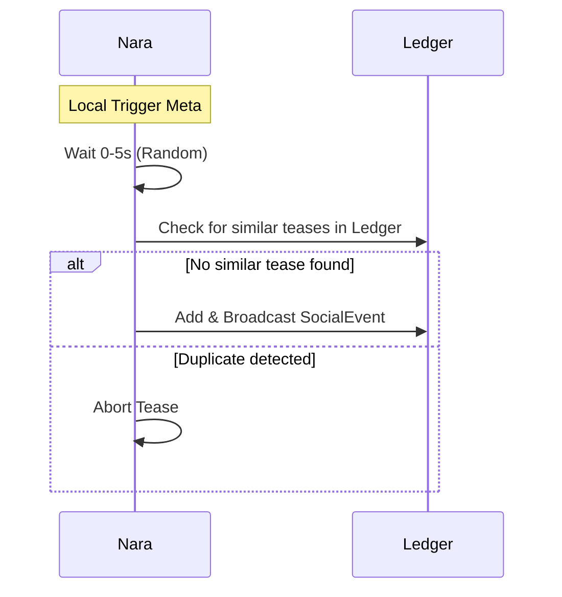

# Social Events

Social events capture teasing, gossip, and lightweight observations, driving the UI timeline and subjective reputation (clout).

## Conceptual Model

| Concept | Rule |
| :--- | :--- |
| **Immutability** | Stored in `SyncLedger` with `svc: social`. |
| **Gating** | Local heuristics (personality + state changes) trigger events. |
| **Spam Protection** | 5-minute cooldown per actor-target pair. |
| **Personality Filter** | Observers drop "unmeaningful" events based on personality (e.g., high Chill). |

## Event Payload (`svc: social`)

```json
{
  "type": "tease | observed | gossip | observation | service",
  "actor": "nara-name",
  "target": "target-name",
  "reason": "reason-code",
  "witness": "witness-name"
}
```

### Common Reasons
- **Tease**: `high-restarts`, `comeback`, `trend-abandon`, `random`, `nice-number`.
- **Observation**: `online`, `offline`, `journey-pass`, `journey-complete`.
- **Service**: `stash-stored`.

## Algorithms

### 1. Tease Triggering (Deterministic)
- **Restarts**: Triggered if rate > 2/day (adjusted by Sociability).
- **Nice Number**: Count matches 42, 69, 100, etc. (Probabilistic).
- **Comeback**: `MISSING` → `ONLINE` and `Sociability > 40`.
- **Random**: Seeded hash of `soul + target + ts`. Base 1% chance.

### 2. Anti-Pile-On


### 3. Personality Filtering (`socialEventIsMeaningful`)
Incoming events are evaluated against the receiver's personality:
- **High Chill**: Filters `random` teases and routine `online`/`offline` logs.
- **High Agreeableness**: Filters conflict-heavy teases.

## Interfaces
- **SSE**: `GET /events` stream for UI.
- **DM**: `POST /dm` for direct mesh-based delivery (signed `SyncEvent`).
- **MQTT**: `nara/plaza/social` broadcast.

## Security
- **Authentication**: All events require Ed25519 signatures.
- **Divergence**: Peers may disagree on what is "meaningful," leading to non-global timelines.

## Test Oracle
- **Determinism**: Tease logic yields consistent results for identical inputs. (`teasing_test.go`)
- **Cooldown**: `TeaseState` enforces silence intervals. (`teasing_test.go`)
- **Filtering**: Verify event dropping based on personality profiles. (`sync_test.go`)
