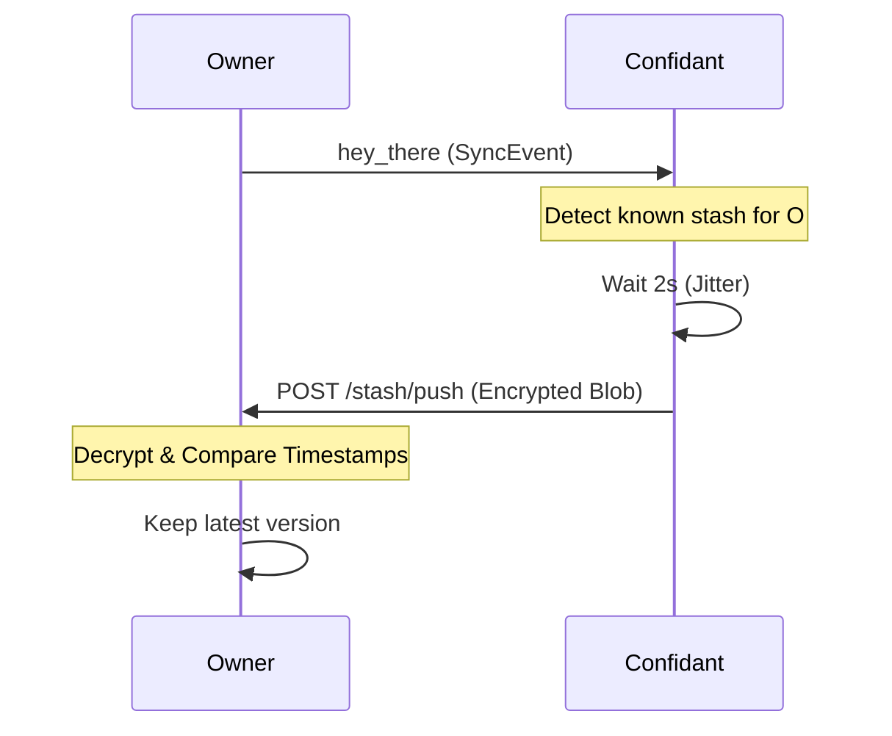

# Stash

Distributed, encrypted, memory-only persistence. Naras store encrypted state with "confidants" to survive restarts without disk persistence.

## Conceptual Model

| Concept | Rule |
| :--- | :--- |
| **Encryption** | XChaCha20-Poly1305 (RFC 8439). Only owner can decrypt. |
| **Storage** | In-memory only. Volatile across network-wide restarts. |
| **Confidants** | Peers chosen to store stashes. Target: 3 per owner. |
| **Privacy** | Confidants see only owner name, nonce, and ciphertext (max 10KB). |

## Algorithms

### 1. Key Derivation & Encryption
1. **Key**: `HKDF-SHA256(PrivateKey.Seed, salt="nara:stash:v1", info="symmetric")`.
2. **Prep**: Gzip-compress JSON state.
3. **Encrypt**: XChaCha20-Poly1305 with 24-byte random nonce.

### 2. Confidant Selection
1. **Rank**: Score peers by `Uptime + MemoryMode`.
2. **Primary**: Best-scoring peer.
3. **Redundancy**: 2 random selections from remaining top-tier peers.
4. **Capacity**: Limits based on memory mode (`short: 5`, `medium: 20`, `hog: 50`).

### 3. Recovery Lifecycle

## Interfaces (Mesh HTTP)
All requests require `X-Nara-Mesh-Auth` headers.

| Endpoint | Method | Purpose |
| :--- | :--- | :--- |
| `/stash/store` | `POST` | Store/update a stash blob. |
| `/stash/retrieve`| `POST` | Explicitly fetch own stash. |
| `/stash/push` | `POST` | Push stash to owner (for recovery). |
| `/stash/store` | `DELETE`| Remove own stash from confidant. |

## Maintenance & Eviction
- **Refresh**: Owners refresh confidant connections periodically.
- **Pruning**: Confidants evict stashes for owners offline > 7 days.
- **Retries**: Failed confidants are blacklisted for 5 minutes.

## Security
- **Confidentiality**: End-to-end encryption via XChaCha20.
- **Integrity**: Poly1305 tag verifies ciphertext authenticity.
- **Access Control**: Storage/deletion gated by Mesh-authenticated identity.

## Test Oracle
- **Round-trip**: Encryption/Gzip/Decryption integrity. (`stash_test.go`)
- **Capacity**: Respects memory mode limits. (`stash_test.go`)
- **Conflict**: Prefers newest timestamp on multi-source recovery. (`stash_test.go`)
- **Eviction**: Automatic cleanup of stale (7-day) stashes. (`stash_test.go`)
