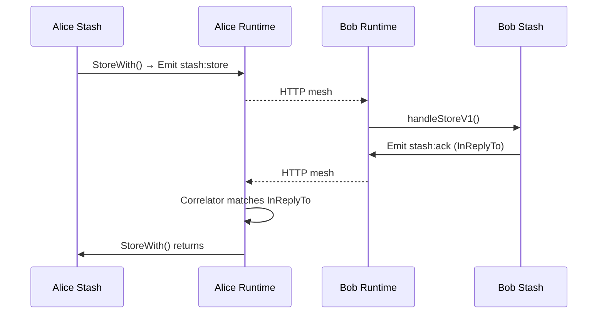

Stash used to be a collection of HTTP handlers. Chapter 1 reimagines it as a runtime service—the reference implementation for every service that will follow. It runs completely on the runtime, emits typed `Messages`, and never talks to HTTP or MQTT directly: the runtime handles transport, signing, deduplication, and delivery.

## 1. Purpose
- Provide encrypted, memory-only persistence for critical blobs by delegating storage to trusted confidants.
- Serve as the template for future runtime services: declare behaviors, implement typed handlers, and let the runtime do the heavy lifting.
- Demonstrate request/response semantics (store/ack, request/response) using the correlator utility and versioned message kinds.

## 2. Conceptual Model
- **Owner** – the nara whose sensitive blob is encrypted and cached elsewhere.
- **Confidant** – a trusted peer that holds encrypted data (nonce, ciphertext, stored timestamp) for the owner.
- **EncryptedStash** – in-memory record containing `OwnerID`, `Nonce` (24 bytes for XChaCha20-Poly1305), `Ciphertext`, and `StoredAt`.
- **Encryptor** – derives a symmetric key from a 32-byte seed (ideally the owner’s Ed25519 seed) via `HKDF-SHA256` and encrypts/decrypts using XChaCha20-Poly1305 (`utilities/encryptor.go`).
- **Correlator** – utility that tracks pending requests, pairs them with responses using `InReplyTo`, and times out after 30 seconds (`utilities/correlator.go`).
- **Runtime Service** – implements `Service` interface, registers behaviors via `services/stash/behaviors.go`, and reacts to messages with typed handlers in `services/stash/handlers.go`.

Invariants:
1. Only the owner can decrypt because the symmetric key is deterministically derived from their seed.
2. Every stash message is a `runtime.Message` with versioned payloads; handlers delegate to `runtime.Message.Reply` to maintain `InReplyTo`.
3. Storage occurs only in RAM (`stored map[string]*EncryptedStash`); the runtime’s ledger adapter is currently a no-op.

## 3. External Behavior
- `StoreWith(confidantID, data)` encrypts `data`, emits `stash:store` to the confidant, and blocks until it receives `stash:ack` from that confidant.
- `RequestFrom(confidantID)` asks a confidant for the owner’s stash, decrypts the result, and returns plaintext or an error.
- `RecoverFromAny` iterates the configured confidant list, calling `RequestFrom` until one succeeds.
- `SetConfidants` seeds the runtime with the list of peers that should hold your stash, and `HasStashFor` is used when acting as a confidant to check existing holdings.
- `stash-refresh` is broadcast via `MQTT` to `nara/plaza/stash_refresh` (see `runtime.Ephemeral` registration). Confidants that know about the owner reply over mesh with `stash:response`.
- Transport: everything except `stash-refresh` uses `MeshOnly` transport so messages travel straight to the target’s `/mesh/message` endpoint; the runtime’s adapters translate this into HTTP and MQTT on behalf of the service.

## 4. Interfaces
- **Service API** (`services/stash/service.go`):
  * `StoreWith(confidantID string, data []byte) error` – encrypts, sends `stash:store`, waits for ack via `storeCorrelator`.
  * `RequestFrom(confidantID string) ([]byte, error)` – sends `stash:request`, waits for `stash:response`, decrypts via the encryptor.
  * `RecoverFromAny() ([]byte, error)` – sequentially calls `RequestFrom` over `confidants`.
  * `SetConfidants(confidantIDs []string)` – reconfigures confidant list for future operations.
  * `HasStashFor(ownerID string) bool` – helper used when the service acts as a confidant.
  * `MarshalState()` / `UnmarshalState()` – snapshot the `confidants` slice and the `stored` map for persistence.
- **Message kinds** (all v1 unless noted):
  * `stash:store` – `messages.StashStorePayload` (owner ID, optional display name, 24-byte nonce, ciphertext, timestamp). Transport: `MeshOnly`. Response: `stash:ack`.
  * `stash:ack` – `messages.StashStoreAck` (OwnerID, StoredAt, Success flag, optional Reason). Used to feed the store correlator.
  * `stash:request` – `messages.StashRequestPayload` (OwnerID, optional RequestID). Transport: `MeshOnly`. Response: `stash:response`.
  * `stash:response` – `messages.StashResponsePayload` (OwnerID, RequestID echo, Found boolean, optional Nonce/Ciphertext/StoredAt). Sent over mesh back to the requester.
  * `stash-refresh` – `messages.StashRefreshPayload` (OwnerID, optional display name). Transport: `MQTT` plaza topic `nara/plaza/stash_refresh`. No direct response; confidants reply with `stash:response` over mesh.
- **Correlator** (`utilities/correlator.go`):
  * `Send(rt RuntimeInterface, msg *runtime.Message) <-chan Result` – ensures `msg.ID` exists, tracks it in `pending`, emits the message, and returns a channel that yields either the response or `ErrTimeout`.
  * `Receive(inReplyTo string, payload Resp)` – matches a response with the request that has the same `ID`. Used by `handleStoreAckV1` and `handleResponseV1`.
- **Encryptor** (`utilities/encryptor.go`): `NewEncryptor(seed []byte)` derives the symmetric key with HKDF (`salt="nara:stash:v1"`, `info="symmetric"`), `Seal` generates a random 24-byte nonce, and `Open` decrypts while verifying the Poly1305 tag.

## 5. Event Types & Schemas
- `messages.StashStorePayload` (`stash:store`):
  * Required: `OwnerID`, `Nonce` (24 bytes), `Ciphertext`.
  * Optional: `Owner` (display name), `Timestamp`.
  * `Validate()` rejects empty owner IDs, non-24-byte nonces, and empty ciphertext.
- `messages.StashStoreAck` (`stash:ack`):
  * Always echoes `OwnerID`.
  * `StoredAt` indicates the confidant’s local clock.
  * `Success` boolean and optional `Reason` for failure.
- `messages.StashRequestPayload` (`stash:request`): requires `OwnerID`, optional `RequestID`.
- `messages.StashResponsePayload` (`stash:response`):
  * Echoes `OwnerID` and `RequestID`.
  * `Found` indicates stash presence.
  * When `Found`, includes `Nonce`, `Ciphertext`, `StoredAt`.
- `messages.StashRefreshPayload` (`stash-refresh`):
  * Contains the `OwnerID` of the owner that is asking for their stash.
  * Broadcast over MQTT (no storage, no signature verification required on the runtime level beyond the normal runtime pipeline).

All stash payloads are versioned (`CurrentVersion = 1`, `MinVersion = 1`) and registered with the runtime in `services/stash/behaviors.go` using `runtime.MeshRequest`/`runtime.Ephemeral`. Typed handlers are provided in `services/stash/handlers.go`.

## 6. Algorithms
- **Storing**: `StoreWith` encrypts the blob (`encryptor.Seal`), constructs a `runtime.Message` with kind `stash:store`, `ToID` set to the confidant, and the payload. The message is emitted via `Runtime.Emit`, which routes it through the mesh transport stage. `storeCorrelator.Send` records the message ID and waits for `stash:ack`; `handleStoreAckV1` sets `InReplyTo` and calls `storeCorrelator.Receive` so the blocking goroutine can resume.
- **Confidant handling**: `handleStoreV1` validates the payload, stores the encrypted stash in `stored` map, and replies with `stash:ack` using `msg.Reply`, which automatically sets `InReplyTo`. Failures emit a negative ack with `Success=false`.
- **Requesting**: `RequestFrom` emits `stash:request` and blocks on `requestCorrelator`. `handleRequestV1` validates the request, looks up the stash, and uses `msg.Reply("stash:response", ...)` to reply with either the encrypted blob or `Found=false`.
- **Response handling**: `handleResponseV1` matches the response to the pending request via `requestCorrelator.Receive`. If the response is `Found`, `RequestFrom` decrypts the ciphertext using the encryptor’s `Open`.
- **Recovery**: `RecoverFromAny` loops over the configured `confidants` and returns the first successful call to `RequestFrom`, logging failures for each peer.
- **Correlator internals**: `Send` pre-computes `msg.ID`, stores a `pendingRequest` with a channel, and emits the message. `Receive` looks up the channel via `InReplyTo`, delivers the payload, and deletes the pending entry. A background `reapLoop` checks for timeouts (30 seconds) and returns `ErrTimeout` when no response arrives.
- **Encryption**: The owner’s encryptor calls `hkdf.New(sha256.New, seed, []byte("nara:stash:v1"), []byte("symmetric"))` to derive a 32-byte symmetric key, uses `chacha20poly1305.NewX` to create the AEAD, generates a random nonce, and seals/decrypts accordingly.
- **Refresh flow**:

Confidants also subscribe to `stash-refresh`; `handleRefreshV1` checks `stored[p.OwnerID]` and, if present, emits `stash:response` so the runtime routes the response back to the owner.

## 7. Failure Modes
- Mesh transport fails when the confidant’s mesh IP is missing (`runtime_adapters.TransportAdapter.TrySendDirect` returns an error), so `StoreWith`/`RequestFrom` surface the error once the correlator channel receives it.
- Correlator timeouts (`ErrTimeout`) occur when no response arrives within 30 seconds; both `storeCorrelator` and `requestCorrelator` propagate that error to the caller.
- Invalid payloads are rejected by `Validate()` and cause `handleStoreV1`/`handleRequestV1` to emit failure responses, preventing malicious or malformed payloads from corrupting state.
- Decryption fails if the cipher text was tampered with or the owner’s seed changed; `Encryptor.Open` returns an error that bubbles to `RequestFrom`.
- If all confidants restart simultaneously, RAM-only storage is lost; recovery requires re-storing or reconfiguring confidants.
- `stash-refresh` broadcasts may leak only the owner’s ID (no ciphertext) via MQTT; secrets travel only over mesh via `stash:response`.

## 8. Security / Trust Model
- Confidentiality is guaranteed by XChaCha20-Poly1305 with a key derived from a private seed. Only someone with the same seed (the owner) can decrypt because the key derivation is deterministic and private.
- Integrity is enforced by Poly1305 tags and runtime signatures. Every stash message is signed by the runtime, and the receiver verifies the signature before running the handler.
- `InReplyTo` ties responses to requests, so correlators cannot be spoofed; an attacker cannot, for example, send a false `stash:ack` without also having access to the owner’s key/ID.
- `stash-refresh` is intentionally limited to MQTT plaza broadcasts that do not carry ciphertext. Confidants respond directly over mesh (`stash:response`), so encrypted payloads never traverse the plaza.

## 9. Test Oracle
- `services/stash/service_test.go` drives the store/ack and request/response flows using `runtime.NewMockRuntime`. Key assertions include verifying that `StoreWith` emits `stash:store`, `stash:ack` carries the correct `InReplyTo`, and the correlators unblock the blocked goroutines (`TestStashStoreAndAck`, `TestStashRequestAndResponse`).
- `TestStashRequestNotFound` proves that missing stashes produce a `stash:response` with `Found=false` and that `RequestFrom` returns an error reflecting the missing data.
- `TestStashInvalidPayloads` ensures invalid `stash:store` payloads generate failure ack messages (`Success=false`, `Reason` present).
- `TestStashStateMarshaling` confirms `MarshalState`/`UnmarshalState` round-trip the confidant list and stored map.
- `TestStashEncryptionDecryption` verifies that `utilities.Encryptor` produces a 24-byte nonce, preserves ciphertext length (plus auth tag), decrypts correctly, and rejects wrong nonces or keys.
- A disabled `TestStashRefreshHandler` documents the expected behavior once MQTT-driven recovery is wired.

## 10. Open Questions / TODO
- The encryptor seed is currently a 32-byte zero slice; future work must derive it from the owner’s Ed25519 key so that the stash follows the owner’s soul.
- Confidant selection remains manual via `SetConfidants`; the runtime does not yet surface automatic heuristics (memory mode, uptime, etc.).
- The runtime’s `LedgerAdapter` and `GossipQueueAdapter` are placeholders, so stash data is never recorded in the sync ledger or gossip zines in Chapter 1.
- `stash-refresh` Recovery currently relies on manual MQTT messages; hooking it into startup/recovery workflows requires MQTT plumbing and is noted by the disabled test.
