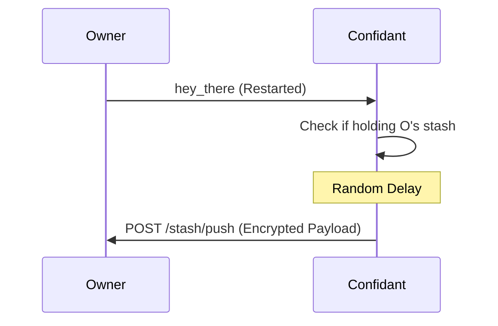

# Stash

Stash is Nara's distributed, encrypted, memory-only storage system. It enables persistence for small (max 10KB) state blobs by storing them with "confidants"—other naras—without local disk use.

## 1. Purpose
- Persistence for essential state (personality, history) without disk.
- Identity migration via `soul`.
- Privacy: Owner-only decryption.
- Availability: Replication across multiple confidants (default: 3).

## 2. Conceptual Model
- **Owner**: Creator and owner of the stash data.
- **Confidant**: Peer storing an encrypted stash for an owner.
- **StashPayload**: Encrypted, compressed blob (owner, nonce, ciphertext).

### Invariants
- **Privacy**: Encrypted with key derived from owner's private soul.
- **Volatility**: Memory-only; lost if confidant restarts.
- **Capacity**: 10KB payload limit.
- **Security**: Operations gated by Mesh-authenticated identity.

## 3. External Behavior
- **Distribution**: Owners seek new confidants if count < 3.
- **Recovery**: Neighbors holding a stash "push" it back to owner upon seeing `hey_there`.
- **Limits**: Stash slots per confidant based on `MemoryMode` (Short: 5, Medium: 20, Hog: 50).
- **Maintenance**: Occurs every 5-10 minutes.

## 4. Interfaces

### HTTP Endpoints
Requires `X-Nara-Mesh-Auth` headers.

| Endpoint | Method | Purpose |
| :--- | :--- | :--- |
| `/stash/store` | POST | Store/update stash. |
| `/stash/store` | DELETE| Delete owner's stash. |
| `/stash/retrieve`| POST | Fetch owner's stash. |
| `/stash/push` | POST | Confidant returns stash to owner. |

### Data Structures
- **StashData**: `{ timestamp, data (JSON), version }`
- **StashPayload**: `{ owner, nonce, ciphertext }`

## 5. Algorithms

### Encryption & Compression
1. **Compress**: Gzip.
2. **KDF**: HKDF-SHA256 (salt="nara:stash:v1", info="symmetric") from Ed25519 seed.
3. **Encrypt**: XChaCha20-Poly1305 with random 24-byte nonce.

### Confidant Selection
Score = `MemoryModeScore + UptimeWeight + Jitter`.
- **MemoryMode**: Hog (+300) > Medium (+200) > Short (+100).
- **Stability**: Prefer long-running naras.

### Ghost Pruning
Evict stash if owner is **OFFLINE** or **MISSING** for > 7 days.

### Recovery (Push)

## 6. Failure Modes
- **Network Wipe**: Simultaneous restart of all nodes loses all data.
- **Soul Loss**: Cannot decrypt recovered stash without original soul.
- **Capacity**: Confidant rejects store if slots are full.

## 7. Security
- **Confidentiality**: XChaCha20-Poly1305.
- **Integrity**: Poly1305 MAC tag.
- **Freshness**: Timestamps prevent replay of old versions.

## 8. Test Oracle
- `TestStashEncryption`: Round-trip encryption/decryption.
- `TestStashStorageLimits`: Memory-mode limit enforcement.
- `TestConfidantSelection`: Scoring and prioritization logic.
- `TestGhostPruning`: Eviction of long-offline owners.
- `TestStashRecoveryPush`: Proactive push mechanism.
