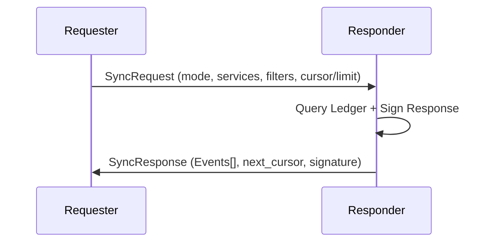

The Sync Protocol enables naras to reconcile "hazy memories" by exchanging events from local ledgers, handling partial connectivity and memory constraints.

## 1. Purpose
- Reconcile missed events after downtime/partitions.
- Distribute historical state (checkpoints) to new nodes.
- Maintain a consistent but subjective shared history.
- Support diverse sync strategies (deep sync vs. casual catch-up).

## 2. Conceptual Model
- **SyncLedger**: In-memory store for syncable events.
- **Deduplication**: Content-hash-based identification.
- **Pruning**: `MaxEvents` limit; removals based on priority and age.
- **Critical History**: `checkpoint`, `restart`, `first-seen` are never pruned.
- **Hazy Memory**: Personality filters social events; memory is unique and subjective.

### Invariants
- **Immutability**: Event IDs are derived from content; modifications are forbidden.
- **Uniqueness**: No duplicate IDs in a single ledger.
- **Priority**: Critical events (Priority 0) are never pruned.
- **Rate Limiting**: Max 10 observations per subject per 5 mins.

## 3. External Behavior
- **Boot Sync**: Startup deep sync (`page` or `sample` mode) from neighbors.
- **Steady State**: Periodic `recent` fetches to fill gaps.
- **Gossip**: Events from sync may be re-gossiped via zines.

## 4. Interfaces

### HTTP API: `POST /api/sync`

**SyncRequest Fields**: `from`, `mode` (sample|page|recent), `services`[], `subjects`[], `limit`, `cursor`, `page_size`, `sample_size`.

**SyncResponse Fields**: `from`, `events`[], `next_cursor`, `ts`, `sig` (Ed25519 of metadata + event IDs).

### SyncEvent Structure
- `id`: 16-char hex hash.
- `ts`: Unix nanoseconds.
- `svc`: Service type (`social`, `ping`, `observation`, `hey-there`, `chau`, `seen`, `checkpoint`).
- `emitter` / `emitter_id`.
- `sig`: Ed25519 (RFC 8032) signature.
- **Payload**: Specific service data.

## 5. Algorithms

### ID Computation
`ID = hex(SHA256(ts_nanos + ":" + svc + ":" + payload)[0:16])`
- **Restart Deduplication**: Uses `subject:restart:restart_num:start_time` payload string.

### Priority-Based Pruning
When `len(ledger) > MaxEvents`, remove by order:
1. Unknown emitter events (no public key).
2. Priority 4: `ping` (ephemeral).
3. Priority 3: `seen`.
4. Priority 2: `social` (teases, gossip).
5. Priority 1: `status-change`, `hey-there`, `chau`.
6. **NEVER PRUNED** (Priority 0): `checkpoint`, `restart`, `first-seen`.

### Observation Compaction
- Max 20 observations per (Observer, Subject) pair.
- Prune `status-change` before `restart`.
- `restart` only pruned if a `checkpoint` exists for the subject.

### Personality & Sampling
- **Weighting**: `Social` events weighted by Sociability and Chill (Chill = faster decay).
- **Sample Mode**:
    - Critical events always included.
    - Decay-weighted: Newer events preferred.
    - Relevance: 2x weight boost for events involving requester.
- **Interleaved Slicing**: `index % sliceTotal == sliceIndex` for distributed coverage.

## 6. Failure Modes
- **Ledger Saturation**: Too many Priority 0 events exceed `MaxEvents`.
- **Clock Skew**: Future-dated events rejected or treated as expired.
- **Schema Cutoff**: Filter checkpoints before `1768271051`.

## 7. Security
- **Authenticity**: Every `SyncEvent` is signed by emitter.
- **Accountability**: `SyncResponse` is signed by responder.

## 8. Test Oracle
- `TestSyncLedger_Deduplication` / `TestSyncLedger_Pruning`.
- `TestSyncLedger_ObservationCompaction`: Restart preservation.
- `TestSyncLedger_GetEventsPage`: Deterministic pagination.
- `TestObservationRateLimit` / `TestSyncLedger_PersonalityFilter`.
- `TestSyncLedger_SampleMode` / `TestSyncLedger_InterleavedSlicing`.
