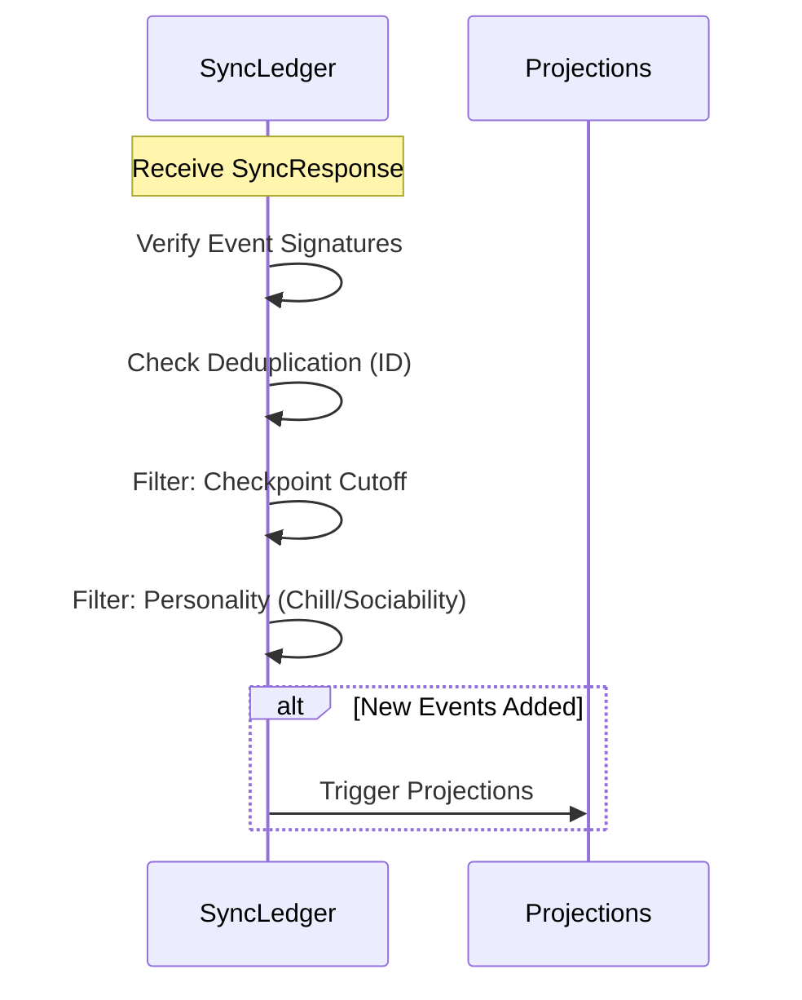

# Sync Protocol

The Sync protocol allows naras to reconcile ledger state ("what did I miss?") through peer-to-peer event exchange.

## Conceptual Model

| Concept | Rule |
| :--- | :--- |
| **Best Effort** | Completeness is not guaranteed; gossip fills gaps. |
| **Hazy Memory** | Peers may return weighted samples of history based on memory limits. |
| **Idempotency** | Ledger merging is deduplicated by Event ID. |
| **Transport** | Primary: HTTP-over-Mesh. Fallback: MQTT gossip. |

## Sync Modes

| Mode | Purpose | Ordering | Behavior |
| :--- | :--- | :--- | :--- |
| `recent` | UI/Catch-up | Descending | Returns the `limit` newest events. |
| `page` | Deep History | Ascending | Returns `page_size` events where `ts > cursor`. |
| `sample` | Hazy Boot | Weighted | Random sampling; prioritizes critical events + recent context. |

## Interfaces

### POST `/api/sync`
**Request Payload**:
```json
{
  "from": "requester-name",
  "mode": "sample | page | recent",
  "services": ["svc1"], "subjects": ["nara1"], // Filters
  "sample_size": 5000, "limit": 100, "cursor": "nanos", "page_size": 5000
}
```

**Response Payload**:
```json
{
  "from": "responder-name",
  "events": [ ... ],
  "next_cursor": "nanos",
  "sig": "base64-sig"
}
```
*Signature covers: `SHA256("{from}:{ts}:" + list_of_event_ids)`.*

## Algorithms

### 1. Weighted Sampling
Prioritizes events for `sample` mode:
1. **Critical (Mandatory)**: `checkpoint`, `hey-there`, `chau`, and importance=3 `observation`s.
2. **Relevance**: Higher weight if `from` or `to` matches request/responder.
3. **Recency**: 30-day half-life decay.
4. **Importance**: `normal` > `casual`.

### 2. Merge & Ingestion


## Lifecycle

- **Boot**: Parallel sync from up to 10 neighbors in `sample` or `page` mode.
- **Background**: Every ~30m (jittered), nodes fetch `recent` events from 1-2 neighbors.

## Security
- **Authentication**: Response signatures verify the peer served the batch.
- **Transport**: Mesh-level encryption (WireGuard).
- **Integrity**: Every event is self-verifying via its own signature.

## Test Oracle
- **Pagination**: Verify contiguous history slices in `page` mode. (`sync_test.go`)
- **Sampling**: Ensure critical events are always present. (`sync_sampling_test.go`)
- **Merging**: Verify deduplication and projection triggers. (`integration_events_test.go`)
