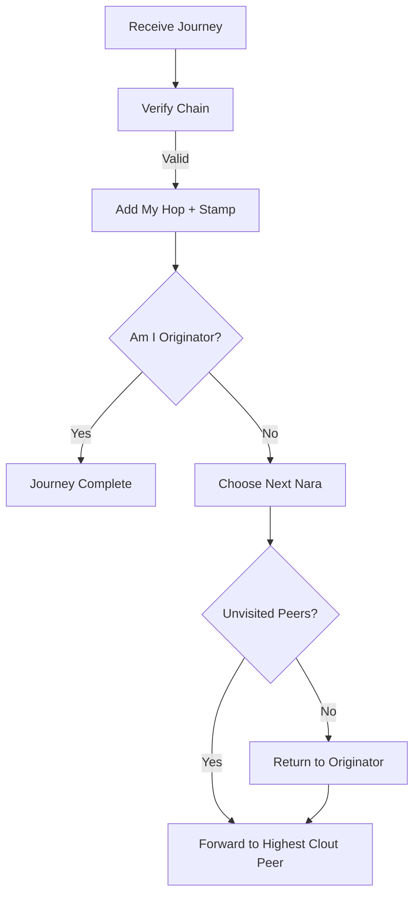

# World Postcards

World Postcards (or World Journeys) are messages that travel from Nara to Nara across the network, accumulating a chain of cryptographic signatures and "emoji stamps" until they return to their originator.
## Purpose
- Provide a collaborative network-wide "game" or activity.
- Demonstrate and verify multi-hop connectivity and identity.
- Reward participation and high reputation (clout) through participation.
- Create a shared, verifiable history of a message's journey.
## Conceptual Model
- **WorldMessage**: The "postcard" itself, containing the original message, the originator, and the chain of hops.
- **WorldHop**: A single stop on the journey, including the Nara's name, timestamp, signature, and an emoji stamp.
- **Originator**: The Nara who starts the journey.
- **WorldHop**: A single stop on the journey, including the Nara's name, timestamp, signature, and an emoji stamp.
- **Originator**: The Nara who starts the journey.
- **Routing**: Decisions about where to send the message next, influenced by reputation (clout).

### Invariants
- **Verifiable Chain**: Each hop signs the entire state of the message up to that point, creating an immutable cryptographic chain.
- **Single Visit**: A journey should visit each Nara at most once before returning to the originator.
- **Single Visit**: A journey should visit each Nara at most once before returning to the originator.
- **Loop Completion**: A journey is "complete" only when it is signed by the originator as the final hop.
## External Behavior
- **Starting a Journey**: A Nara creates a `WorldMessage` and sends it to the online peer with the highest clout.
- **Passing Through**: When a Nara receives a journey, it verifies the chain, adds its own signed hop and emoji stamp, and forwards it to the next unvisited peer.
- **Observation**: Naras who see a journey pass through (or hear about its completion) record `JourneyPass` or `JourneyComplete` events in their ledger.
- **Timeout**: If a journey a Nara participated in doesn't complete within 5 minutes, it is marked as `JourneyTimeout`.
- **Attestation**: The chain of hops serves as a multi-party attestation of the message's path.
## Interfaces
### WorldMessage Structure
- `id`: Unique journey identifier.
- `id`: Unique journey identifier.
- `message`: The text message being carried.
- `originator`: Name of the Nara who started it.
- `hops`: Array of `WorldHop` objects:
  - `nara`: Name of the participant.
  - `timestamp`: Unix time.
  - `signature`: Ed25519 signature of the journey state.
  - `stamp`: An emoji "token of appreciation" added by the Nara.

### MQTT: `nara/plaza/journey_complete`
Broadcast when a journey returns home so other participants can resolve their pending state.

### MQTT: `nara/plaza/journey_complete`
Broadcast when a journey returns home so other participants can resolve their pending state.
## Algorithms
### Hop Signing
A Nara signs the following canonical data:
`SHA256(JSON({id, message, originator, previous_hops, current_nara}))`
### Journey Routing

### Next Nara Selection
1. Filter online peers: exclude self, already visited peers, and the originator.
2. Sort candidates by **Clout** (descending).
3. If no non-originator candidates remain, select the **Originator** (if online) to complete the loop.
4. If the originator is offline and no other candidates exist, the journey is "stuck".

### 3. Rewards
When a journey completes, it generates subjective clout rewards (applied via projections):
- **Originator**: +10 Clout.
- **Participants**: +2 Clout each.

- **Originator**: +10 Clout.
- **Originator**: +10 Clout.
- **Participants**: +2 Clout each.
### Stamp Selection
A Nara picks an emoji stamp deterministically from a pool of 10 emojis based on the current hop count: `pool[len(hops) % 10]`.
## Failure Modes
- **Stuck Journey**: If a Nara has no online, unvisited peers to forward to, the journey dies.
- **Signature Failure**: If any signature in the chain is invalid, the Nara rejects the message and doesn't forward it.
- **Timeout**: If the network is slow or a participant goes offline, the journey may exceed the 5-minute timeout window.
## Security / Trust Model
- **Chain Integrity**: The signature chain prevents participants from reordering, removing, or spoofing hops without breaking the final verification.
- **Authenticity**: Each participant proves their involvement by signing with their private soul.
## Test Oracle
- `TestWorldJourney_ChainVerification`: Verifies that a valid chain of signatures is accepted and an invalid one is rejected.
- `TestWorldJourney_NextNaraSelection`: Ensures that clout-based routing correctly prioritizes highly-reputed peers.
- `TestWorldJourney_CompletionRewards`: Checks that clout is correctly distributed upon journey completion.
- `TestWorldJourney_Timeout`: Validates that pending journeys are correctly purged and recorded as timeouts after 5 minutes.
