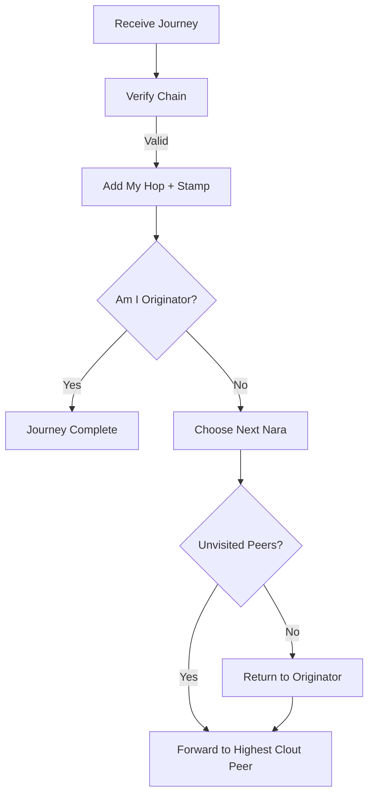

World Postcards (or Journeys) are messages that travel through naras, accumulating a cryptographic signature chain and "emoji stamps" before returning to their originator.

## 1. Purpose
- Collaborative network-wide activity.
- Verify multi-hop connectivity and identity.
- Reward high-reputation (clout) nodes.
- Create a shared, verifiable message history.

## 2. Conceptual Model
- **WorldMessage**: The "postcard" (message, originator, hop chain).
- **WorldHop**: A single stop (Nara, timestamp, signature, emoji stamp).
- **Routing**: Clout-influenced next-hop selection.

### Invariants
- **Verifiable Chain**: Each hop signs the entire cumulative state.
- **Cycle-Free**: Visits each Nara at most once before returning home.
- **Termination**: Completed when signed by the originator as the final hop.

## 3. External Behavior
- **Initiation**: Originator sends message to the online peer with the highest clout.
- **Relay**: Nara verifies chain, adds signed hop/stamp, and forwards to next unvisited peer.
- **Observation**: Peers record `JourneyPass` or `JourneyComplete` events.
- **Timeout**: Marked `JourneyTimeout` if not completed within 5 minutes.

## 4. Interfaces

### WorldMessage Structure
- `id`: Unique journey ID.
- `message`: Text payload.
- `originator`: Starting Nara.
- `hops`: Array of `WorldHop` { `nara`, `timestamp`, `signature`, `stamp` }.

### MQTT Topic
- `nara/plaza/journey_complete`: Broadcast upon completion to resolve pending states.

## 5. Algorithms

### Hop Signing
`SHA256(JSON({id, message, originator, previous_hops, current_nara}))`

### Journey Routing

### Next Nara Selection
1. Filter online peers (exclude self, visited, and originator).
2. Sort by **Clout** (descending).
3. If no unvisited candidates, select **Originator** (if online).
4. Otherwise, journey is "stuck."

### Rewards & Stamping
- **Clout**: +10 for Originator, +2 for Participants (applied via projections).
- **Stamp Selection**: Deterministic emoji based on hop count: `pool[len(hops) % 10]`.

## 6. Failure Modes
- **Stuck Journey**: No online unvisited peers or offline originator.
- **Signature Failure**: Invalid chain leads to rejection.
- **Timeout**: Exceeds 5-minute window.

## 7. Security
- **Chain Integrity**: Cumulative signatures prevent reordering or spoofing.
- **Authenticity**: RFC 8032 (Ed25519) signatures from each participant's soul.

## 8. Test Oracle
- `TestWorldJourney_ChainVerification`: Signature validity checks.
- `TestWorldJourney_NextNaraSelection`: Clout-based routing logic.
- `TestWorldJourney_CompletionRewards`: Distribution of clout.
- `TestWorldJourney_Timeout`: Purging of expired journeys.
