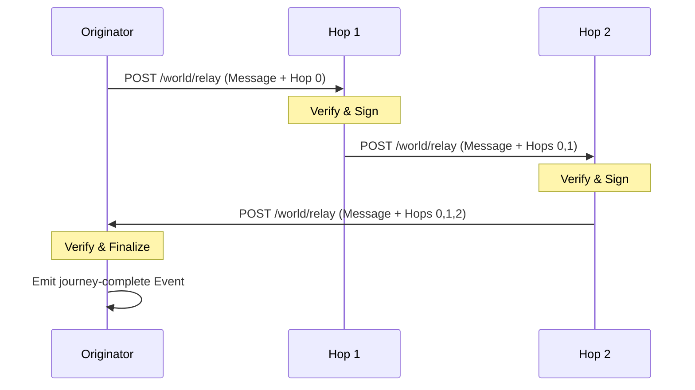

# World Postcards

Messages that travel through the network as a chain of signed hops, creating a shared ritual of participation.

## Conceptual Model

| Concept | Rule |
| :--- | :--- |
| **Integrity** | Each hop signs the entire journey state up to that point. |
| **Loop** | A journey is complete only when it returns to the originator. |
| **Uniqueness** | A nara is visited at most once per journey. |
| **Routing** | Greedy selection based on highest local Clout. |

## Lifecycle



## Algorithms

### 1. Hop Signing (Ed25519)
Signable string: `SHA256(JSON({id, message, originator, previous_hops, current_nara}))`.
This binds the identity of the current hop to the specific message and its entire history.

### 2. Routing (`ChooseNextNara`)
1. **Candidates**: Online, mesh-enabled peers.
2. **Exclude**: Self, originator, and peers already in `Hops` list.
3. **Selection**: Pick candidate with the highest local Clout score.
4. **Fallback**: If no new candidates remain, attempt return to originator.

### 3. Verification
A node must verify **every signature** in the `Hops` list before processing. If any signature fails or the sequence is invalid (e.g., duplicate hop), the message is dropped.

## Interfaces

- `POST /world/relay`: Mesh endpoint for receiving/forwarding messages.
- `GET /world/journeys`: UI endpoint for completed journeys.
- `social` (`svc`): Observation events emitted during pass/completion.

## Data Structures

### `WorldMessage` (JSON)
```json
{
  "id": "16-char-id",
  "message": "string",
  "originator": "name",
  "hops": [{ "nara": "name", "ts": 123, "sig": "...", "stamp": "🌟" }]
}
```

## Failure Modes
- **Stalling**: Journey dies if next hop is unreachable or no candidates exist.
- **Timeout**: Originator cleans up tracked journeys after 5 minutes.
- **Tampering**: Modifying any field (message, ID, previous hops) invalidates all subsequent signatures.

## Test Oracle
- **Chain Integrity**: `VerifyChain` logic. (`world_test.go`)
- **Routing Loop**: `ChooseNextNara` ensures eventual return. (`world_integration_test.go`)
- **Event Trigger**: Completion fires `social` observation. (`world_integration_test.go`)
