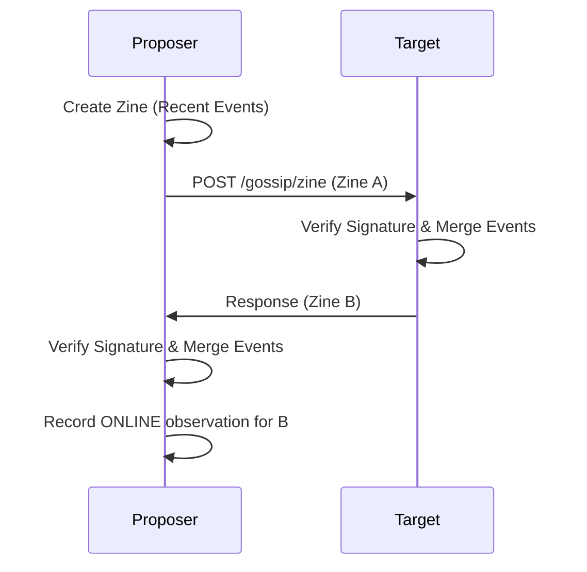

Zines are compact, signed bundles of recent events exchanged point-to-point over Mesh HTTP. They allow naras to propagate history "hand-to-hand" across the network without relying on a central broker.

## 1. Purpose
- Provide a decentralized gossip mechanism independent of MQTT.
- Efficiently propagate recent events (typically the last 5 minutes).
- Enable peer discovery and mesh connectivity tracking.
- Facilitate the creation of a distributed, collective "hazy" memory.

## 2. Conceptual Model
- **Zine**: A signed container for a batch of `SyncEvent` objects.
- **Hand-to-Hand**: A bidirectional exchange; sending a zine to a peer triggers receiving their recent events in response.
- **Mesh Discovery**: The process of finding and validating peers on the private mesh network.
- **Direct Message (DM)**: An optimized delivery mechanism for a single urgent event.

### Invariants
1. **Recency**: Zines MUST primarily focus on recent events to prevent redundant data transfer.
2. **Reciprocity**: A successful zine exchange MUST result in both parties receiving new data.
3. **Authenticity**: Every zine MUST be signed by the publisher to prevent tampering.

## 3. External Behavior
- naras initiate "gossip rounds" at intervals determined by their `Chattiness` parameter.
- They select a small set of random online mesh neighbors for each round.
- A successful exchange updates the observer's opinion of the target to `ONLINE`.

## 4. Interfaces
### HTTP Endpoints
- `POST /gossip/zine`: The primary endpoint for bidirectional zine exchange.
- `POST /dm`: Used for immediate delivery of a single `SyncEvent`.

### Data Structures
- `Zine`: Contains `From` (name), `CreatedAt` (timestamp), `Events` (array of `SyncEvent`), and `Signature`.

## 5. Event Types & Schemas
Zines carry all event types defined in the [Events Spec](/docs/spec/events/).

## 6. Algorithms

### Zine Creation & Signing
1. The publisher queries its ledger for all events with `Timestamp >= (Now - 5 minutes)`.
2. Generate the canonical `signingData`: `SHA256(From + ":" + CreatedAt + ":" + event_id_1 + event_id_2 + ...)`
3. Sign the hash using the publisher's Ed25519 private key.

### Gossip Round Execution

### Mesh Discovery (Subnet Scan)
1. If a nara knows its mesh subnet (e.g., `100.64.0.0/24`), it can perform parallelized `GET /ping` calls across the range.
2. Valid responders are added to the neighbourhood, and their public keys are imported.

## 7. Failure Modes
- **Mesh Outage**: If the mesh is unreachable, naras cannot exchange zines and must fall back to plaza broadcasts.
- **Signature Failure**: If a zine's signature is invalid, it is discarded, and the incident may be logged as a social "tease" or observation.
- **Discovery Lag**: Newly joined mesh peers may not be discovered until the next subnet scan or until they broadcast on the plaza.

## 8. Security / Trust Model
- **Authenticated Transport**: Zine exchanges are protected by the [Mesh HTTP](/docs/spec/mesh-http/) authentication middleware.
- **Payload Integrity**: Each event within the zine is individually signed, and the zine itself is signed as a bundle.

## 9. Test Oracle
- `TestZineSigning`: Verifies that zine bundles are correctly signed and verified.
- `TestGossipRound`: Ensures that events are correctly exchanged and merged between two naras.
- `TestPeerDiscovery`: Validates that the subnet scan correctly identifies active mesh peers.
- `TestDirectMessage`: Confirms that individual events can be delivered outside of a gossip round.

## 10. Open Questions / TODO
- Implement "Editorial Zines" where naras only include events they find "interesting" based on personality.
- Add compression to zine payloads to reduce mesh bandwidth usage.
