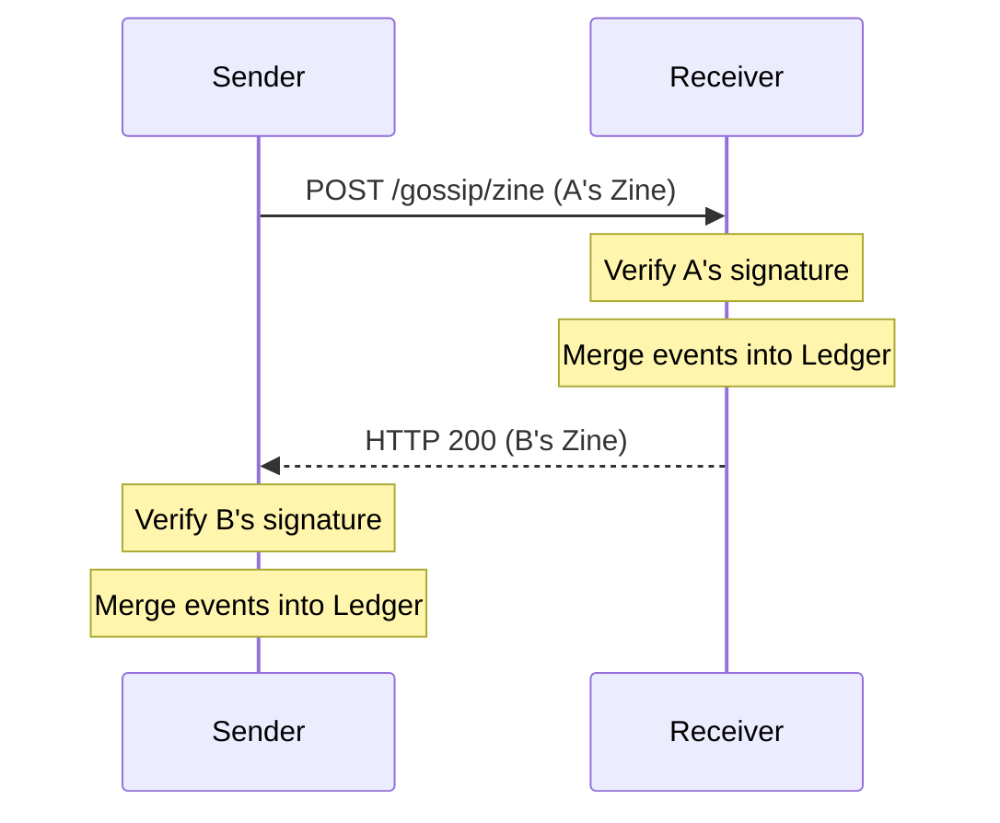

# Zines

Zines are compact, signed bundles of recent events exchanged peer-to-peer over Mesh HTTP, enabling decentralized gossip and memory propagation.

## Conceptual Model

| Concept | Rule |
| :--- | :--- |
| **Gossip** | Bidirectional exchange via `POST /gossip/zine`. |
| **Recency** | Only events from the last ~5 minutes are included. |
| **Authentication** | Signatures verify the sender and the specific batch of event IDs. |
| **Best-Effort** | Failure to exchange reduces propagation speed but not correctness. |

## Algorithms

### 1. Zine Creation
1. Collect all `SyncEvent`s from the ledger where `TS >= (Now - 5m)`.
2. Sort events by timestamp.
3. Sign: `Ed25519(SHA256("{from}:{created_at}:" + event_ids))`.

### 2. Exchange Protocol


### 3. Peer Selection
- Frequency: Every 30-300s (adjusted by Chattiness).
- Target: 3-5 mesh-enabled peers (Reduced to 1-2 in `short` memory mode).

## Interfaces

### Zine Structure (JSON)
```json
{
  "from": "sender-name",
  "created_at": 1700000000,
  "events": [ ... ],
  "signature": "base64-sig"
}
```

## Security
- **Mesh Auth**: Requests require `X-Nara-Mesh-Auth` headers.
- **Batch Integrity**: Zine signature binds the sender to the specific set of events shared.
- **Identity Proof**: Receiving a valid zine from an unknown peer triggers public key discovery.

## Test Oracle
- **Signature**: Verify batch authentication logic. (`integration_gossip_test.go`)
- **Merge**: Verify events from zines are ingested correctly. (`integration_gossip_test.go`)
