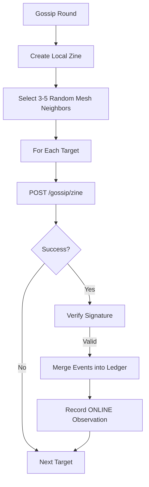

# Zines

Zines are compact, signed bundles of recent events exchanged peer-to-peer over Mesh HTTP. Like underground zines at punk shows, these spread organically through the network, allowing naras to share recent history "hand-to-hand".
## 1. Purpose
- Enable decentralized gossip without relying on MQTT broadcasts.
- Propagate recent events (last ~5 minutes) across the mesh.
- Provide a mechanism for peer discovery and mesh connectivity tracking.
- Facilitate distributed memory through hand-to-hand exchange.
## 2. Conceptual Model
- **Zine**: A signed container for a batch of `SyncEvent` objects.
- **Hand-to-Hand**: Zines are exchanged bidirectionally; when you send a zine, you receive one back.
- **Mesh Discovery**: The process of finding peers on the WireGuard/Tailscale network.
- **Hand-to-Hand**: Zines are exchanged bidirectionally; when you send a zine, you receive one back.
- **Mesh Discovery**: The process of finding peers on the WireGuard/Tailscale network.
- **Direct Messaging (DM)**: A specialized optimization for sending a single event directly to a target.

### Invariants
- **Recency**: Only events from the last 5 minutes are typically included in a zine.
- **Mutual Exchange**: A successful zine exchange always provides events from both parties.
- **Authenticity**: Zines are signed by the publisher's Ed25519 key.

## External Behavior
- **Mutual Exchange**: A successful zine exchange always provides events from both parties.
- **Authenticity**: Zines are signed by the publisher's Ed25519 key.
## 3. External Behavior
- **Periodic Gossip**: Naras perform "gossip rounds" at intervals between 30 and 300 seconds, determined by their `Chattiness`.
- **Target Selection**: During a round, a Nara selects 3-5 random online mesh-enabled neighbors (1-2 in short-memory mode).
- **Liveness Proof**: A successful zine exchange counts as an observation that the peer is "ONLINE".
## 4. Interfaces
### HTTP Endpoints

#### `POST /gossip/zine`
Handles the bidirectional exchange of zines.
**Payload**: `Zine` JSON object.
**Response**: `Zine` JSON object from the responder.
#### `POST /dm`
A "Direct Message" endpoint for immediate delivery of a single `SyncEvent`.
### Data Structures
#### Zine
- `from`: Publisher nara name.
- `created_at`: Unix timestamp (seconds).
- `events`: Array of recent `SyncEvent`s.
- `signature`: Base64 Ed25519 signature.

## 6. Algorithms

### Zine Creation & Signing
1. Query the ledger for events where `Timestamp >= (Now - 5 minutes)`.
2. Generate `signingData`: `SHA256("{from}:{created_at}:" + event_id_1 + event_id_2 + ...)`
3. Sign `signingData` with the Nara's private key.
### Mesh Discovery
Naras find each other on the mesh using two strategies:
1. **Status API**: Query the mesh controller (e.g., Tailscale) for a list of peers.
2. **Subnet Scan**: Parallelized scan of the mesh subnet (e.g., `100.64.0.1-254`) for nodes responding to `GET /ping`.
3. **Public Key Fetch**: If a peer is found but their public key is unknown, perform an unauthenticated `/ping` to retrieve it.
### Gossip Round Execution

1. Create a local zine.
2. Select random targets from the known neighborhood who have `MeshIP` set and are currently `ONLINE`.
3. For each target:

### 3. Gossip Round Execution
1. Create a local zine.
2. Select random targets from the known neighborhood who have `MeshIP` set and are currently `ONLINE`.
3. For each target:
   - `POST` the zine to `http://{target_mesh_ip}:8080/gossip/zine`.
   - On success, verify the signature of the returned zine and merge its events into the local ledger.
   - Record an "ONLINE" observation for the peer.

   - On success, verify the signature of the returned zine and merge its events into the local ledger.
   - Record an "ONLINE" observation for the peer.
## 7. Failure Modes
- **Mesh Unreachable**: If the mesh network is down, the Nara falls back to MQTT or waits for the mesh to return.
- **Signature Mismatch**: Zines with invalid signatures are discarded; the peer's reputation (subjective) might be impacted.
- **Discovery Lag**: New peers might not be found immediately if the subnet scan is slow or the Status API is delayed.
## 8. Security / Trust Model
- **Authenticated Requests**: All mesh requests (Zines, DMs) must include `X-Nara-Mesh-Auth` headers containing an Ed25519 signature of the request metadata.
- **Identity Proof**: Validating a zine signature proves the events came from the claimed publisher.
- **Encryption**: The mesh network (WireGuard) provides transport-layer encryption.
## 9. Test Oracle
- `TestZineSigning`: Verifies that `SignZine` and `VerifyZine` are consistent.
- `TestGossipRound`: Checks that events are correctly shared and merged between two naras.
- `TestPeerDiscovery`: Ensures that subnet scanning correctly identifies active naras.
- `TestDirectMessage`: Validates the immediate delivery of events via the `/dm` endpoint.
- `TestMeshAuth`: Verifies that requests without valid `X-Nara-Mesh-Auth` headers are rejected.
