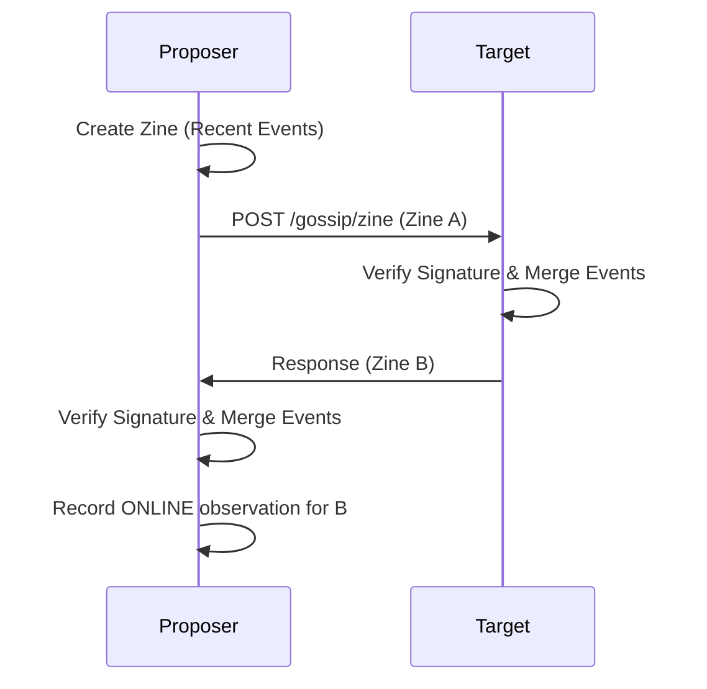

# Zines

Zines are compact, signed bundles of recent events exchanged P2P over Mesh HTTP. They propagate history "hand-to-hand" across the network.

## 1. Purpose
- Decentralized gossip independent of MQTT.
- Propagate recent events (last 5 minutes).
- Peer discovery and mesh connectivity tracking.
- Facilitate distributed "hazy" memory.

## 2. Conceptual Model
- **Zine**: Signed container for a batch of `SyncEvent`s.
- **Hand-to-Hand**: Bidirectional exchange; sending a zine triggers receiving one back.
- **Mesh Discovery**: Finding peers on the WireGuard/Tailscale network.
- **DM (Direct Message)**: Optimized delivery for a single event.

### Invariants
- **Recency**: Typically includes events from the last 5 minutes.
- **Reciprocity**: Successful exchange always provides events from both parties.
- **Authenticity**: Publisher-signed (Ed25519).

## 3. External Behavior
- **Gossip Rounds**: Intervals (30-300s) determined by `Chattiness`.
- **Target Selection**: 3-5 random online mesh neighbors (1-2 if in short-memory mode).
- **Liveness**: Successful exchange confirms peer is `ONLINE`.

## 4. Interfaces

### HTTP Endpoints
| Endpoint | Method | Purpose |
| :--- | :--- | :--- |
| `/gossip/zine` | POST | Bidirectional zine exchange. |
| `/dm` | POST | Immediate single event delivery. |

### Data Structures
- **Zine**: `{ from, created_at, events[], signature }`

## 5. Algorithms

### Zine Creation & Signing
1. Query ledger for `Timestamp >= (Now - 5 minutes)`.
2. Generate `signingData`: `SHA256("{from}:{created_at}:" + event_id_1 + ...)`
3. Sign `signingData` (RFC 8032).

### Mesh Discovery
1. **Status API**: Query mesh controller (e.g., Tailscale).
2. **Subnet Scan**: Parallelized `GET /ping` scan of mesh subnet (e.g., `100.64.0.0/24`).
3. **PK Fetch**: Retrieve unknown public keys via unauthenticated `/ping`.

### Gossip Round Execution

## 6. Failure Modes
- **Mesh Outage**: Fallback to MQTT or retry later.
- **Signature Failure**: Discard zine; potential impact on peer reputation.
- **Discovery Lag**: Latency in finding new peers via scan/API.

## 7. Security
- **Authenticated Requests**: Mesh calls require `X-Nara-Mesh-Auth` headers (Ed25519 signature of request metadata).
- **Transport Security**: WireGuard provides underlying encryption.

## 8. Test Oracle
- `TestZineSigning` / `TestGossipRound`.
- `TestPeerDiscovery`: Subnet scan accuracy.
- `TestDirectMessage` / `TestMeshAuth`.
